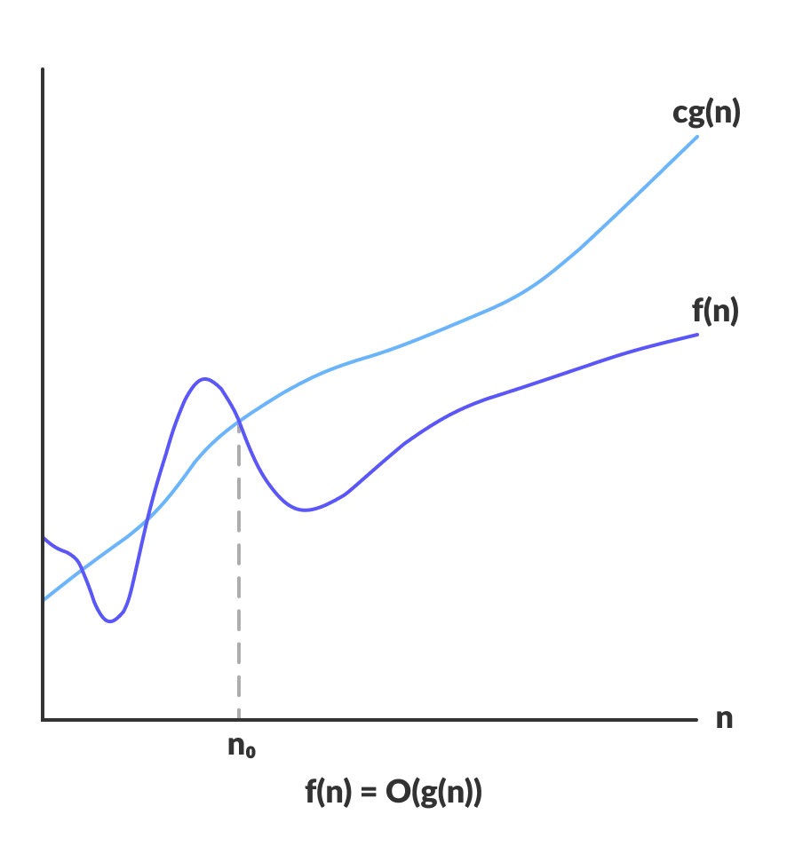
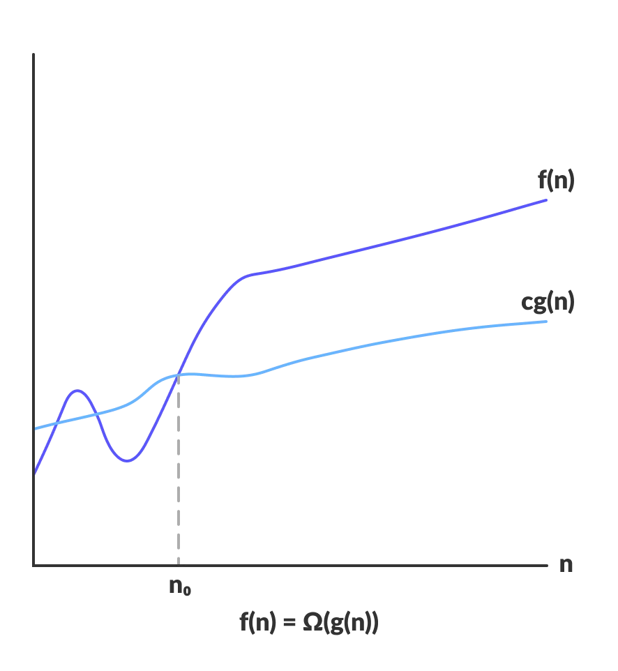
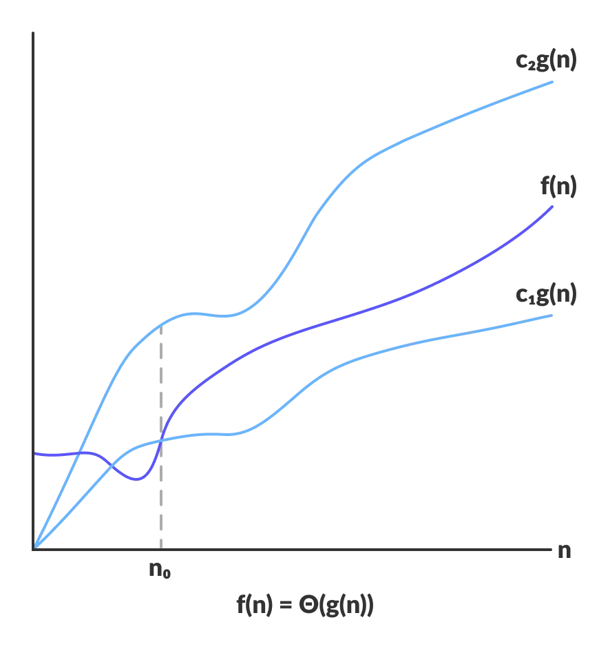

# Day 2 (28 June 2023)

## [Datastructures and Algorithms](https://www.programiz.com/dsa)

## Asymptotic Analysis: Big-O Notation and More

The efficiency of an algoriyhm depends on the amount of time, storage annd other resources required to execute the algortihm. Thne efficiency is measured with the help of asymptotic notations.

An algorithm may not have the same performance for different types of inputs. With the increase in the input size, the performance will change.

The study of change in performance of the algorithm with the change in the order of the input size is defined as asymptotic

### Asymptotic Notations

Asymptotic notations are the mathematical notations used to describe the running time of ann algortihm when the input tennds towards a particular value or a limiting value.

Example: In bubble sort, when the input array is already sorted, the time taken by the algorithm is linear i.e. the best case.

But, when the input array is in reverse condition, the algorithm takes the maximum time (quadratic) to sort the elements i.e. the worst case.

When the input array is neither sorted nor in reverse order, then it takes average time. There durations are denoted using asymptotic notations.

**There are mainly three asymptotic notations:**

- Big-O notation
- Omega notation
- Theta notation

### Big-O Notation (O-notation)

Big-O notation represents the upper bound of the running time of an algorithm. Thus, it give the worst-case complexity of an algorithm.



```
O(g(n)) = { f(n): there exist positive constants c and n0
            such that 0 ≤ f(n) ≤ cg(n) for all n ≥ n0 }
```

The above expression can be described as a function `f(n)` belongs to the set `O(g(n))` if there exists a positive constant `c` such that it lies between `O` and `cg(n)`, for sufficiently large `n`.

For any value of `n`, the running time of an algorithmdoes not cross the time provided by `O(g(n))`.

Since it gives the worst-case running time of an algorithm, it is widely used to analyze an algorithm as we are always interested in the worst-case scenario.

### Omega Notation (Ω-notation)

Omega notation represents the lower bound of the running time of an algorithm. Thus, it provides the best case complexity of an algorithm.



```
Ω(g(n)) = { f(n): there exist positive constants c and n0
            such that 0 ≤ cg(n) ≤ f(n) for all n ≥ n0 }
```

The above expression can be described as a function `f(n)` belongs to the set `Ω(g(n))` if there exists a positive constant `c` such that it lies above `cg(n)`, for sufficiently large `n`.

For any value of `n`, the minimum time required by the algorithm is given by Omega `Ω(g(n))`.

### Theta Notation (Θ-notation)

Theta notation encloses the function from above and below. Since it represents the upper and the lower bound of the running time of an algorithm, it is used for analyzing the average-case complexity of an algorithm.



For a function `g(n)`, `Θ(g(n))` is given by the relation:

```
Θ(g(n)) = { f(n): there exist positive constants c1, c2 and n0
            such that 0 ≤ c1g(n) ≤ f(n) ≤ c2g(n) for all n ≥ n0 }
```

The above expression can be described as a function `f(n)` belongs to the set `Θ(g(n))` if there exist positive constants `c1` and `c2` such that it can be sandwiched between `c1g(n)` and `c2g(n)`, for sufficiently large `n`.

If a function `f(n)` lies anywhere between `c1g(n)` and `c2g(n)` for all `n>=n0`, then `f(n)` is said to be asymptotically tight bound.

## Master Theorem

The master method is a formula for solving recurrence relations of the form:

```
T(n) = aT(n/b) + f(n),
where,
n = size of input
a = number of subproblems in the recursion
n/b = size of each subproblem. All subproblems are assumed
     to have the same size.
f(n) = cost of the work done outside the recursive call,
      which includes the cost of dividing the problem and
      cost of merging the solutions

Here, a ≥ 1 and b > 1 are constants, and f(n) is an asymptotically positive function.
```

An asymptotically positive function means that for a sufficiently large value of `n`, we have `f(n) > 0`.

> The master theorem is used in calculating the time complexity of recurrence relations (divide and conquer algorithms) in a simple and quick way.

### Master Theorem

If `a >= 1` and `b > 1` are constants and `f(n)` is an asymptotically positive function, then the time complexity of a recursive relation is given by

```
T(n) = aT(n/b) + f(n)

where, T(n) has the following asymptotic bounds:

    1. If f(n) = O(nlogb a-ϵ), then T(n) = Θ(nlogb a).

    2. If f(n) = Θ(nlogb a), then T(n) = Θ(nlogb a * log n).

    3. If f(n) = Ω(nlogb a+ϵ), then T(n) = Θ(f(n)).

ϵ > 0 is a constant.
```

Each of the above conditions can be interpreted as:

1. If the cost of solving the sub-problems at each level increases by a certain factor, the value of `f(n)` will become polynomically smaller than `n^logb a`. Thus, the time complexity is oppressed by the cost of the last level i.e. `n^logb a`

2. If the cost of solving the sub-problem at each level is nearly equal, then the value of `f(n)` will be `n^logb a`. Thus, the time complexity will be `f(n)` times the total number of levels i.e. `n^logb a * log n`

3. If the cost of solving the sub-problems at each level decreases by a certain factor, the value of `f(n)` will become polynomically larger than `n^logb a`. Thus, the time complexity is oppressed by the cost of `f(n)`.

### Solved Example of Master Theorem

```
T(n) = 3T(n/2) + n2
Here,
a = 3
n/b = n/2
f(n) = n2

logb a = log2 3 ≈ 1.58 < 2

ie. f(n) < nlogb a+ϵ , where, ϵ is a constant.

Case 3 implies here.

Thus, T(n) = f(n) = Θ(n2)
```

### Master Theorem Limitations

The master theorem cannot be used if:

- `T(n)` is not monotone. eg. `T(n) = sin n`
- `f(n)` is not a polynomial. eg. `f(n) = 2n`
- `a` is not a constant. eg. `a = 2n`
- `a < 1`
