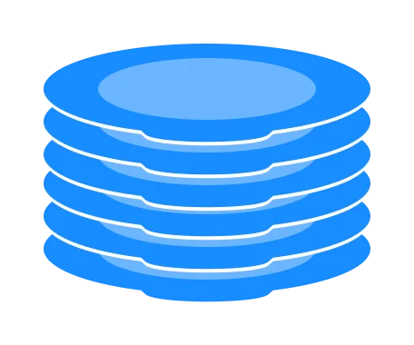
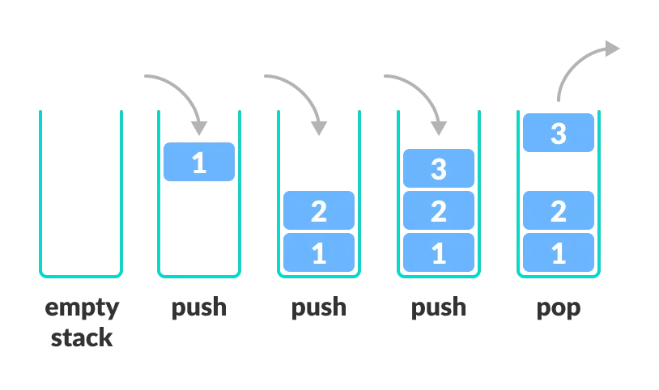
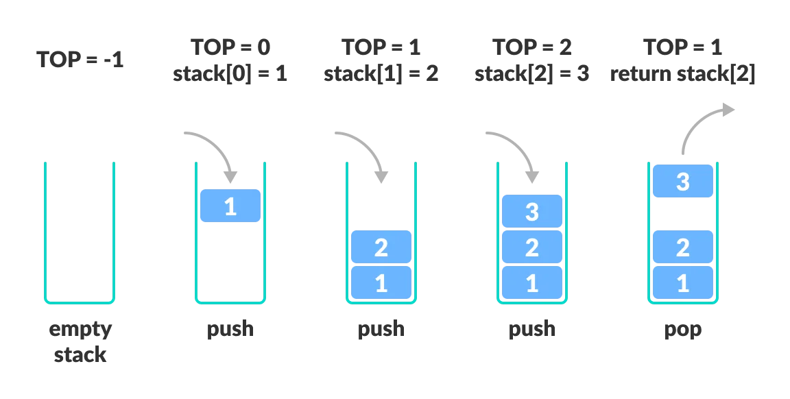

# Day 4 (30 June 2023)

## [Datastructures and Algorithms](https://www.programiz.com/dsa)

## Stack Data Structure

A Stack is a linear data structure that follows the principle of **Last In First Out (LIFO).** This means the last element inserted inside the stack is removed first.

You can think of the stack data structure as the pile of plates on top of another.

<div align="center" >
    
</div>

Here, you can:

- Put a new plate on top
- Remove the top plate

ANd, if you want the plate at the bottom, you must first remove all the plates on top. This is exactly how the stack data structure works.

### LIFO Principle of Stack

In programminng terms, putting an iitem on top of the stack is called **push** and removing an item is **pop**.



In the above image, although item **3** was kept last, it was removed first. This is exactly how the **LIFO(Last In First Out) Principle** works.

### Basic Operations of Stack

There are some basic operations that allow us to perform different actions on a stack.

- **Push:** Add an element to the top of a stack
- **Pop:** Remove an element from the top of a stack
- **IsEmpty:** Check if the stack is empty
- **IsFull:** Check if the stack is full
- **Peek:** Get the value of the top element without removing it

### Workinng of Stack Data Structure

The operations work as follows:

1. A pointer called `TOP` is used to keep track of the top element in the stack.
2. When initializing the stack, we set its value to -1 so that we can check if the stack is empty by comparing `TOP == 1`.
3. On pushing an element, we increase the value of `TOP` and place the new element in the position pointed to by `TOP`.
4. On popping an element, we return the element pointed to by `TOP` and reduce its value.
5. Before pushing, we check if the stack is already full.
6. Before popping, we check if the stack is already empty.



### Stack Implementation in Python

The most common stack implementation is using array, but it can also be implemented using lists.

```python
# Stack implementation in python

# Creating a stack
def create_stack():
    stack = []
    return stack

# Creating an empty stack
def check_empty(stack):
    return len(stack) == 0

# Adding items into the stack
def push(stack, item):
    stack.append(item)
    print("pushed item:" + item)

# Removing an element from the stack
def pop(stack):
    if (check_empty(stack)):
        return "stack is empty"

    return stack.pop()

stack = create_stack()
push(stack, str(1))
push(stack, str(2))
push(stack, str(3))
push(stack, str(4))
print("popped item: " + pop(stack))
print("stack after popping an element: " + str(stack))

```

### Stack Time Complexity

For the array-based implementation of a stack, the push and pop operations take constant time, i.e. `O(1)`.

### Applications of Stack Data Structure

Although stack is a simple data structure to implement, it is very powerful. The most common uses of a stack are:

- **To reverse a word** - Put all the letters in a stack and pop them out. Because of the LIFO order of stack, you will get the letters in reverse order.

- **In compilers** - Compilers use the stack to calculate the value of expressions like `2 + 4 / 5 * (7 - 9)` by converting the expression to prefix or postfix form.

- **In browsers** - The back button in a browser saves all URLs you have visited previously in a stack. Each time you visit a new page, it is added on top of the stack. When you press the back button, the current URL is removed from the stack, and the previous URL is accessed.

## [Data Structures & Algorithms in Python (Google)](https://learn.udacity.com/courses/ud513)

## Arrays

An array is a list with few added rules.
Rules.

- Each array has a location for every element called as **index**.
- Insertion is difficult in arrays as you have to move every element after the insertion.
- Deletion is difficult in arrays as you have to move every element before deletion.

## Linked Lists

A linked list is an extension of a list but not an array.

- Each element is connected to the last element.
- Deletion and Insertion is Easy in the Linked List.

## Differennce between an Array and a Linked List

| Array    | Linked List |
| -------- | ----------- |
| Value: 8 | Value: 8    |
| index: 0 | next: null  |

## Linked List Practise in the ./Day 4/DSA(Google) directory named as code_1.py

## Stacks

Stacks are a type of data structure. Example of stack is a pile of pancakes.

Termologies used in stacks

- **Push-** Adding an element.
- **Pop-** Removing an element.
- **LIFO-** Last In, First Out.

## Queues

A line of people waiting in a ticket counter to buy a ticket. The first person will get the ticket first and last person will get the ticket in the last. Apposite of a stack. **FIFO** (First In, First Out). The first element is called a **Head** ad the last element is called a **Tail**.

Termologies used in queues

- **Dequeue-** Removing the Head of a Queue.
- **Enqueue-** Removing the Tail of a Queue.
- **Peek-** Look the Head of a Queue.
