# Day 6 (07 July 2023)

## [Datastructures and Algorithms](https://www.programiz.com/dsa)

## Priority Queue

A priority queue is a **special type of queue** in which each element is associated with a **priority value**. And, elements are served on the basis of their priority. That is, higher priority elements are served first.

However, if elements with the same priority occur, they are served according to their order in the queue.

### Assigning Priority Value

Generally, the value of the element itself is considered for assigning the priority. For example,

The element with the highest value is considered the highest priority element. However, in other cases, we can assume the element with the lowest value as the value as the highest priority element.

We can also set priorities according to our needs.

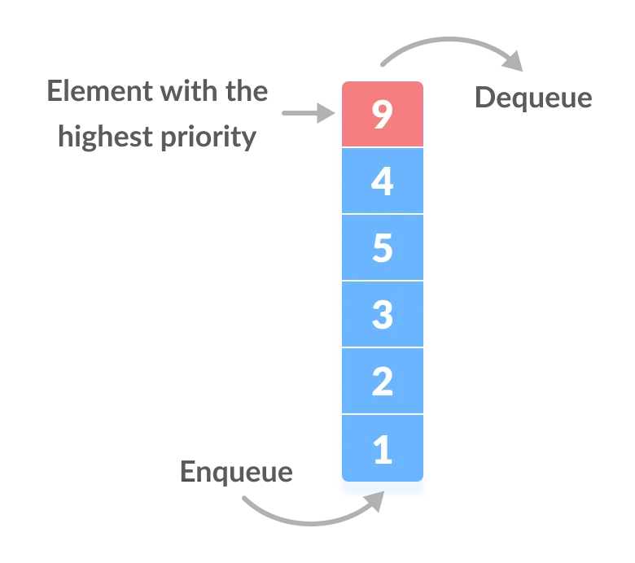

### Difference between Priority Queue and Normal Queue

In a queue, the **first-in-first-out rule** is implemented whereas, in a priority queue, the values are removed **on the basis of priority**. The element with the highest priority is removed first.

### Implementation of Priority Queue

Priority queue can be implemented using an array, a linked list, a heap data structure, or a binary search tree. Among these data structures, heap data structure provides efficient implementationn of priority queues.

Hence, we will be using the heap data structure to implement the priority queue in this tutorial. A max-heap is implemented in the following operations. If you want to learn more about it, please visit max-heap and min-heap.

A comparative analysis of different implementations of priority queue is given below.

| Operatiosn         | peek   | insert     | delete     |
| ------------------ | ------ | ---------- | ---------- |
| Linked List        | `O(1)` | `O(n)`     | `O(1)`     |
| Binary Heap        | `O(1)` | `O(log n)` | `O(log n)` |
| Binary Search Tree | `O(1)` | `O(log n)` | `O(log n)` |

### Priority Queue Operations

Basic operations of a priority queue are inserting, removing, and peeking elements.

> Before studying the priority queue, please refer to the heap data strcuture for a better understanding of binary heap as it is used to implement the priority queue in this article.

#### 1. Inserting an Element into the Priority Queue

Inserting an element into a priority queue (max-heap) is done by the following steps.

- Insert the new element at the end of the tree.
<div align="center" >
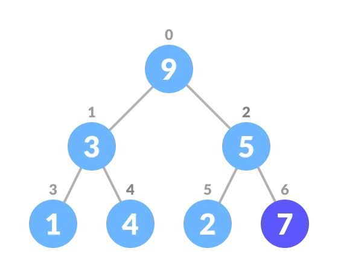
</div>

- Heapify the tree.
<div align="center" >
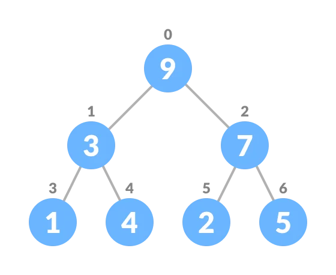
</div>

Algorithm for insertion of an element into priority queue (max-heap)

```
If there is no node,
    create a newNode.
else (a node is already present)
    insert the newNode at the end (last node from left to right.)
heapify the array
```

For Min Heap, the above algorithm is modified so that `parentNode` is always smaller than `newNode`.

#### 2. Deleting an Element from the Priority Queue

Deleting an element from a priority queue (max-heap) is done as follows:

- Select the element to be deleted.
<div align="center" >
 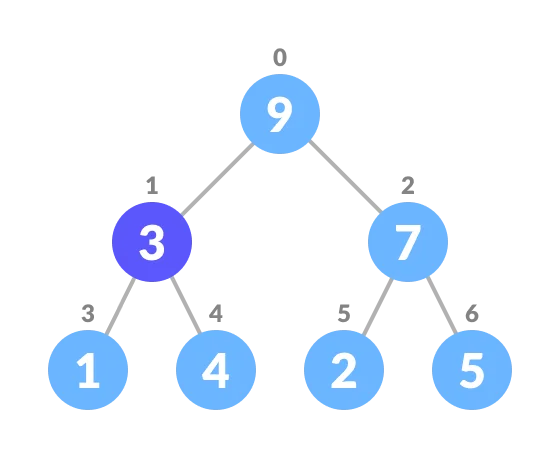
</div>

- Swap it with the last element.
<div align="center" >
 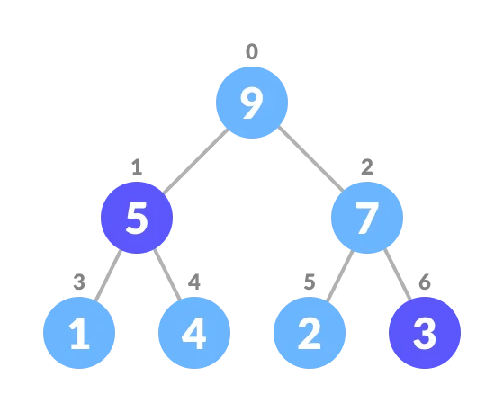
</div>

- Remove the last element.
<div align="center" >
    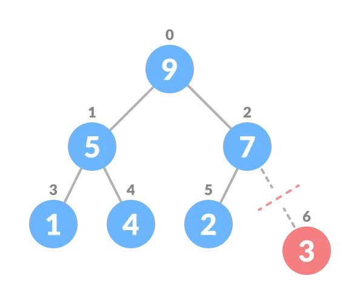
</div>

- Heapify the tree.
<div align="center" >
    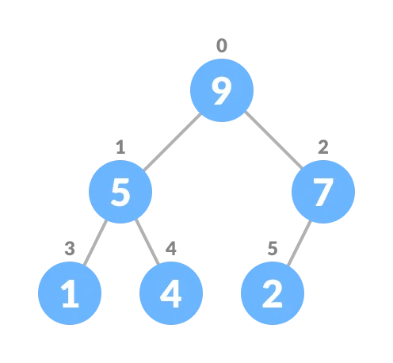
</div>

Algorithm for deletion of an element in priority queue (max-heap)

```
If nodeToBeDeleted is the leafNode
    remove the node
Else swap nodeToBeDeleted witht the lastLeafNode
    remove nodeToBeDeleted

heapify the array
```

For Min Heap, the above algorithm is modified so that the both `childNodes` are smaller than `currentNode`.

#### 3. Peeking from the Priority Queue (Find max/min)

Peek operation returns the maximum element from Max Heap or minimum element from Min Heap without deleting the node.

For both Max heap and Min Heap

```
return rootNode
```

#### 4. Extract-Max/Min from the Priority Queue

Extract-Max return the node with maximum value after removing it from a Max Heap whereas Extract-Min returns the node with minimum value after removing it from Min Heap.

### Priority Queue Implementation in Python

```python
# Priority Queue implementation in Python

# Function to heapify the tree
def heapify(arr, n, i):
    # Find the largest among root, left child and right child
    largest = i
    l = 2 * i + 1
    r = 2 * i + 2

    if l < n and arr[i] < arr[l]:
        largest = l

    if r < n and arr[largest] < arr[r]:
        largest = r

    # Swap and continue heapifying if root is not the largest
    if largest != i:
        arr[i], arr[largest] = arr[largest], arr[i]
        heapify(arr, n, largest)

# Function to insert an element into the tree
def insert(array, newNum):
    size = len(array)
    if size == 0:
        array.append(newNum)
    else:
        array.append(newNum)
        for i in range((size // 2) - 1, - 1, - 1):
            heapify(array, size, i)

# Function to delete an element from the tree
def deleteNode(array, num):
    size = len(array)
    i = 0
    for i in range(0, size):
        if num == array[i]:
            break

    array[i], array[size - 1] = array[size - 1], array[i]

    array.pop(size - 1)

    for i in range((len(array) // 2) - 1, - 1, - 1):
        heapify(array, len(array), i)

arr = []

```

### Priority Queue Applications

Some of the applications of a priority queue are:

- Dijkstra's algorithm
- for implementing stack
- for load balancing and interrupt handling in an operating system
- for data compression in Huffman code

## Deque Data Structure

Deque or Double Ended Queue is a type of queue in which insertion and removal of elements can either be performed from the front or the rear. Thus, it does not follow FIFO rule (First In First Out).

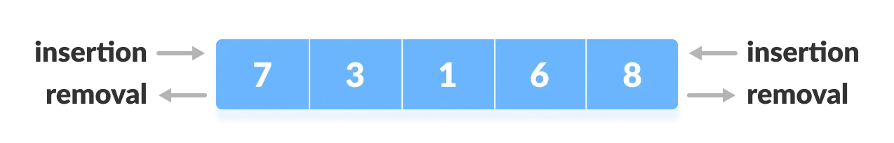

### Types of Deque

- **Input Restricted Deque**
  In this deque, input is restricted at a single end but allows deletion at both the ends.

- **Output Restricted Deque**
  In this deque, output is restricted at a single end but allows insertion at both the ends.

### Operations on a Deque

Below is the circular array implementation of deque. In a circular array, if the array is full, we start from the beginning.

But in a linear array implementation, if the array is full, "overflow message" is thrown.

Before performing the following operations, these steps are followed.

1. Take an array (deque) of size `n`.
2. Set two pointers at the first position and set `front = -1` and `rear = 0`
   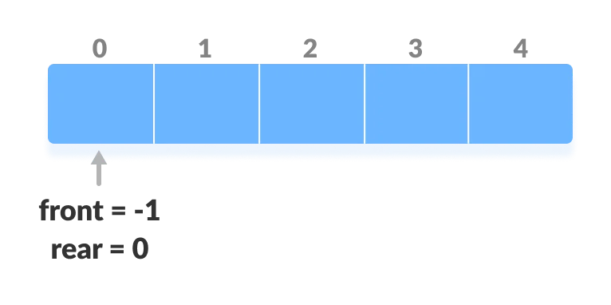

#### 1. Insert at the Front

This operation adds an element at the front.

1. Check the position of front.
   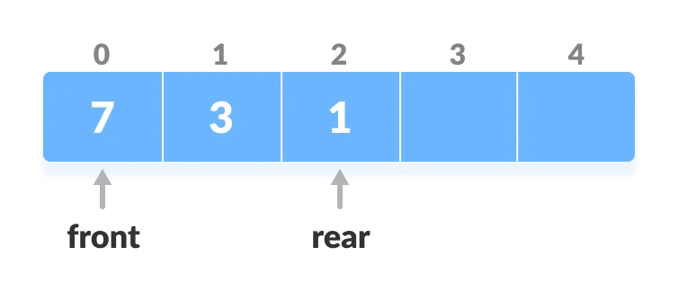

2. If `front < 1`, reinitialize `front = n-1` (last index).
   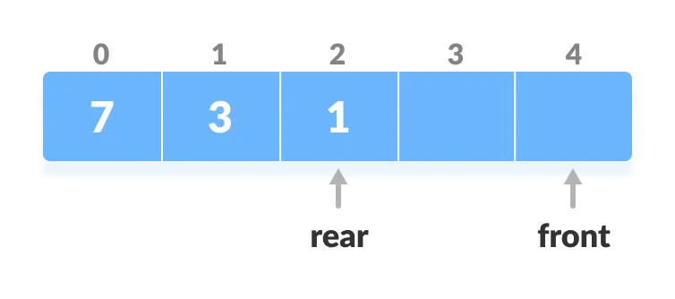

3. Else, decrease `front` by 1.

4. Add the new key `5` into `array[front]`.
   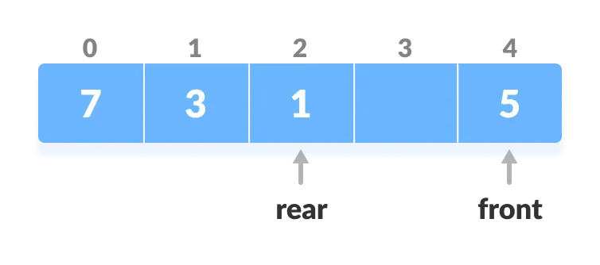

#### 2. Insert at the Rear

This operation adds an element to the rear.

1. Check if the array is full.
   

2. If the deque is full, reinitialize `rear = 0`.

3. Else, increase `rear` by 1.
   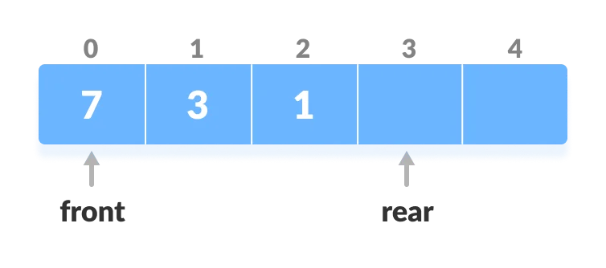

4. Add the new key `5` into `array[rear]`.
   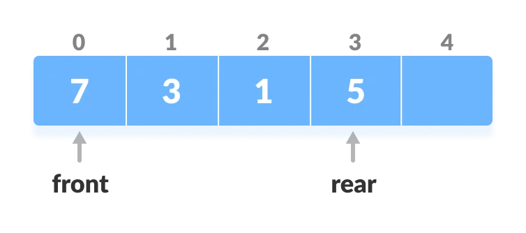

#### 3. Delete from the Front

The operation deletes an element from the front.

1. Check if the deque is empty.
   

2. If the deque is empty (i.e. `front = -1`), deletion cannot be performed (**underflow condition**).

3. If the deque has only one element (i.e. `front = rear`), set `front = -1` and `rear = -1`.

4. Else if `front` is at the end (i.e. `front = n - 1`), set go to the front `front = 0`.

5. Else, `front = front + 1`.
   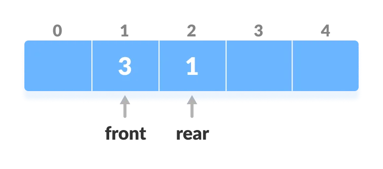

#### 4. Delete from the Rear

This operation deletes an element from the rear.

1. Check if the deque is empty.
   

2. If the deque is empty (i.e. `front = -1`), deletion cannot be performed (**underflow condition**).

3. If the deque has only one element (i.e. `front = rear`), set `front = -1` and `rear = -1`, else follow the steps below.

4. If `rear` is at the front (i.e. `rear = 0`), set go to the front `rear = n - 1`.

5. Else, `rear = rear - 1`.
   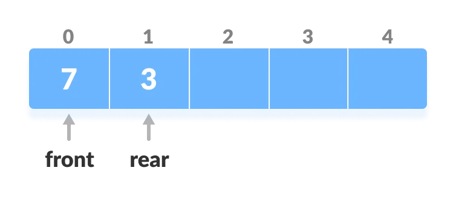

#### 5. Check Empty

This operation checks if the deque is empty. If `front = -1`, the deque is empty.

#### 6. Check Full

This operatio checks if the deque is full. If `front = 0` and `rear = n - 1` OR `front = rear + 1`, the deque is full.

### Deque Implementation in Python

```python

# Deque implementation in Python

class Deque:
    def __init__(self):
        self.items = []

    def isEmpty(self):
        return self.items == []

    def addRear(self, item):
        self.items.append(item)

    def addFront(self, item):
        self.items.insert(0, item)

    def removeFront(self):
        return self.items.pop(0)

    def removeRear(self):
        return self.items.pop()

    def size(self):
        return len(self.items)

d = Deque()
print(d.isEmpty())
d.addRear(8)
d.addRear(5)
d.addFront(7)
d.addFront(10)
print(d.size())
print(d.isEmpty())
d.addRear(11)
print(d.removeRear())
print(d.removeFront())
d.addFront(55)
d.addRear(45)
print(d.items)

```

### Time Complexity

The time complexity of all the above operations is constant i.e. `O(1)`.

### Applications of Deque Data Structure

1. In undo operations on software.
2. To store history in browsers.
3. For implementing both stacks and queues.
