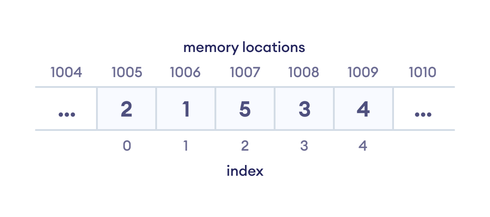
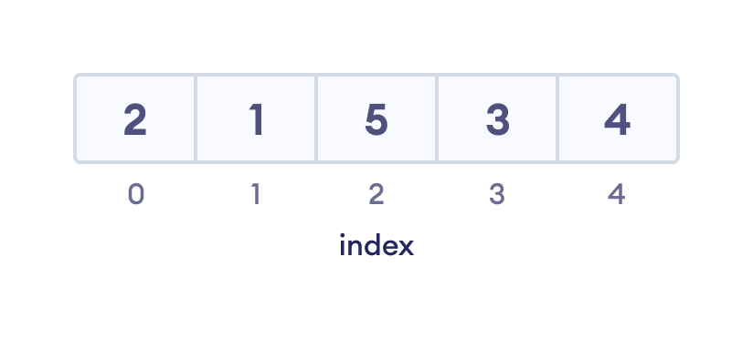
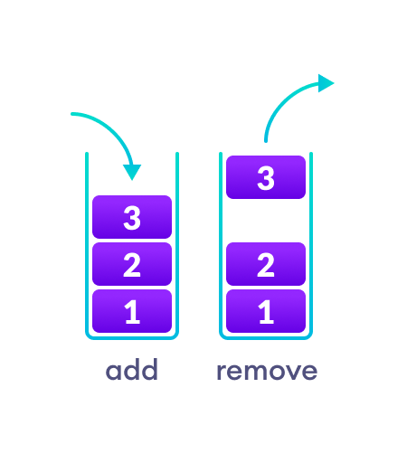
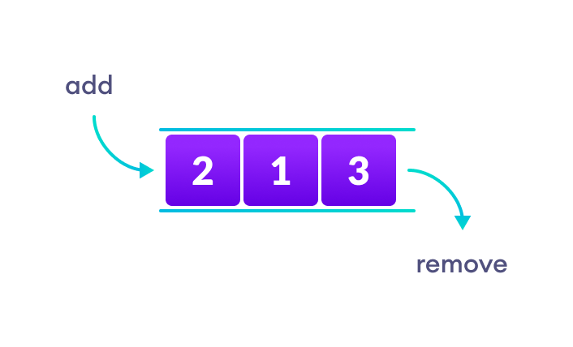
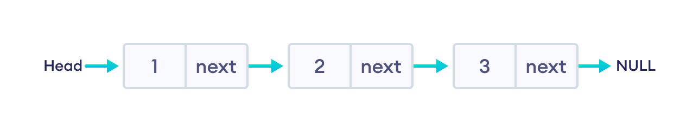
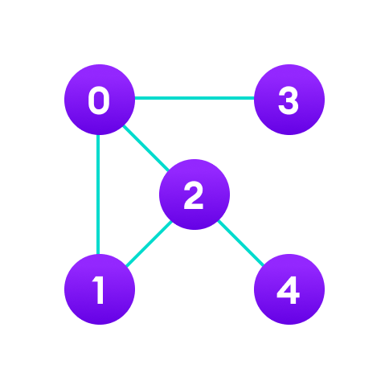
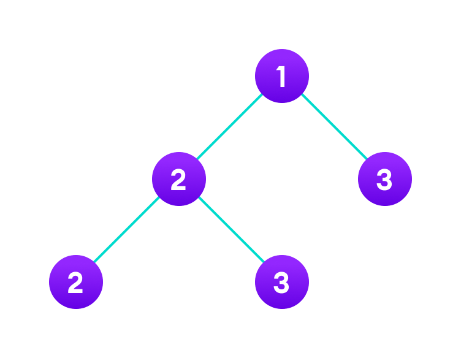

# Day 1 (27 June 2023)

## [Datastructures and Algorithms](https://www.programiz.com/dsa)

### Algorithm -

In computer programming terms, an algorithm is a set of well-defined instructuins to solve a particular problem. It takes a set of input(s) abd oriduces the desired output. Example -
An algorithm to add two numbers:

1.  Take two number inputs
2.  Add numbers using the + operator
3.  Display the result

### Qualities of a Good Algorithm -

- Input and output should be defined precisely.
- Each step in the algorithm should be clear and unambiguous.
- Algorithms should be most effective among many different ways to solve a problem.
- An algorithm shouldn't include computer code. Instead, the algorithm should be written in such a way that it can be used in different programming languages.

### What are Data Structures?

Data strucute is a storage that is used to store and organize data. It is a way of arranging data on a computer so that it can be accessed and updated efficiently.

Depending on your requirement and project, it is important to choose the right data structure for your project. Example - If you want to store data sequentially in the memory, then you can go for the Array data structure.

> Note: Data structure and Data types are slightly different. Data structure is the collection of data types arranged in a specific order.

### Types of Data Structure

Basically, data structures are divied into two categroies:

- Linear data structure
- Non-linear data structure

### Linear data structures

In linear data structure, the elemenets are arranged in sequence one after the other. Since elemenets are arranged in particular order, they are easy to implement.

However, when the complexity of the program increases, the linear data structures might not be the best choice because of operational complexities.

**Popular linear data structures:**

#### 1. Array Data Structure

In an array, elements in memory are arranged in continuous memory. All the elements of ann array are of the same type. And, the type of elements that can be stored in the form of arrays is determined by the programming language.

#### 2. Stack Data Structure

In stack data structure, elements are stored in the LIFO (Last In First Out) principle. That is, the last element stored in a stack will be remove first.

It works like a pile of plates where the last plate kept on the pile will be removed first.

    

#### 3. Queue Data Structure

Unlike stack, the queue data structure works in the FIFO (Fisrt In First Out) principle where first element stored in the queue will be removed first.

It works just like a queue of people in the ticket counter where first person on the queue will get the ticket first.

    

#### 4. Linked List Data Structure

In linked list data structure, data elements are connected through a series of nodes. And, each node contains the data items and address to the next node.

### Non linear data structure

Unlike linear data structure, elements in non-linear data structures are not in any sequence. Instead they are arranged in a hierarchical manner where one element will be connected to one or more elements.

Non-linear data structures are further divided into graph and tree based data structures.

#### 1. Graph Data Structure

In graph data structure, each node is called vertex and each vertex is connected to other vertices through edges.

    

#### 2. Trees Data Structure

Similar to a graph, a tree is also a collection of verties and edges. However, i tree data structure, there can only be one edge between two vertices.

    

| **Linear Data Structures**                                                                                                                        | **Non Linear Data Structures**                                                                                                                 |
| ------------------------------------------------------------------------------------------------------------------------------------------------- | ---------------------------------------------------------------------------------------------------------------------------------------------- | --- |
| The data items are arranged in sequential order, one after the other.                                                                             | The data items are arranged in non-sequential order (hierarchical manner).                                                                     |
| All the items are present on the single layer.                                                                                                    | The data items are present at different layers.                                                                                                |
| It can be traversed on a single run. That is, if we start from the first element, we can traverse all the elements sequentially in a single pass. | It requires multiple runs. That is, if we start from the first element it might not be possible to traverse all the elements in a single pass. |
| The memory utilization is not efficient.                                                                                                          | Different structures utilize memory in different efficient ways depending on the need.                                                         |
| The time complexity increase with the data size.                                                                                                  | Time complexity remains the same.                                                                                                              |
| Example: Arrays, Stack, Queue                                                                                                                     | Example: Tree, Graph, Map                                                                                                                      |     |
