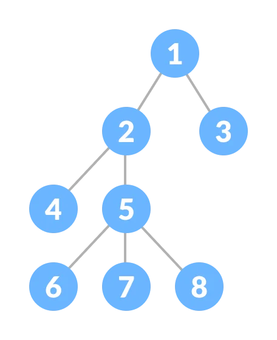
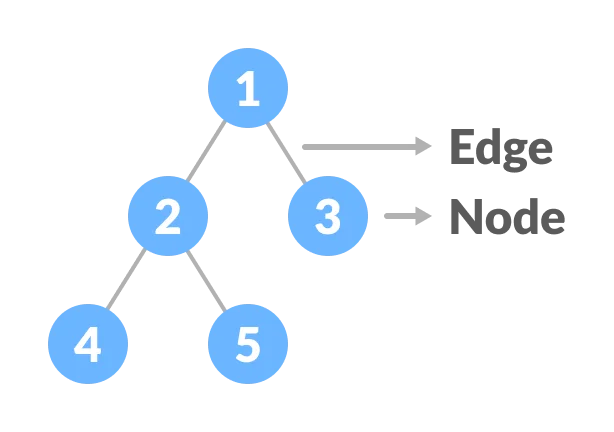
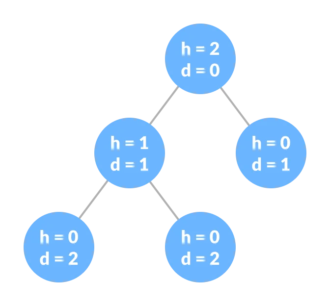
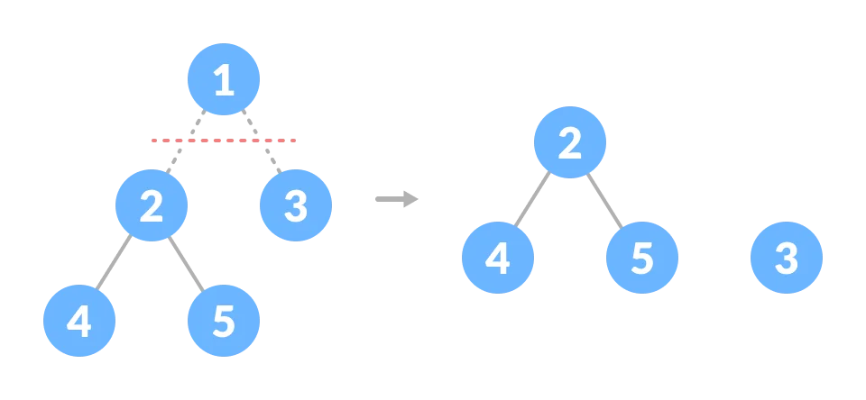

# Day 10 (02 August 2023)

## [Datastructures and Algorithms](https://www.programiz.com/dsa)

## Tree Data Structure

A tree is a nonlinear hierarchical data structure that consists of nodes connected by edges.

<div align="center" >
    
</div>

### Why Tree Data Structure?

Other data structures such as array, linked list, stack, and queue are linear data structures that store data sequentially. In order to perform any operation in a linear data structure, the time complexity increases with the increase in the data
size. But, it is not acceptable in today's computational world.

Different tree data structures allow quicker and easier access to the data as it is a non-linear data structure.

### Tree Terminologies

#### Node

A node is an entity that contains a key or value and pointers to its child nodes.

The last nodes of each path are called **leaf nodes or external nodes** that do not contain a link/pointer to child nodes.

The node having at least a child node is called an **internal node**.

#### Edge

It is the link between any two nodes.

<div align="center" >
    
</div>

#### Root

It is the topmost node of a tree.

#### Height of a Node

The height of a node is the number of edges from the node to the deepest leaf (i.e. the longest path from the node to a leaf node).

#### Depth of a Node

THe depth of a node is the number of edges from the root to the node.

#### Height of a Tree

The height of a Tree is the height of the root node or the depth of the deepest node.

<div align="center" >
    
</div>

#### Degree of a Node

The degree of a node is the total number of branches of that node.

#### Forest

A collection of disjoint trees is called a forest.



YOu can create a forest by cutting the root of a tree.

### Types of Tree

1. Binary Tree
2. Binary Search Tree
3. AVL Tree
4. B-Tree

### Tree Traversal

In order to perform any operation on a tree, you need to reach to the specific node. The tree traversal algorithm helps in visiting a required node in the tree.

### Tree Applications

- Binary Search Trees(BSTs) are used to quickly check whether an element is present in a set or not.
- Heap is a kind of tree that is used for heap sort.
- A modified version of tree called Tries is used in modern routers to store routing information.
- Most popular databases use B-Trees and T-Trees, which are variants of the tree structure we learned above to store their data.
- Compilers use syntax tree to validate the syntax of every program you write.

## [Leetcode Question (Valid Anagram) ](https://leetcode.com/problems/valid-anagram/description/)

```python
class Solution:
    def isAnagram(self, s: str, t: str) -> bool:
        x = [*s]
        y = [*t]
        x.sort()
        y.sort()
        return x == y
```
