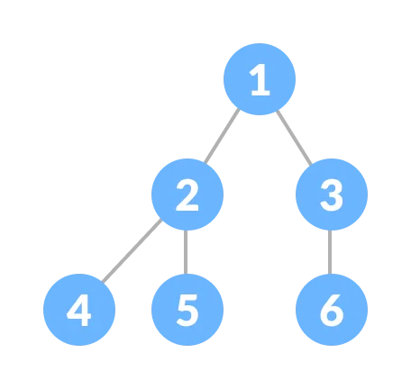

# Day 11 (03 August 2023)

## [Datastructures and Algorithms](https://www.programiz.com/dsa)

## Tree Traversal - inorder, preorder and postorder

Traversing a tree means visiting every node in the tree. You might, for instance, want to add all the values in the tree or find the largest one. For all these operations, you will need to visit each node of the tree.

Linear data structure like arrays, stacks, queues, and linked list have only one way to read the data. But a hierarchical data structure like a tree can be traveres in different ways.


Let's think about how we can read the elements of the tree in the image shown above.

Strating from top, Left to Right

`1 -> 12 -> 5 -> 6 -> 9`

Starting from bottom, Left to Right

`5 -> 6 -> 12 -> 9 -> 1`

Although this process is somewhat easy, it does't respect the hierarchy of the tree, only the depth of the nodes.

Instead, we use traversal methods that take into account the basic structure of a tree i.e.

```c++
struct node {
    int data;
    struct node* left;
    struct node* right;
}
```

The struct node pointed to by `left` and `right` might have other left and right children so we should think of them as sub-trees instead of sub-nodes.

According to this structure, every tree is a combination of

- A node carrying data
- Two subtrees


Remember that our goal is to visit each node, so we nneed to visit all the nodes in the subtree, visit the root node and visit all the nodes in the right subtree as well.

Dependinng on the order in which we do this, there can be three types of traversal.

### Inorder traversal

1. First, visit all the nodes in the left subtree
2. Then the root node
3. Visit all the nodes in the right subtree

```lua
inorder(root->left)
display(root->data)
inorder(root->right)
```

### Preorder traversal

1. Visit root node
2. Visit all the nodes in the left subtree
3. Visit all the nodes in the right subtree

```lua
display(root->data)
preorder(root->left)
preorder(root->right)
```

### Postorder traversal

1. Visit all the nodes in the left subtree
2. Visit all the nodes in the right subtree
3. Visit root node

```lua
postorder(root->left)
postorder(root->right)
display(root->data)
```

Let's visualize in-order traversal. We start from the root node


We traverse the left subtree first. We also need to remember to visit the root node and the right subtree when this tree is done.

Let's pull all this in a stack so that we remember.


Now we traverse to the subtree pointed on the TOp of the stack.

Again, we follow the same rule of inorder

```lua
Left subtree -> root -> right subtree
```

After traversing the left subtree, we are left with


Since the node "5" doesn't have anny subtrees, we print it directly. After that we print its parent "12" and then the right child "6".

Putting everything on a stack was helpful because now that the left-subtree of the root node has been traversed, we can print it and go to the right subtree.

After going through all the elements, we get the inorder traversal as

`5 -> 12 -> 6 -> 1 -> 9`

We don't have to create the stack ourselves because recursion maitains the correct order for us.

## Python Example

```python
# Tree traversal in Python

class Node:
    def __init__(self, item):
        self.left = None
        self.right = None
        self.val = item

def inorder(root):

    if root:
        # Traverse left
        inorder(root.left)
        # Traverse root
        print(str(root.val) + "->", end="")
        # Traverse right
        inorder(root.right)

def postorder(root):

    if root:
        # Traverse left
        inorder(root.left)
        # Traverse right
        inorder(root.right)
        # Traverse root
        print(str(root.val) + "->", end="")

def preorder(root):

    if root:
        # Traverse root
        print(str(root.val) + "->", end="")
        # Traverse left
        inorder(root.left)
        # Traverse right
        inorder(root.right)

root = Node(1)
root.left = Node(2)
root.right = Node(3)
root.left.left = Node(4)
root.left.right = Node(5)

print("Inorder traversal")
inorder(root)

print("\nPreorder traversal")
preorder(root)

print("\nPostorder traversal")
postorder(root)

```

## Binary Tree

A binary tree is a tree data structure in which each parent node can have at most two children. Each node of a binary tree consist of three items:

- data item
- address of left child
- address of right child


### Types of Binary Tree

**1. Full Binary Tree**
A Full Binary tree is a special type of binary tree in which every parent node/internal node has either two or no children.

<div align="center" >
    
</div>

**2. Perfect Binary Tree**
A perfect binary tree is a type of binary tree in which every internal node has exactly two child nodes and all the leaf nodes are at the same level.

<div align="center" >
    
</div>

**3. Complete Binary Tree**
A complete binary tree is just like a full binary tree, but with two major differences

1.  Every level must be completely filled
2.  All the leaf elements must lean towards the left.
3.  The last leaf element might not have a right sibling i.e. a complete binary tree doesn't have to be a full binary tree.

<div align="center" >
    
</div>

**4. Degenerate or Pathological Tree**
A degenerate or pathological tree is the tree having a single child either left or right.

<div align="center" >
    
</div>

**5. Skewed Binary Tree**
A skewed binary tree is a pathological/degenrate tree in which the tree is either dominated by the left nodes or the right nodes. Thus, there are two types of skewed binary tree: **left-skewed binary tree** and **right-skewed binary tree**.

<div align="center" >
    
</div>

**6. Balanced Binary Tree**
It is a type of binary tree in which the difference between the height of the left and the right subtree for each node is either 0 or 1.

<div align="center" >
    
</div>

## Binary Tree Representation

A node of a binary tree is represented by a structure containing a data part and two pointers to other structures of the same type.

```c++
struct node
{
    int data;
    struct node *left;
    struct node *right;
};
```

<div align="center" >
    
</div>

## Python Example

```python
# Binary Tree in Python

class Node:
    def __init__(self, key):
        self.left = None
        self.right = None
        self.val = key

    # Traverse preorder
    def traversePreOrder(self):
        print(self.val, end=' ')
        if self.left:
            self.left.traversePreOrder()
        if self.right:
            self.right.traversePreOrder()

    # Traverse inorder
    def traverseInOrder(self):
        if self.left:
            self.left.traverseInOrder()
        print(self.val, end=' ')
        if self.right:
            self.right.traverseInOrder()

    # Traverse postorder
    def traversePostOrder(self):
        if self.left:
            self.left.traversePostOrder()
        if self.right:
            self.right.traversePostOrder()
        print(self.val, end=' ')

root = Node(1)

root.left = Node(2)
root.right = Node(3)

root.left.left = Node(4)

print("Pre order Traversal: ", end="")
root.traversePreOrder()
print("In order Traversal: ", end="")
root.traverseInOrder()
print("Post order Traversal: ", end="")
root.traversePostOrder()
```

## Binary Tree Applications

- For easy and quick access to data
- In router algorithms
- To implement heap data structure
- Syntax tree

## [Leetcode Question (Two Sum) ](https://leetcode.com/problems/two-sum/)

```python
class Solution:
    def twoSum(self, nums: List[int], target: int) -> List[int]:
        prevMap = {}  # val -> index

        for i, n in enumerate(nums):
            diff = target - n
            if diff in prevMap:
                return [prevMap[diff], i]
            prevMap[n] = i
```
