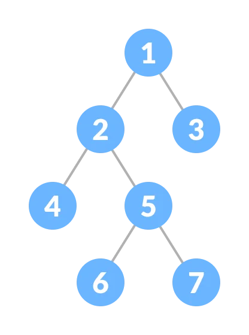
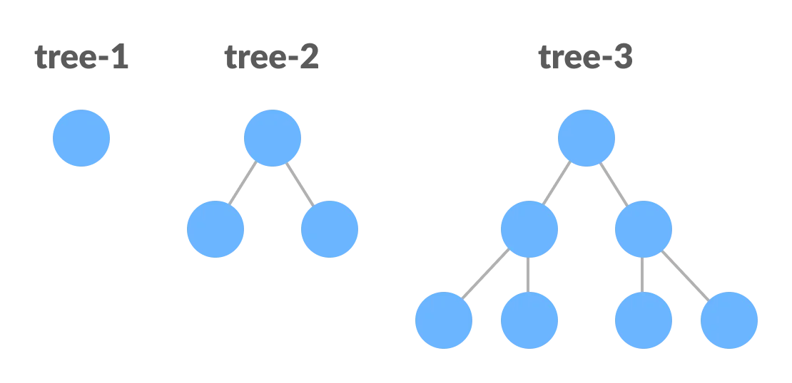
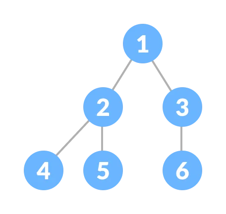
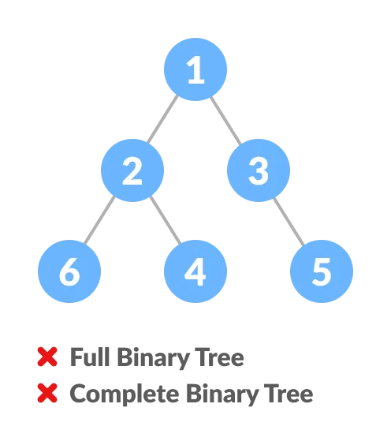
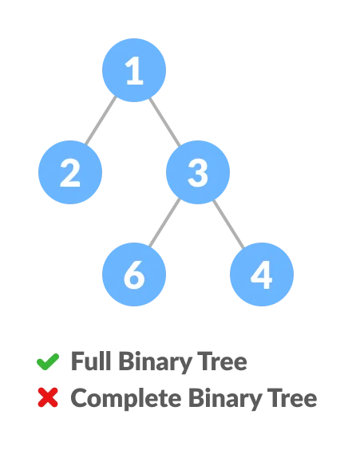
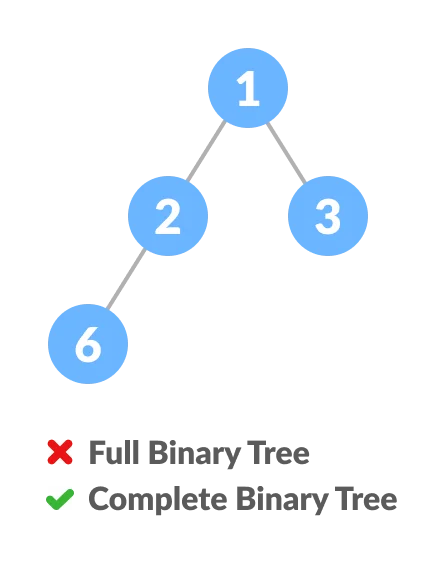
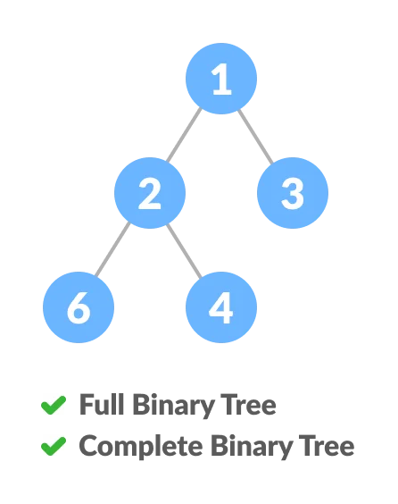
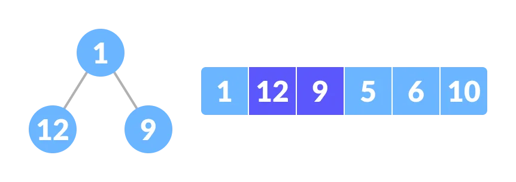
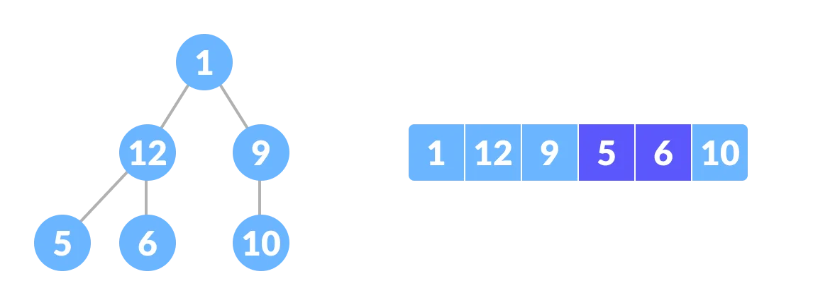

# Day 12 (04 August 2023)

## [Datastructures and Algorithms](https://www.programiz.com/dsa)

## Full Binary Tree

A full Binary tree is a special type of a binary tree in which every parent node/internal node has either two or no children.

It is also known as **a proper binary tree**.

<div align="center" >
    
</div>

### Full Binary Tree Theorems

```
Let, i = the number of internal nodes
     n = be the total number of nodes
     l = number of leaves
     λ = number of levels
```

1. The number of leaves is `i + 1`.
2. The total number of nodes is `2i + 1`.
3. The number of internal nodes is `(n - 1) / 2`.
4. The number of leaves is `(n + 1) / 2`.
5. The total number of internal nodes is `2l - 1`.
6. The number of internal nodes is `l - 1`.
7. The number of leaves is at most `2 ^ (λ - 1)`.

### Python Example

```python
# Checking if a binary tree is a full binary tree in python

# Creating a node
class Node:
    def __init__(self, item):
        self.item = item
        self.leftChild = None
        self.rightChild = None

# Checking full binary tree
def isFullTree(root):

    # Tree empty case
    if root is None:
        return True

    # Checking whether a child is present
    if root.leftChild is None and root.rightChild is None:
        return True

    if root.leftChild is not None and root.rightChild is None:
        return (isFullTree(root.leftChild) and isFullTree(root.rightChild))

    return False

root = Node(1)
root.rightChild = Node(3)
root.leftChild = Node(2)

root.leftChild.leftChild = Node(4)
root.leftChild.rightChild = Node(5)
root.leftChild.rightChild.leftChild = Node(6)
root.leftChild.rightChild.rightChild = Node(7)

if isFullTree(root):
    print("The tree is a full binary tree")
else:
    print("The tree is not a full binary tree")
```

## Perfect Binary Tree

A perfect binary tree is a type of binary tree in which every internal node has exactly two child nodes and all leaf are at the same level.

<div align="center" >
    
</div>

All the internal nodes have a degree of 2.

Recursively, a perfect binary tree ca be defined as:

1. If a single node has a children, it is a perfect binary tree of height `h = 0`.
2. If a node has `h > 0`, it is a perfect binnary tree if both of its subtrees are of height `h - 1` and are non-overlapping.



### Python Example

```python
# Checking if a binary tree is a perfect binary tree in python

class newNode:
    def __init__(self, k):
        self.key = k
        self.right = self.left  = None

# Calculate the depth
def calculateDepth(node):
    d = 0
    while (node is not None):
        d += 1
        node = node.left
    return d

# Check if the tree is perfect binary tree
def is_perfect(root, d, level=0):

    # Check if the tree is empty
    if (root is None):
        return True

    # Check the presence of trees
    if (root.left is None and root.right is None):
        return (d == level + 1)

    if (root.left is None or root.right is None):
        return False

    return (is_perfect(root.left, d, level + 1) and is_perfect(root.right, d, level + 1))

root = None
root = newNode(1)
root.left = newNode(2)
root.right = newNode(3)
root.left.left = newNode(4)
root.left.right = newNode(5)

if (is_perfect(root, calculateDepth(root))):
    print("The tree is a perfect binary tree")
else:
    print("The tree is not a perfect binary tree")
```

### Perfect Binary Tree Theorems

1. A perfect binary tree of height h has `2 ^ (h -1) - 1` node.
2. A perfect binary tree with n nodes has height `log(n - 1) - 1 = 0(ln(n))`.
3. A perfect binary tree of height h has `2 ^ h` leaf nodes.
4. The average depth of a node in a perfect binary tree is `0(ln(n))`.

## Complete Binary Tree

A complete binary tree is a biary tree in which all the levels are completely filled except possibly the lowest one, which is filled from the left.

A complete binary tree is just like a full binary tree,but with two major differences

1. All the leaf elemets mus lean towards the left.
2. The last element might not have a right sibling i,e, a compelete binary tree doesn't have to be a full binary tree.

<div align="center" >
    
</div>

### Full Binary Tree vs Complete Binary Tree

<div align="center" >
    
</div>

<div align="center" >
    
</div>

<div align="center" >
    
</div>

<div align="center" >
    
</div>

### How a Complete Binary Tree is Created?

1. Select the first element of the list to be the root node. (no. of elemens on level-I: 1)
   

2. Put the second element as a left child of the root node and the third element as the right child. (no. of elements on level-II: 2)
   

3. Put the next two elements as children of the left node of the second level. Again, put the next two elements as children of the right node of the second level (no. of elements on level-III: 4) elements.

4. Keep repeating until you reach the last element.
   

### Python Example

```python
# Checking if a binary tree is a complete binary tree in python

class Node:
    def __init__(self, item):
        self.item = item
        self.left = None
        self.right = None

# Count the number of nodes
def count_nodes(root):
    if root is None:
        return 0
    return(1 + count_nodes(root.left) + count_nodes(root.right))

# Check if the tree is complete binary tree
def is_complete(root, idex, numberNodes):
    # Check if the tree is empty
    if root is None:
        True

    if index >= numberNodes:
        return False

    return (is_complete(root.left, 2 * index + 1, numberNodes) and is_complete(root.right, 2 * index + 2, numberNodes))

root = Node(1)
root.left = Node(2)
root.right = Node(3)
root.left.left = Node(4)
root.left.right = Node(5)
root.right.left = Node(6)

node_count = count_nodes(root)
index = 0

if is_complete(root, index, node_count):
    print("The tree is a complete binary tree")
else:
    print("The tree is not a complete binary tree")
```

### Relationship between array indexes and tree element

A complete binary tree has an inntreseting property that we can use to find the childre and parents of any node.

If the index of any element in the array is `i`, the element i the index `2i + 1` will become the left child and element in `2i + 2` index will become the right child. Also, the parent of any element at index `i` is given by the lower bound of `(i - 1) / 2`.

Let's test it out,

```
Left child of 1 (index 0)
= element in (2 * 0 + 1) index
= element in 1 index
= 12

Right child of 1
= element in (2 * 0 + 2) index
= elemennt in 2 index
= 9

Similarly,
Left child of 12 (index 1)
= element in (2 * 1 + 1) index
= element in 3 index
= 5

Right child of 12
= element in (2 * 1 + 2) index
= element in 4 index
= 6
```

Let us also confirm that the rules hold for finding parent of any node

```
Parent of 9 (position 2)
= (2 - 1) / 2
= 1 / 2
= 0.5
~ 0 index
= 1

Parent of 12 (position 1)
= (1 - 1) / 2
= 0 index
= 1
```

### Complete Binary Tree Applications

- Heap-based data structures
- Heap sort
