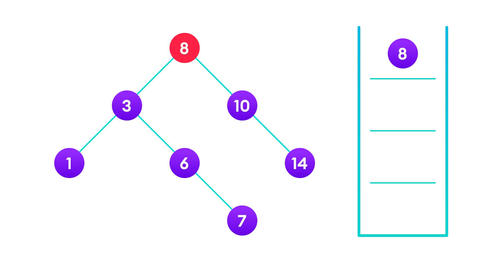
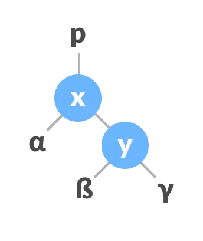
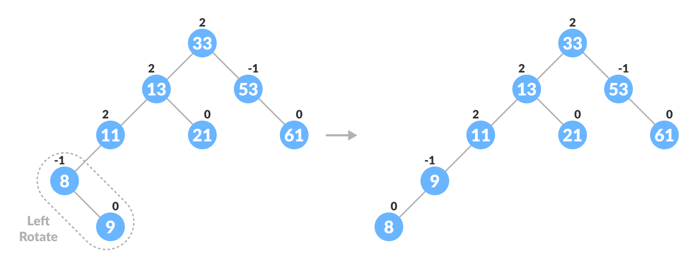
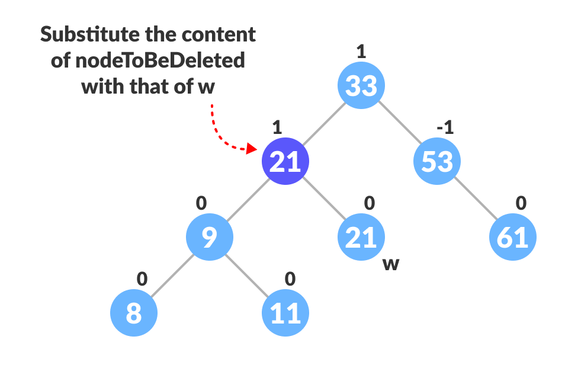

# Day 13 (06 August 2023)

## [Datastructures and Algorithms](https://www.programiz.com/dsa)

## Balanced Binary Tree

A balanced binary tree, also referred to as a height-balanced binary tree, is defined as a binary tree in which the height of the left and right subtree of any node differ by not more than 1.

Following are the conditions for a height-balanced binary tree:

1. difference between the left and the right subtree for any node is not more than one
2. the left subtree is balanced
3. the right subtree is balanced

<div align="center" >
    
</div>

<div align="center" >
    
</div>

### Python Example

```python
# Checking if a binary tree is height balanced in Python

class Node:
    def __init__(self, data):
        self.data = data
        self.left = self.right = None

class Height:
    def __init__(self):
        self.height = 0

def isHeightBalanced(root, height):

    left_height = Height()
    right_height = Height()

    if root is None:
        return True

    l = isHeightBalanced(root.left, left_height)
    r = isHeightBalanced(root.right, right_height)

    height.height = max(left_height.height, right_height.height) + 1

    if abs(left_height.height - right_height.height) <= 1:
        return l and r

    return False

height = Height()

root = Node(1)
root.left = Node(2)
root.right = Node(3)
root.left.left = Node(4)
root.left.right = Node(5)

if isHeightBalanced(root, height):
    print("The tree is balanced")
else:
    print("The tree is not balanced")
```

## Binary Search Tree (BST)

Binary search tree is a data structure that quickly allows us to maintain a sorted list of numbers.

- It is called a binary tree because each tree node has a maximum of two children.
- It is called search tree because it can be used to search fo the presence of a number in `O(log(n))` time.

The properties that separate a binary search tree from a regular binary tree is

1. All nodes of left subtree are less than the root node
2. All nodes of right subtree are more than the root node
3. Both subtrees of each node are also BSTs i.e. they have the above two properties


The binary tree on the right isn't a binary search tree beacuse the right subtree of the node "3" contains a value smaller than it.

There are two basic operations that you can perform on a binary search tree:

### Search Operation

The algorithm depends on the property of BST that if each left subtree has values below root and each right subtree has values above the root.

If the value is below the root, we can say for sure that the value is not in the right subtree; we need to only search in the left subtree and if the value is above the root, we can say for sure that the value is not in the left subtree; we need to only search in the right subtree.

**Algorithm:**

```lua
If root == NULL
    return NULL;
If number == root->data
    return root->data
If number < root->data
    return search(root->left)
If number > root->data
    return search(root->right)
```

Let us try to visualize this with a diagram.


If the value is found, we return the value so that it gets propagated in each recursion step as shown in the image below.

If you might have noticed, we have called return seach(struct node\*) four times. When we return either the new node or NULL, the value gets returned again and again until search(root) returns the final result.


If the value is not found, we eventually reach the left or right child of a leaf node which is NULL and it gets propagated and returned.

### Insert Operation

Inserting a value in the correct position is similar to searching because we try to maintain the rule that the left subtree is lessar than root and the right subtree is larger than root.

We keep going to either right subtree or left subtree depending on the value and when we reach a point left or right subtree is null, we put the new node there.

**Algorithm:**

```lua
if node == NULL
    return createNode(data)
if (data < node->data)
    node->left  = insert(node->left, data)
else if (data > node->data)
    node->right = insert(node->right, data)
return node;
```

The algorithm isn't as simple as it looks. Let's try to visualize how we add a number to an existing BST.




We have attached the node but we still have to exit from the function without doing any damage to the rest of the tree. This is where the `return node;` at the end comes in handy. In the case of `NULL`, the newly created node is returned and attached to the parent node, otherwise the same node is returned without any change as we go up until we return to the root.

This makes sure that as we move back up the tree, the other node connections aren't changed.


### Deletion Operation

These are three cases for deleting a node from a binary search tree.

#### Case 1

In the first case, the node to be deleted is the leaf node. In such a case, simply delete the node from the tree.


#### Case 2

In the second case, the node to be deleted lies has a single child node. In such a case follow the steps below:

1. Replace that node with its child node.

2. Remove the child node from its original position.


#### Case 3

In the third case, the node to be deleted has two children. In such a case follow the steps below:

1. Get the inorder successor of that node.

2. Replace the node with the inorder successor.

3. Remove the norder successor from its original position.


### Python Example

```python
# Binary Search Tree operations in Python

# Create a node
class Node:
    def __init__(self, key):
        self.key = key
        self.left = None
        self.right = None

# Inorder traversal
def inorder(root):
    if root is not None:
        # Traverse left
        inorder(root.left)

        # Traverse root
        print(str(root.key) + "->" , end=" ")

        # Traverse right
        inorder(root.right)

# Insert a node
def insert(node, key):

    # Return a new node if the tree is empty
    if node is None:
        return Node(key)

    # Traverse to the right place and insert the node
    if key < node.key:
        node.left = insert(node.left, key)
    else:
        node.right = insert(node.right, key)

    return node

# Find the inorder successor
def minValueNode(node):
    current = node

    # Find the leftmost leaf
    while(current.left is not None):
        current = current.left

    return current

# Deleting a node
def deleteNode(root, key):

    # Return if the tree is empty
    if root is None:
        return root

    # Find the node to be deleted
    if key < root.key:
        root.left = deleteNode(root.left, key)
    elif key > root.key:
        root.right = deleteNode(root.right, key)
    else:
        # If the node is with only one child or no child
        if root.left is None:
            temp = root.right
            root = None
            return temp

        elif root.right is None:
            temp = root.left
            root = None
            return temp

        # If the node has two children, place the inorder successor in position of the node to be deleted
        temp = minValueNode(root.right)

        root.key = temp.key

        # Delete the inorder successor
        root.right = deleteNode(root.right, temp.key)

    return root

root = None
root = insert(root, 8)
root = insert(root, 3)
root = insert(root, 1)
root = insert(root, 6)
root = insert(root, 7)
root = insert(root, 10)
root = insert(root, 14)
root = insert(root, 4)

print("Inorder traversal: ", end=' ')
inorder(root)

print("\nDelete 10")
root = deleteNode(root, 10)
print("Inorder traversal: ", end=' ')
inorder(root)
```

### Binary Search Tree Complexities

#### Time Complexity

| Operation | Best Case Complexity | Average Case Camplexity | Worst Case Complexity |
| --------- | -------------------- | ----------------------- | --------------------- |
| Search    | O(log n)             | O(log n)                | O(n)                  |
| Insertion | O(log n)             | O(log n)                | O(n)                  |
| Deletion  | O(log n)             | O(log n)                | O(n)                  |

Here, `n` is the number of nodes in the tree.

#### Space Complexity

The space complexity for all the operations is `O(n)`.

### Binary Search Tree Applications

1. In multilevel indexing in the database
2. For dynamic sorting
3. For managing virtual memory areas in Unix kernal

## AVL Tree

AVl tree is a slef-balancing binary seach tree in which each node maintains extra information called a balance factor whose value is either -1, 0 or +1.

AVL tree got its name after its inventor Grorgy Adelson-Velsky and Landis.

### Balance Factor

Balance factor of a node in an AVL tree is the difference between the height of the left subtree and that of the right subtree of that node.

Balance Factor = (Height of Left Subtree - Height of Right Subtree) or (Height of Right Subtree - Height of Left Subtree)

The slef balancing property of an avl tree is maintained by the balance factor. The value of balance factor should always be -1, 0 or +1.

AN example of a balanced avl tree is:


### Operations on an AVL tree

Various operatins that can be performed on an AVL tree are:

### Rotating the subtrees in an AVL Tree

In rotation operation, the positions of the nodes of a subtree are interchangedc.

These are two types of roations:

#### Left Rotate

In left-rotation, the arrangement of the nodes on the right is transeformed into the arrangements on the left node.

Algorithm

1. Let the initial tree be:

<div align="center" >
    
</div>

2. If `y` has a left subtree, assign `x` as the parent of the left subtree of `y`.
<div align="center" >
    
</div>

3. If the parent of `x` is `NULL`, make `y` as the root of the tree.

4. Else if `x` is the left child of `p`, make `y` as the left child of `p`.

5. Else design `y` as the right child of `p`.
<div align="center" >
    
</div>

6. Make `y` as the parent of `x`.
<div align="center" >
    
</div>

#### Right Rotate

In right-rotation, the arrangement of the nodes on the left is transformed into the arrangements on the right noe.

1. Let the initial tree be:
<div align="center" >
    
</div>

2. If `x` has a right subtree, assign `y` as the parent of the right subtree of `x`.
<div align="center" >
    
</div>

3. If the parent of `y` is `NULL`, make `x` as the root of the tree.

4. Else if `y` is the right child of its parent `p`, make `x` as the right child of `p`.

5. Else assign `x` as the left child of `p`.
<div align="center" >
    
</div>

6. Make `x` as the parent of `y`.
<div align="center" >
    
</div>

#### Left-Right and Right-Left Rotate

In left-right rotation, the arrangements are first shifted to the left and then to the right.

1. Do left rotation on x-y.
   

2. Do right rotation on z-y.
   

In right-left rotation, the arrangements are first shifted to the right and then to the left.

1. Do right rotation x-y.
   

2. Do left rotation on z-y.
   

### Algorithm to insert a newNode

A `newNode` is always inserted as a leaf node with balance factor equal to 0.

1. Let the initial tree be:
   

Let the node to be inserted be:

<div align="center" >

</div>

2.  Go to the approptiate leaf node to insert a `newNode` using the following recursive steps. Compare `newKey` with `rootKey` of the current tree.
    a. If `newKey` < `rootKey`, call insertion algorithm on the left subtree of the current node until the leaf node is reached.

    b. Else if `newKey` > `rootKey`, call insertion algorithm on the right subtree of the current node until the leaf node is reaced.

    c. Else, return `leafNode`.
    

3.  Compare `leafKey` obtained from the above steps with `newKey`:
    a. If `newKey` < `leafKey`, make newNode as the `leftChild` of `leafNode`.

    b. Else, make `newNode` as `rightChild` of `leafNode`.
    

4.  Update `balanceFactor` of the nodes.
    

5.  If the nodes are unbalanced, then rebalance the node.

    a. If `balanceFactor` > 1, it means the height of the left subtree is greater than that of the right subtree. So, do a right rotation or left-right rotation

        a. If `newNodeKey` < `leftChildKey` do right rotation.

        b. Else, do left-right rotation.

    

    b. If `balanceFactor` < -1, it means the height of the right subtree is greater than that of the left subtree. So, do right rotation or right-left rotation

        a. If `newNodeKey` > `rightChildKey` do left rotation.

        b. Else, do right-left rotation

6.  The final tree is:
    

### Algorithm to Delete a node

A node is always deleted as a leaf node. After deleting a node, the balance factors of the nodes get changed. In order to rebalance the balance factor, suitable rotations are performed.

1.  Locate `nodeToBeDeleted` (recursion is used to find `nodeToBeDeleted` in the code used below).
    

2.  There are three cases for deleting a node:

    a. If `nodeToBeDeleted` is the leaf node (ie. does not have any child), then remove `nodeToBeDeleted`.

    b. If `nodeToBeDeleted` has one child, then substitute the contents of `nodeToBeDeleted` with that of the child. Remove the child.

    c. If `nodeToBeDeleted` has two children, find the inorder successor `w` of `nodeToBeDeleted` (ie. node with minimum value of key in the right subtree).
    

    a. Substitute the contents of `nodeToBeDeleted` with that of `w`
    

    b. Remove the leaf node `w`.
    

3.  Update `balanceFactor` of the nodes.
    

4.  Rebalance the tree if the balance factor of any of the nodes is not equal to -1, 0 ,1.
    a. If `balanceFactor` of `currentNode` > 1,
    a) 1. If `balanceFactor` of `leftChild` >= 0, do right rotation.
    

    a) 2. Else do left-right rotation.

    b. If `balanceFactor` of `currentNode` < -1,
    b) 1. If `balanceFactor` of `rightChild` <= 0, do left rotation.

    b) 2. Else do right-left rotation.

5.  The final tree is:
    

### Python Example

```python
# AVL tree implementation in Python

import sys

# Create a tree node
class TreeNode(object):
    def __init__(self, key):
        self.key = key
        self.left = None
        self.right = None
        self.height = 1

class AVLTree(object):

    # Function to insert a node
    def insert_node(self, root, key):

        # Find the correct location and insert the node
        if not root:
            return TreeNode(key)
        elif key < root.key:
            root.left = self.insert_node(root.left, key)
        else:
            root.right = self.insert_node(root.right, key)

        root.height = 1 + max(self.getHeight(root.left),self.getHeight(root.right))

        # Update the balance factor and balance tree
        balanceFactor = self.getBalance(root)
        if balanceFactor > 1:
            if key < root.key:
                return self.rightRotate(root)
            else:
                root.left = self.leftRotate(root.left)
                return self.rightRotate(root)

        return root

    # Function to delete a node
    def delete_node(self, root, key):

        # Find the node to be deleted and remove it
        if not root:
            return root
        elif key < root.key:
            root.left = self.delete_node(root.left, key)
        elif key > root.key:
            root.right = self.delete_node(root.right, key)
        else:
            if root.left is None:
                temp = root.right
                root = None
                return temp
            elif root.right is None:
                temp = root.left
                root = None
                return temp
            temp = self.getMinValueNode(root.right)
            root.key = temp.key
            root.right = self.delete_node(root.right, temp.key)

        if root is None:
            return root

        # Update the balance factor of nodes
        root.height = 1 + max(self.getHeight(root.left),self.getHeight(root.right))

        balanceFactor = self.getBalance(root)

        # Balance the tree
        if balanceFactor > 1:
            if self.getBalance(root.left) >= 0:
                return self.rightRotate(root)
            else:
                root.left = self.leftRotate(root.left)
                return self.rightRotate(root)
        if balanceFactor < -1:
            if self.getBalance(root.right) <= 0:
                return self.leftRotate(root)
            else:
                root.right = self.rightRotate(root.right)
                return self.leftRotate(root)
        return root

    # Function to perform left rotation
    def leftRotate(self, z):
        y = z.right
        T2 = y.left
        y.left = z
        z.right = T2
        z.height = 1 + max(self.getHeight(z.left),self.getHeight(z.right))
        y.height = 1 + max(self.getHeight(y.left),self.getHeight(y.right))
        return y

    # Function to perform right rotation
    def rightRotate(self, z):
        y = z.left
        T2 = y.right
        y.right = z
        z.left = T2
        z.height = 1 + max(self.getHeight(z.left),self.getHeight(z.right))
        y.height = 1 + max(self.getHeight(y.left),self.getHeight(y.right))
        return y

    # Get the height of the node
    def getHeight(self, root):
        if not root:
            return 0
        return root.height

    # Get balance factor of the node
    def getBalance(self, root):
        if not root:
            return 0
        return self.getHeight(root.left) - self.getHeight(root.right)

    def getMinValueNode(self, root):
        if root is None or root.left is None:
            return root
        return self.getMinValueNode(root.left)

    def preOrder(self, root):
        if not root:
            return
        print("{0}".format(root.key), end="")
        self.preOrder(root.left)
        self.preOrder(root.right)

    # Print the tree
    def printHelper(self, currPtr, indent, last):
        if currPtr != None:
            sys.stdout.write(indent)
            if last:
                sys.stdout.write("R----")
                indent += "    "
            else:
                sys.stdout.write("L----")
                indent += "|   "
            print(currPtr.key)
            self.printHelper(currPtr.left, indent, False)
            self.printHelper(currPtr.right, indent, True)

myTree = AVLTree()
root = None
nums = [33,13,52,9,21,61,8,11]
for num in nums:
    root = myTree.insert_node(root, num)
myTree.printHelper(root, "", True)
key = 13
root = myTree.delete_node(root, key)
print("After Deletion: ")
myTree.printHelper(root, "", True)
```

### Complexities of Different Operations on an AVL Tree

| Insertion | Deletion | Search   |
| --------- | -------- | -------- |
| O(log n)  | O(log n) | O(log n) |

### AVL Tree Applications

- For indexing large records in databases
- For searching in large databases
