# Day 14 (07 August 2023)

## [Datastructures and Algorithms](https://www.programiz.com/dsa)

## B-tree

B-tree is a special type of self-balancing search tree in which each node can contain more than one key and can have more than two children. It is a generalized form of the binary search tree.

It is also known as a height-balanced m-way tree.

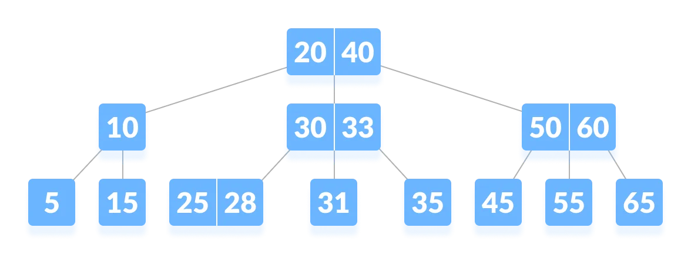

### Why do you need a B-tree data structure?

The need for B-tree arose with the rise in the need for lesser time in accessing physical storage media like a hard disk. The secondary storage devices are slower with a larger capacity. There was a need for such types of data structures that minimize the disk access.

Other data structures such as a binary search tree, avl tree, red-black tree, etc can store only one key in one node. If you have to store a large number of keys, then the height of such trees becomes very large, and the access time increase.

However, B-tree can store many keys in a single node and can have multiple child nodes. This decreases the height significantly allowing faster disk accesses.

### B-tree Properties

1. For each node `x`, the keys are stored in increasing order.

2. In each node, there is a boolean value `x.leaf` which is true if `x` is a leaf.

3. If `n` is the order of the tree, each internal node can contain at most `n - 1` keys along with a pointer to each child.

4. Each node except root can have at most n children and at least `n/2` children.

5. All leaves have the same depth (i.e. height-h of the tree).

6. The root has at least 2 children and contains a minimum of 1 key.

7. If `n >= 1`, then for any n-key B-tree of height-h and minimum degree `t >= 2`, `h >= logt(n+1)/2`.

### Operations on a B-tree

#### Searching an element in a B-tree

Searching for an element in a B-tree is the generalized form of searching an element in a Binary Search Tree. The following steps are followed.

1. Starting from the root node, compare k with the first key of the node.
   If `k = the first key of the node`, return node and the index.

2. If `k.leaf = true`, return `NULL` (i.e. not found).

3. If `k < the first key of the root node`, search the left child of this key recursively.

4. If there is more than one key in the current node and `k > the first key`, compare k with the next key in the node.
   If `k < next key`, search the left child of this key (i.e. k lies in between the first and the second keys).
   Else, search the right child of the key.

5. Repeat steps 1 to 4 until the leaf is reached.

#### Searching Example

1. Let us search key `k = 17` in the tree below of degree 3.
   

2. `k` is not found in the root so, compare it with the root key.
   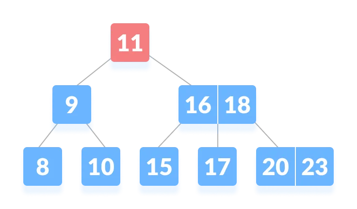

3. Since `k > 11`, go to the right child of the root node.
   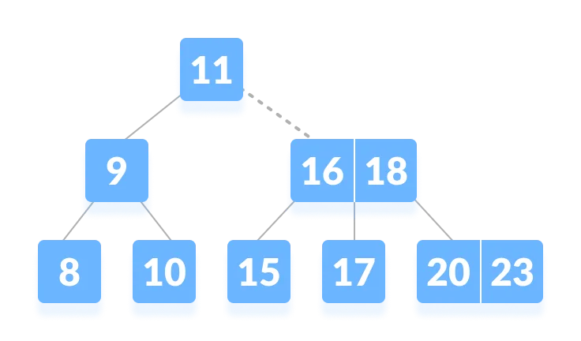

4. Compare k with 16. Since `k > 16`, compare k with the next key 18.
   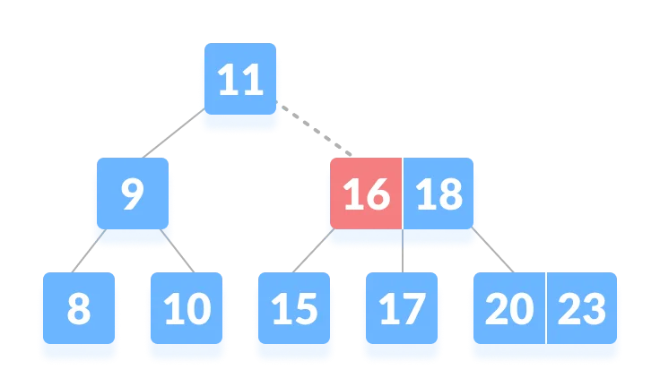

5. Since `k < 18`, k lies between 16 and 18. Search in the right child of 16 or the left child of 18.
   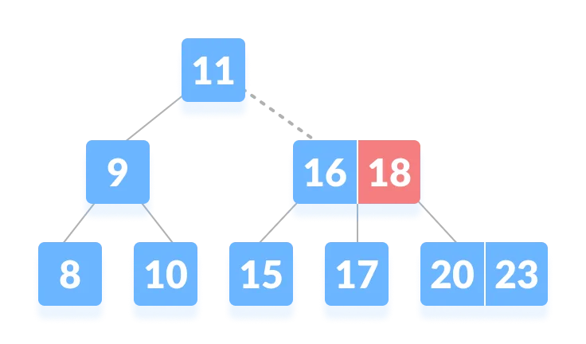

6. k is found.
   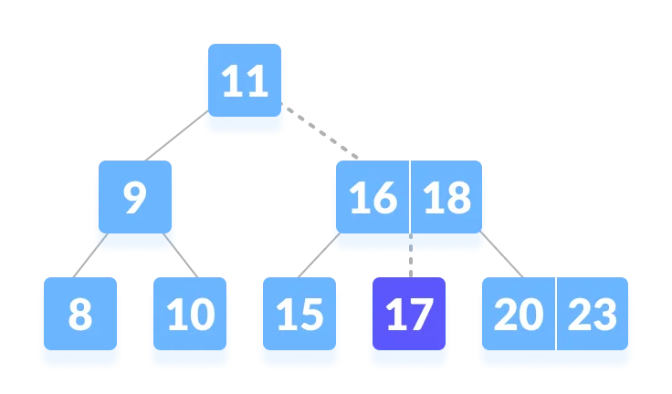

### Algorithm for Searching an Element

```lua
BtreeSearch(x, k)
    i = 1
    while i <= n[x] and k >= keyi[x] // n[x] means number of keys in x node
        do i = i + 1
    if i == n[x] and k = keyi[x]
        then return (x, i)
    if leaf[x]
        then return NIL
    else
        return BtreeSearch(ci[x], k)
```

### B-tree operations code in Python

```python
# Searching a key on a B-tree in Python

# Create a node
class BTreeNode:
    def __init__(self, leaf=False):
        self.leaf = leaf
        self.keys = []
        self.child = []

# Tree
class BTree:
    def __init__(self, t):
        self.root = BTreeNode(True)
        self.t = t

    # Insert node
    def insert(self, k):
        root = self.root
        if len(root.keys) == (2 * self.t) - 1:
            temp = BTreeNode()
            self.root = temp
            temp.child.insert(0, root)
            self.split_child(temp, 0)
            self.insert_non_full(temp, k)
        else:
            self.insert_non_full(root, k)

    # Insert nonfull
    def insert_non_full(self, x, k):
        i = len(x.keys) - 1
        if x.leaf:
            x.keys.append((None, None))
            while i >= 0 and k[0] < x.keys[i][0]:
                x.keys[i + 1] = x.keys[i]
                i -= 1
            x.keys[i + 1] = k
        else:
            while i >= 0 and k[0] < x.keys[i][0]:
                i -= 1
            i += 1
            if len(x.child[i].keys) == (2 * self.t) - 1:
                self.split_child(x, i)
                if k[0] > x.keys[i][0]:
                    i += 1
            self.insert_non_full(x.child[i], k)

    # Split the child
    def split_child(self, x, i):
        t = self.t
        y = x.child[i]
        z = BTreeNode(y.leaf)
        x.child.insert(i + 1, z)
        x.keys.insert(i, y.keys[t - 1])
        z.keys = y.keys[t: (2 * t) - 1]
        y.keys = y.keys[0: t - 1]
        if not y.leaf:
            z.child = y.child[t: 2 * t]
            y.child = y.child[0: t - 1]

    # Print the tree
    def print_tree(self, x, l=0):
        print("Level", l, " ", len(x.keys), end=":")
        for i in x.keys:
            print(i, end=" ")
        print()
        l += 1
        if len(x.child) > 0:
            for i in x.child:
                self.print_tree(i, l)

    # Search key in the tree
    def search_key(self, k ,x=None):
        if x is not None:
            i = 0
            while i < len(x.keys) and k > x.keys[i][0]:
                i += 1
            if i < len(x.keys) and k == x.keys[i][0]:
                return (x, i)
            elif x.leaf:
                return None
            else:
                return self.search_key(k, x.child[i])

        else:
            return self.search_key(k, self.root)

def main():
    B = BTree(3)

    for i in range(10):
        B.insert((i, 2 * i))

    B.print_tree(B.root)

    if B.search_key(8) is not None:
        print("\nFound")
    else:
        print("\nNot Found")

if __name__ == '__main__':
    main()
```

### Searching Complexity on B Tree

Worst case Time complexity: `O(log n)`

Average case Time complexity: `O(log n)`

Best case Time complexity: `O(log n)`

Average case Space complexity: `O(n)`

Worst case Space complexity: `O(n)`

### B Tree Applications

- databases and file systems
- to store blocks of data (secondary storage media)
- multilevel indexing

## Insertion into a B-tree

Inserting an element on a B-tree consists of two events: **searching the appropriate node** to insert the element and **splitting the node** if required. Insertion operation always takes place in the bottom-up approach.

### Insertion Operation

1. If the tree is empty, allocate a root node and insert the key.

2. Update the allowed number of keys in the node.

3. Search the appropriate node for insertion.

4. If the node is full, follow the steps below.

5. Insert the elements in increasing order.

6. Now, there are elements greater than its limit. So, split at the median.

7. Push the median key upwards and make the left keys as a left child and the right keys as a right child.

8. If the node is not full, follow the steps below.

9. Insert the node in increasing order.

### Insertion Example

Let us understand the insertion operation with the illustrations below.

The elements to be inserted are 8, 9, 10, 11, 15, 20, 17.

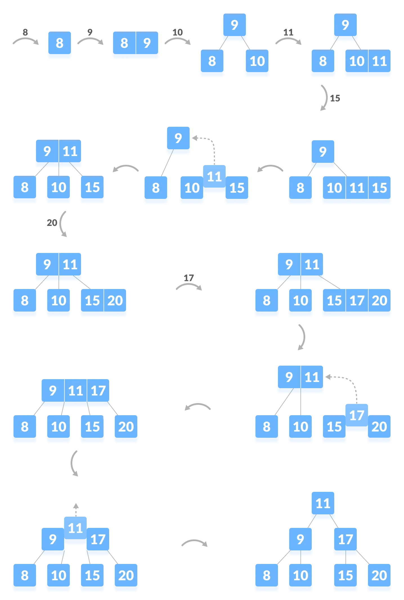

### Python Example

```python
# Inserting a key on a B-tree in Python

# Create a node
class BTreeNode:
    def __init__(self, leaf=False):
        self.leaf = leaf
        self.keys = []
        self.child = []

# Tree
class BTree:
    def __init__(self, t):
        self.root = BTreeNode(True)
        self.t = t

    # Insert node
    def insert(self, k):
        root = self.root
        if len(root.keys) == (2 * self.t) - 1:
            temp = BTreeNode()
            self.root = temp
            temp.child.insert(0, root)
            self.split_child(temp, 0)
            self.insert_non_full(temp, k)
        else:
            self.insert_non_full(root, k)

    # Insert nonfull
    def insert_non_full(self, x, k):
        i = len(x.keys) - 1
        if x.leaf:
            x.keys.append((None, None))
            while i >= 0 and k[0] < x.keys[i][0]:
                x.keys[i + 1] = x.keys[i]
                i -= 1
            x.keys[i + 1] = k
        else:
            while i >= 0 and k[0] < x.keys[i][0]:
                i -= 1
            i += 1
            if len(x.child[i].keys) == (2 * self.t) - 1:
                self.split_child(x, i)
                if k[0] > x.keys[i][0]:
                    i += 1
            self.insert_non_full(x.child[i], k)

    # Split the child
    def split_child(self, x, i):
        t = self.t
        y = x.child[i]
        z = BTreeNode(y.leaf)
        x.child.insert(i + 1, z)
        x.keys.insert(i, y.keys[t - 1])
        z.keys = y.keys[t: (2 * t) - 1]
        y.keys = y.keys[0: t - 1]
        if not y.leaf:
            z.child = y.child[t: 2 * t]
            y.child = y.child[0: t - 1]

    # Print the tree
    def print_tree(self, x, l=0):
        print("Level", l, " ", len(x.keys), end=":")
        for i in x.keys:
            print(i, end=" ")
        print()
        l += 1
        if len(x.child) > 0:
            for i in x.child:
                self.print_tree(i, l)

def main():
    B = BTree(3)

    for i in range(10):
        B.insert((i, 2 * i))

    B.print_tree(B.root)

if __name__ == '__main__':
    main()
```

## Deletion from a B-tree

Deleting an element on a B-tree consist of three main events: **searching the node where the key to be deleted exists**, deleting the key and balancing the tree if required.

While deleting a tree, a condition called **underflow** may occur. Underflow occurs when a node contains less than the minimum number of keys it should hold.

The terms to be understood before studying deletion operation are:

1. **Inorder Prodecessor**
   The largest key on the left child of a node is called its inorder predecessor.

2. **Inorder Successor**
   The smallest key on the right child of a node is called its inorder successor.

### Deletion Operation

Before going through the steps below, one must know these facts about a B tree of degree **m**.

1. A node can have maximum of m children. (i.e. 3)

2. A node can contain a maximum of `m - 1` keys. (i.e. 2)

3. A node should have a minimum of `[m/2]` children. (i.e. 2)

4. A node (except root node) should contain a minimum of `[m/2] - 1` keys. (i.e. 1)

There are three main cases for deletion operation in a B tree.

#### Case I

The key to be deleted lies in the leaf. There are two cases for it.

1. The deletion of the key does not violate the property of the minimum number of keys a node should hold.

   In the tree below, deleting 32 does not violate the above properties.

   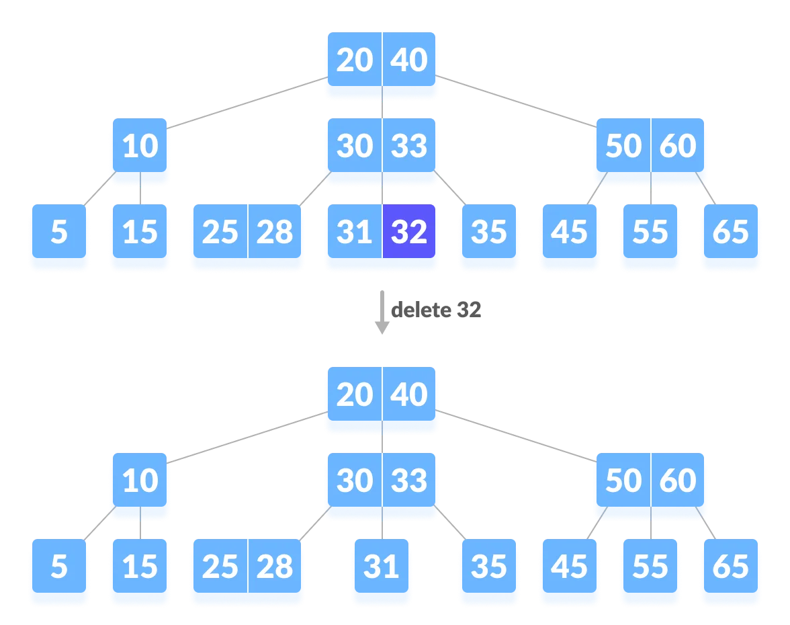

2. The deletion of the key violates the property of the minimum number of keys a node should hold. In this case, we borrow a key from its immediate neighboring sibling node in the order of left to right.

   First, visit the immediate left sibling. If the left sibling node has more than a minimum number of keys, then borrow a key from this node.

   Else, check to borrow from the immediate right sibling node.

   In the tree below, deleting 31 results in the above condition. Let us borrow a key from the left sibling node.

   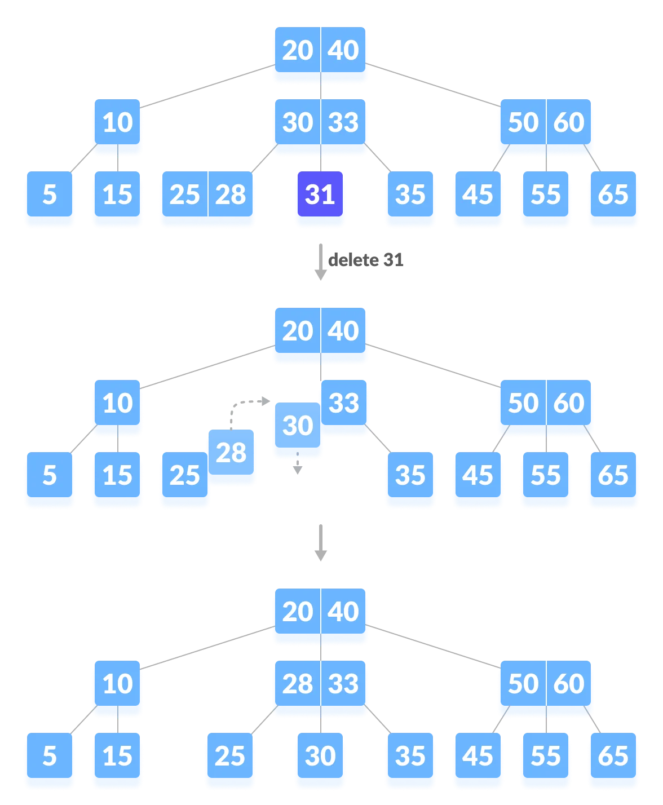

   If both the immediate sibling nodes already have minimum number of keys, then merge the node with either the left sibling node or the right sibling node. **This merging is donne through the parent node.**

   Deleting 30 results in the above case.

   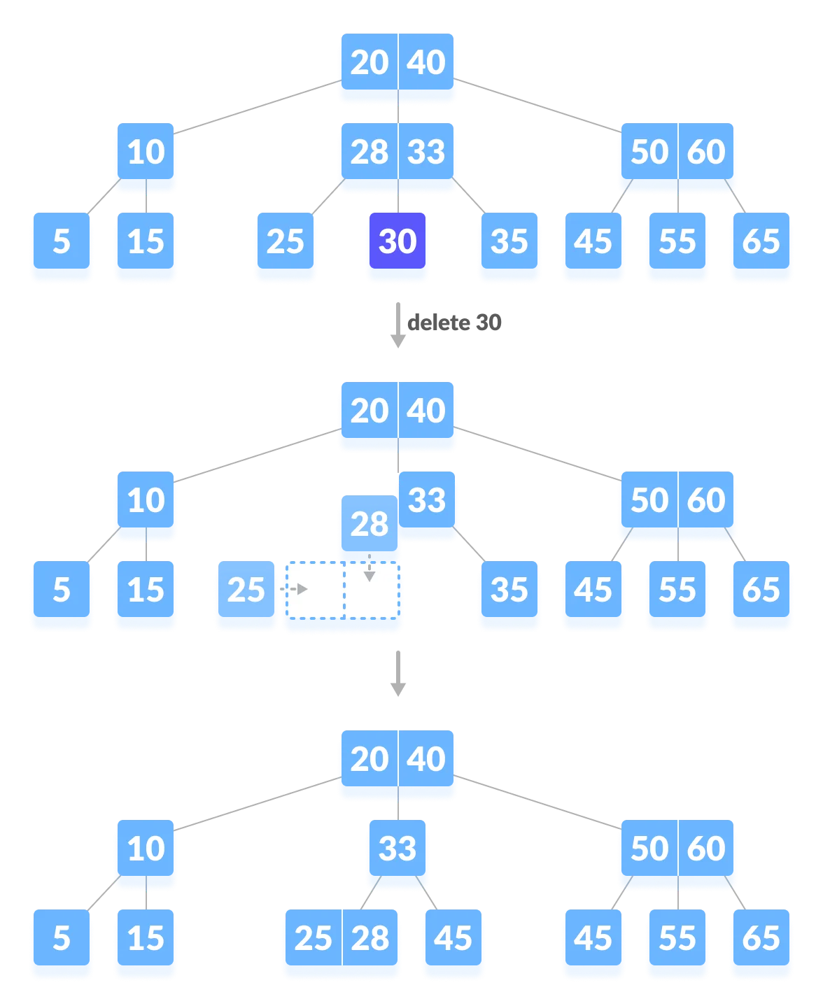

#### Case II

If the key to be deleted lies in the internal node, the following cases occur.

1. The internal node, which is deleted, is replaced by an inorder predecessor if the left child has more than the minimum number of keys.
   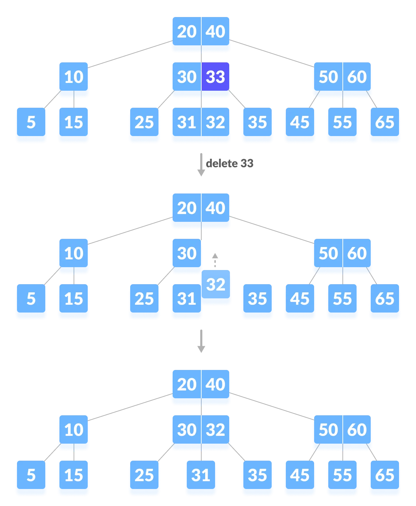

2. The internal node, which is deleted, is replaced by an inorder successor if the right child has more than the minimum number of keys.

3. If either child has exactly a minimum number of keys then, merge the left and the right children.
   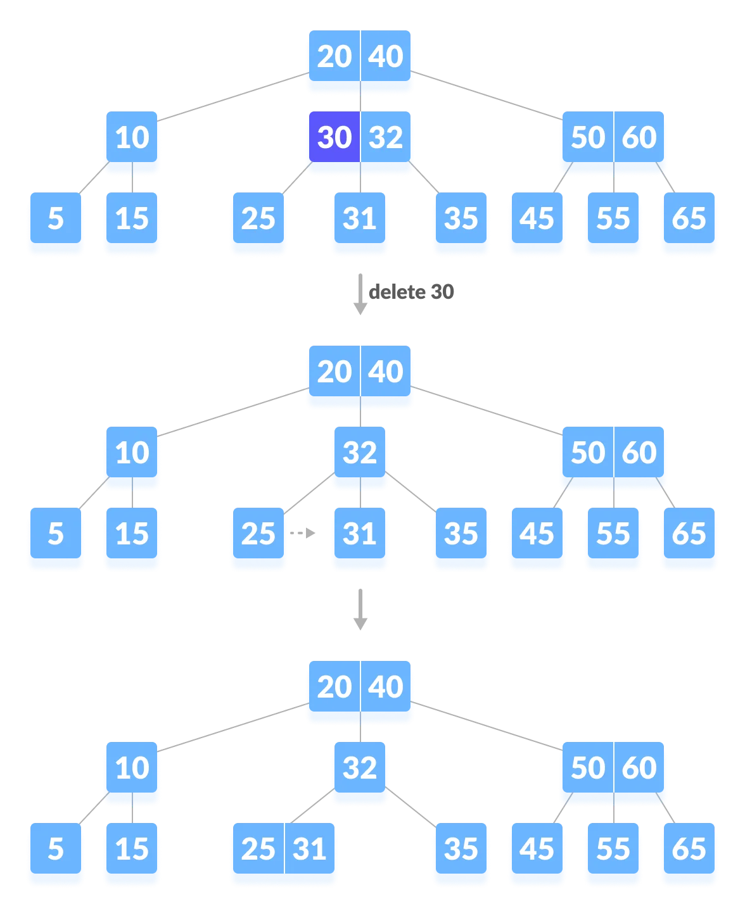
   After merging if the parent node has less than the minimum number of keys then, look for siblings as in Case I.

#### Case III

In this case, the height of the tree shrinks. If the target key lies in an internal node, and the deletion of the key leads to a fewer number of keys in the node (i.e. less than the minimum required), then look for the inorder predecessor and the inorder successor. If both the children contain a minimum number of keys then, borrowinng cannot take place. This leads to Case II(3) i.e. merging the children.

Again, look for the sibling to borrow a key. But, if the sibling also has only a minimum number of keys then, merge the node with the sibling along with the parent. Arraange the children accordingly (increasing order).

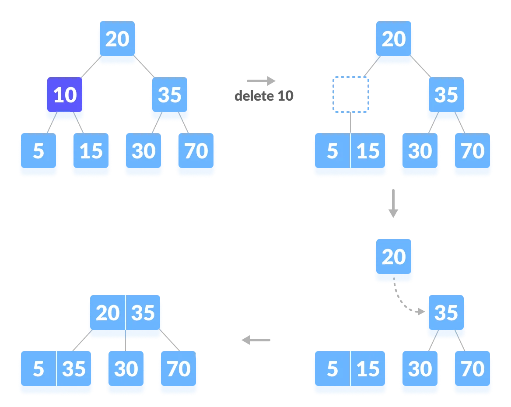

### Python Example

```python
# Deleting a key on a B-tree in Python


# Btree node
class BTreeNode:
    def __init__(self, leaf=False):
        self.leaf = leaf
        self.keys = []
        self.child = []


class BTree:
    def __init__(self, t):
        self.root = BTreeNode(True)
        self.t = t

    # Insert a key
    def insert(self, k):
        root = self.root
        if len(root.keys) == (2 * self.t) - 1:
            temp = BTreeNode()
            self.root = temp
            temp.child.insert(0, root)
            self.split_child(temp, 0)
            self.insert_non_full(temp, k)
        else:
            self.insert_non_full(root, k)

    # Insert non full
    def insert_non_full(self, x, k):
        i = len(x.keys) - 1
        if x.leaf:
            x.keys.append((None, None))
            while i >= 0 and k[0] < x.keys[i][0]:
                x.keys[i + 1] = x.keys[i]
                i -= 1
            x.keys[i + 1] = k
        else:
            while i >= 0 and k[0] < x.keys[i][0]:
                i -= 1
            i += 1
            if len(x.child[i].keys) == (2 * self.t) - 1:
                self.split_child(x, i)
                if k[0] > x.keys[i][0]:
                    i += 1
            self.insert_non_full(x.child[i], k)

    # Split the child
    def split_child(self, x, i):
        t = self.t
        y = x.child[i]
        z = BTreeNode(y.leaf)
        x.child.insert(i + 1, z)
        x.keys.insert(i, y.keys[t - 1])
        z.keys = y.keys[t: (2 * t) - 1]
        y.keys = y.keys[0: t - 1]
        if not y.leaf:
            z.child = y.child[t: 2 * t]
            y.child = y.child[0: t - 1]

    # Delete a node
    def delete(self, x, k):
        t = self.t
        i = 0
        while i < len(x.keys) and k[0] > x.keys[i][0]:
            i += 1
        if x.leaf:
            if i < len(x.keys) and x.keys[i][0] == k[0]:
                x.keys.pop(i)
                return
            return

        if i < len(x.keys) and x.keys[i][0] == k[0]:
            return self.delete_internal_node(x, k, i)
        elif len(x.child[i].keys) >= t:
            self.delete(x.child[i], k)
        else:
            if i != 0 and i + 2 < len(x.child):
                if len(x.child[i - 1].keys) >= t:
                    self.delete_sibling(x, i, i - 1)
                elif len(x.child[i + 1].keys) >= t:
                    self.delete_sibling(x, i, i + 1)
                else:
                    self.delete_merge(x, i, i + 1)
            elif i == 0:
                if len(x.child[i + 1].keys) >= t:
                    self.delete_sibling(x, i, i + 1)
                else:
                    self.delete_merge(x, i, i + 1)
            elif i + 1 == len(x.child):
                if len(x.child[i - 1].keys) >= t:
                    self.delete_sibling(x, i, i - 1)
                else:
                    self.delete_merge(x, i, i - 1)
            self.delete(x.child[i], k)

    # Delete internal node
    def delete_internal_node(self, x, k, i):
        t = self.t
        if x.leaf:
            if x.keys[i][0] == k[0]:
                x.keys.pop(i)
                return
            return

        if len(x.child[i].keys) >= t:
            x.keys[i] = self.delete_predecessor(x.child[i])
            return
        elif len(x.child[i + 1].keys) >= t:
            x.keys[i] = self.delete_successor(x.child[i + 1])
            return
        else:
            self.delete_merge(x, i, i + 1)
            self.delete_internal_node(x.child[i], k, self.t - 1)

    # Delete the predecessor
    def delete_predecessor(self, x):
        if x.leaf:
            return x.pop()
        n = len(x.keys) - 1
        if len(x.child[n].keys) >= self.t:
            self.delete_sibling(x, n + 1, n)
        else:
            self.delete_merge(x, n, n + 1)
        self.delete_predecessor(x.child[n])

    # Delete the successor
    def delete_successor(self, x):
        if x.leaf:
            return x.keys.pop(0)
        if len(x.child[1].keys) >= self.t:
            self.delete_sibling(x, 0, 1)
        else:
            self.delete_merge(x, 0, 1)
        self.delete_successor(x.child[0])

    # Delete resolution
    def delete_merge(self, x, i, j):
        cnode = x.child[i]

        if j > i:
            rsnode = x.child[j]
            cnode.keys.append(x.keys[i])
            for k in range(len(rsnode.keys)):
                cnode.keys.append(rsnode.keys[k])
                if len(rsnode.child) > 0:
                    cnode.child.append(rsnode.child[k])
            if len(rsnode.child) > 0:
                cnode.child.append(rsnode.child.pop())
            new = cnode
            x.keys.pop(i)
            x.child.pop(j)
        else:
            lsnode = x.child[j]
            lsnode.keys.append(x.keys[j])
            for i in range(len(cnode.keys)):
                lsnode.keys.append(cnode.keys[i])
                if len(lsnode.child) > 0:
                    lsnode.child.append(cnode.child[i])
            if len(lsnode.child) > 0:
                lsnode.child.append(cnode.child.pop())
            new = lsnode
            x.keys.pop(j)
            x.child.pop(i)

        if x == self.root and len(x.keys) == 0:
            self.root = new

    # Delete the sibling
    def delete_sibling(self, x, i, j):
        cnode = x.child[i]
        if i < j:
            rsnode = x.child[j]
            cnode.keys.append(x.keys[i])
            x.keys[i] = rsnode.keys[0]
            if len(rsnode.child) > 0:
                cnode.child.append(rsnode.child[0])
                rsnode.child.pop(0)
            rsnode.keys.pop(0)
        else:
            lsnode = x.child[j]
            cnode.keys.insert(0, x.keys[i - 1])
            x.keys[i - 1] = lsnode.keys.pop()
            if len(lsnode.child) > 0:
                cnode.child.insert(0, lsnode.child.pop())

    # Print the tree
    def print_tree(self, x, l=0):
        print("Level ", l, " ", len(x.keys), end=":")
        for i in x.keys:
            print(i, end=" ")
        print()
        l += 1
        if len(x.child) > 0:
            for i in x.child:
                self.print_tree(i, l)


B = BTree(3)

for i in range(10):
    B.insert((i, 2 * i))

B.print_tree(B.root)

B.delete(B.root, (8,))
print("\n")
B.print_tree(B.root)
```

### Deletion Complexity

Best case Time complexity: `O(log n)`

Average case Space complexity: `O(n)`

Worst case Space complexity: `O(n)`
