# Day 15 (08 August 2023)

## [Datastructures and Algorithms](https://www.programiz.com/dsa)

## B+ Tree

A B+ tree is an advanced form of a self-balancing tree in which all the values are present in the leaf level.

An important concept to be understood before learning B+ tree is multilevel indexing. In multilevel indexing, the index of indices is created as in figure below. It makes accessing the data easier and faster.

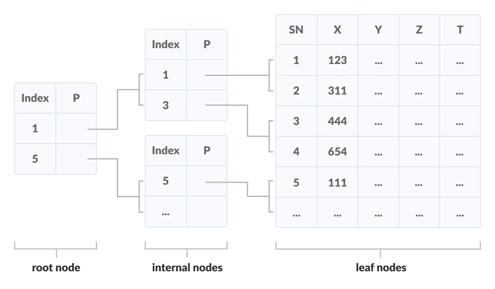

### Properties of a B+ Tree

1. All leaves are at the same level.

2. The root has at least two children.

3. Each node except root can have a maximum of `m` children and at least `m / 2` children.

4. Each node can contain a maximum of `m - 1` keys and a minimum of `[m/2] - 1` keys.

### Comparison between B-tree and a B+ Tree

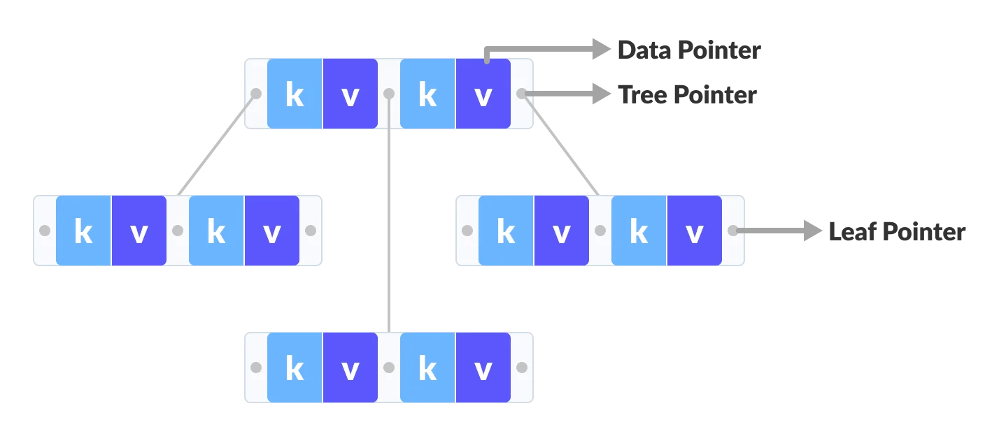

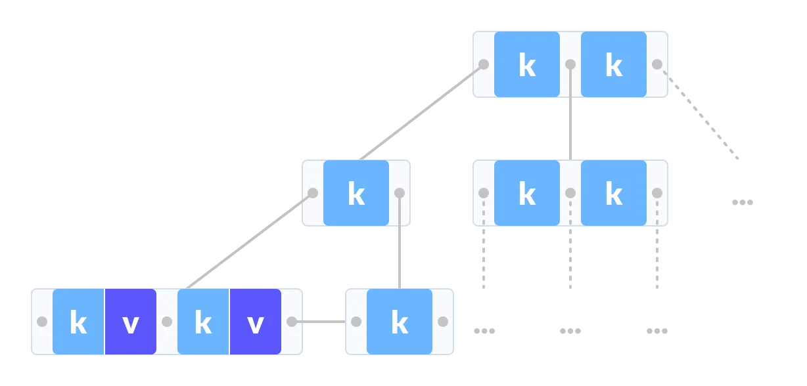

The data pointers are present only at the leaf nodes on a B+ tree whereas the data pointers are present in the internal, leaf or root nodes on a B-tree.

The leaves are not connected with each other on a B-tree whereas they are connected on a B+ tree.

Operations on a B+ tree are faster than on a B-tree.

### Searching on a B+ Tree

The following steps are followed to search for dataa in a B+ Tree of order `m`. Let the data be searched be `k`.

1. Start from the root node. Compare k with the keys at the root node `[k1, k2, k3, .....km-1]`.

2. If `k < k1`, go to the left child of the root node.

3. Else if `k == k1`, compare `k2`. If `k < k2`, k lies between `k1` and `k2`. So, search in the left child of `k2`.

4. If `k > k2`, go for `k3, k4, ...km-1` as in steps 2 and 3.

5. Repeat the above steps until a leaf node is reached.

6. If k exists in the leaf node, return true else return false.

### Searching Example on a B+ Tree

Lets us search `k = 45` on the following B+ tree.


1. Compare k with the root node.
   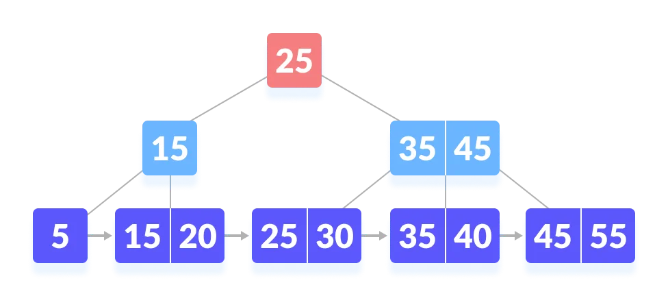

2. Since k > 25, go to the right child.
   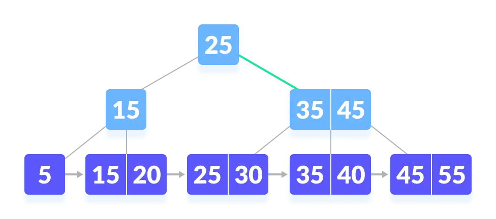

3. Compare k with 35. Since k > 30, compare k with 45.
   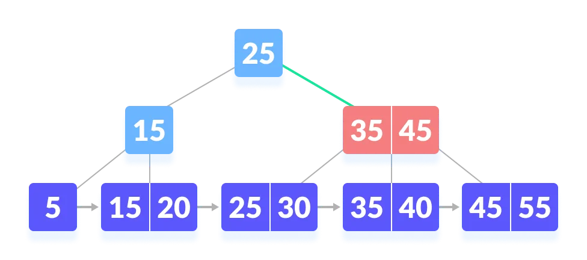

4. Since k >= 45, so go to the right child.
   

5. k is found.
   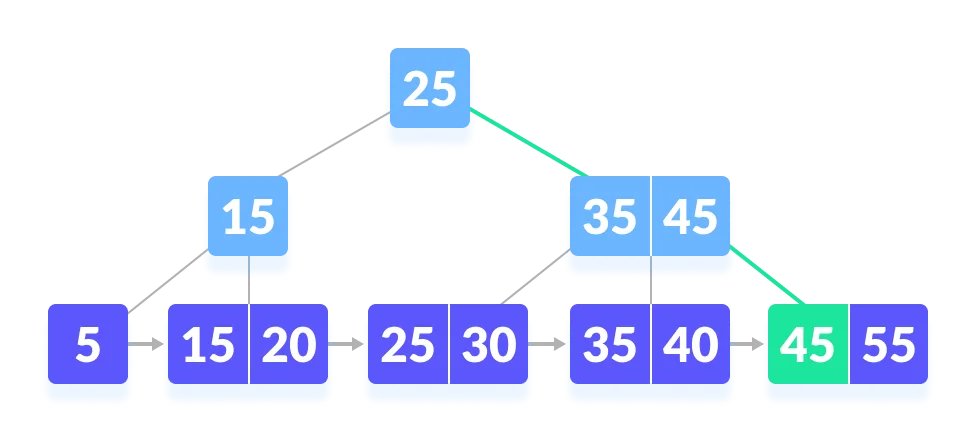

### Python Example

```python
# B+ tee in python


import math

# Node creation
class Node:
    def __init__(self, order):
        self.order = order
        self.values = []
        self.keys = []
        self.nextKey = None
        self.parent = None
        self.check_leaf = False

    # Insert at the leaf
    def insert_at_leaf(self, leaf, value, key):
        if (self.values):
            temp1 = self.values
            for i in range(len(temp1)):
                if (value == temp1[i]):
                    self.keys[i].append(key)
                    break
                elif (value < temp1[i]):
                    self.values = self.values[:i] + [value] + self.values[i:]
                    self.keys = self.keys[:i] + [[key]] + self.keys[i:]
                    break
                elif (i + 1 == len(temp1)):
                    self.values.append(value)
                    self.keys.append([key])
                    break
        else:
            self.values = [value]
            self.keys = [[key]]


# B plus tree
class BplusTree:
    def __init__(self, order):
        self.root = Node(order)
        self.root.check_leaf = True

    # Insert operation
    def insert(self, value, key):
        value = str(value)
        old_node = self.search(value)
        old_node.insert_at_leaf(old_node, value, key)

        if (len(old_node.values) == old_node.order):
            node1 = Node(old_node.order)
            node1.check_leaf = True
            node1.parent = old_node.parent
            mid = int(math.ceil(old_node.order / 2)) - 1
            node1.values = old_node.values[mid + 1:]
            node1.keys = old_node.keys[mid + 1:]
            node1.nextKey = old_node.nextKey
            old_node.values = old_node.values[:mid + 1]
            old_node.keys = old_node.keys[:mid + 1]
            old_node.nextKey = node1
            self.insert_in_parent(old_node, node1.values[0], node1)

    # Search operation for different operations
    def search(self, value):
        current_node = self.root
        while(current_node.check_leaf == False):
            temp2 = current_node.values
            for i in range(len(temp2)):
                if (value == temp2[i]):
                    current_node = current_node.keys[i + 1]
                    break
                elif (value < temp2[i]):
                    current_node = current_node.keys[i]
                    break
                elif (i + 1 == len(current_node.values)):
                    current_node = current_node.keys[i + 1]
                    break
        return current_node

    # Find the node
    def find(self, value, key):
        l = self.search(value)
        for i, item in enumerate(l.values):
            if item == value:
                if key in l.keys[i]:
                    return True
                else:
                    return False
        return False

    # Inserting at the parent
    def insert_in_parent(self, n, value, ndash):
        if (self.root == n):
            rootNode = Node(n.order)
            rootNode.values = [value]
            rootNode.keys = [n, ndash]
            self.root = rootNode
            n.parent = rootNode
            ndash.parent = rootNode
            return

        parentNode = n.parent
        temp3 = parentNode.keys
        for i in range(len(temp3)):
            if (temp3[i] == n):
                parentNode.values = parentNode.values[:i] + \
                    [value] + parentNode.values[i:]
                parentNode.keys = parentNode.keys[:i +
                                                  1] + [ndash] + parentNode.keys[i + 1:]
                if (len(parentNode.keys) > parentNode.order):
                    parentdash = Node(parentNode.order)
                    parentdash.parent = parentNode.parent
                    mid = int(math.ceil(parentNode.order / 2)) - 1
                    parentdash.values = parentNode.values[mid + 1:]
                    parentdash.keys = parentNode.keys[mid + 1:]
                    value_ = parentNode.values[mid]
                    if (mid == 0):
                        parentNode.values = parentNode.values[:mid + 1]
                    else:
                        parentNode.values = parentNode.values[:mid]
                    parentNode.keys = parentNode.keys[:mid + 1]
                    for j in parentNode.keys:
                        j.parent = parentNode
                    for j in parentdash.keys:
                        j.parent = parentdash
                    self.insert_in_parent(parentNode, value_, parentdash)

    # Delete a node
    def delete(self, value, key):
        node_ = self.search(value)

        temp = 0
        for i, item in enumerate(node_.values):
            if item == value:
                temp = 1

                if key in node_.keys[i]:
                    if len(node_.keys[i]) > 1:
                        node_.keys[i].pop(node_.keys[i].index(key))
                    elif node_ == self.root:
                        node_.values.pop(i)
                        node_.keys.pop(i)
                    else:
                        node_.keys[i].pop(node_.keys[i].index(key))
                        del node_.keys[i]
                        node_.values.pop(node_.values.index(value))
                        self.deleteEntry(node_, value, key)
                else:
                    print("Value not in Key")
                    return
        if temp == 0:
            print("Value not in Tree")
            return

    # Delete an entry
    def deleteEntry(self, node_, value, key):

        if not node_.check_leaf:
            for i, item in enumerate(node_.keys):
                if item == key:
                    node_.keys.pop(i)
                    break
            for i, item in enumerate(node_.values):
                if item == value:
                    node_.values.pop(i)
                    break

        if self.root == node_ and len(node_.keys) == 1:
            self.root = node_.keys[0]
            node_.keys[0].parent = None
            del node_
            return
        elif (len(node_.keys) < int(math.ceil(node_.order / 2)) and node_.check_leaf == False) or (len(node_.values) < int(math.ceil((node_.order - 1) / 2)) and node_.check_leaf == True):

            is_predecessor = 0
            parentNode = node_.parent
            PrevNode = -1
            NextNode = -1
            PrevK = -1
            PostK = -1
            for i, item in enumerate(parentNode.keys):

                if item == node_:
                    if i > 0:
                        PrevNode = parentNode.keys[i - 1]
                        PrevK = parentNode.values[i - 1]

                    if i < len(parentNode.keys) - 1:
                        NextNode = parentNode.keys[i + 1]
                        PostK = parentNode.values[i]

            if PrevNode == -1:
                ndash = NextNode
                value_ = PostK
            elif NextNode == -1:
                is_predecessor = 1
                ndash = PrevNode
                value_ = PrevK
            else:
                if len(node_.values) + len(NextNode.values) < node_.order:
                    ndash = NextNode
                    value_ = PostK
                else:
                    is_predecessor = 1
                    ndash = PrevNode
                    value_ = PrevK

            if len(node_.values) + len(ndash.values) < node_.order:
                if is_predecessor == 0:
                    node_, ndash = ndash, node_
                ndash.keys += node_.keys
                if not node_.check_leaf:
                    ndash.values.append(value_)
                else:
                    ndash.nextKey = node_.nextKey
                ndash.values += node_.values

                if not ndash.check_leaf:
                    for j in ndash.keys:
                        j.parent = ndash

                self.deleteEntry(node_.parent, value_, node_)
                del node_
            else:
                if is_predecessor == 1:
                    if not node_.check_leaf:
                        ndashpm = ndash.keys.pop(-1)
                        ndashkm_1 = ndash.values.pop(-1)
                        node_.keys = [ndashpm] + node_.keys
                        node_.values = [value_] + node_.values
                        parentNode = node_.parent
                        for i, item in enumerate(parentNode.values):
                            if item == value_:
                                p.values[i] = ndashkm_1
                                break
                    else:
                        ndashpm = ndash.keys.pop(-1)
                        ndashkm = ndash.values.pop(-1)
                        node_.keys = [ndashpm] + node_.keys
                        node_.values = [ndashkm] + node_.values
                        parentNode = node_.parent
                        for i, item in enumerate(p.values):
                            if item == value_:
                                parentNode.values[i] = ndashkm
                                break
                else:
                    if not node_.check_leaf:
                        ndashp0 = ndash.keys.pop(0)
                        ndashk0 = ndash.values.pop(0)
                        node_.keys = node_.keys + [ndashp0]
                        node_.values = node_.values + [value_]
                        parentNode = node_.parent
                        for i, item in enumerate(parentNode.values):
                            if item == value_:
                                parentNode.values[i] = ndashk0
                                break
                    else:
                        ndashp0 = ndash.keys.pop(0)
                        ndashk0 = ndash.values.pop(0)
                        node_.keys = node_.keys + [ndashp0]
                        node_.values = node_.values + [ndashk0]
                        parentNode = node_.parent
                        for i, item in enumerate(parentNode.values):
                            if item == value_:
                                parentNode.values[i] = ndash.values[0]
                                break

                if not ndash.check_leaf:
                    for j in ndash.keys:
                        j.parent = ndash
                if not node_.check_leaf:
                    for j in node_.keys:
                        j.parent = node_
                if not parentNode.check_leaf:
                    for j in parentNode.keys:
                        j.parent = parentNode


# Print the tree
def printTree(tree):
    lst = [tree.root]
    level = [0]
    leaf = None
    flag = 0
    lev_leaf = 0

    node1 = Node(str(level[0]) + str(tree.root.values))

    while (len(lst) != 0):
        x = lst.pop(0)
        lev = level.pop(0)
        if (x.check_leaf == False):
            for i, item in enumerate(x.keys):
                print(item.values)
        else:
            for i, item in enumerate(x.keys):
                print(item.values)
            if (flag == 0):
                lev_leaf = lev
                leaf = x
                flag = 1


record_len = 3
bplustree = BplusTree(record_len)
bplustree.insert('5', '33')
bplustree.insert('15', '21')
bplustree.insert('25', '31')
bplustree.insert('35', '41')
bplustree.insert('45', '10')

printTree(bplustree)

if(bplustree.find('5', '34')):
    print("Found")
else:
    print("Not found")
```

### Search Complexity

#### Time Complexity

If linear search is implemented inside a node, then total complexity is `O(logt(n))`

If binary search is used, then total complexity is `O(log2(t.logt(n)))`

### B+ Tree Applications

- Multilevel Indexing
- Faster operations on the tree (insertion, deletion, search)
- Database indexing

## Insertion on a B+ Tree

Inserting an element into a B+ tree consists of three main events: **searching the appropriate leaf, inserting** the element and **balancing/splitting** the tree.

### Insertion Operation

Before inserting an element into a B+ tree, these properties must be kept in mind.

- The root has at least two children.
- Each node except root can have a maximum of `m` children and at least `m/2` children.
- Each node can contain a maximum of `m - 1` keys and a minimum of `[m/2] - 1` keys.

The following steps are followed for innserting a element.

1. Since every element is inserted into the leaf node, got to the appropriate leaf node.

2. Insert the key into the leaf node.

#### Case I

1. If the leaf is not full, insert the key into the leaf node is increasing order.

#### Case II

1. If the leaf is full, insert the key into the leaf node is increasing order and balance tree in the following way.

2. Break the node at `m/2th` position.

3. Add `m/2th` key to the parent node as well.

4. If the parent node is already full, follow steps 2 to 3.

### Insertion Example

Let us understand the insertion operation with the illustrations below.

The elements to be inserted are 5, 15, 25, 35, 45.

1. Insert 5.
<div align="center" >
    
</div>

2. Insert 15.
<div align="center" >
    
</div>

3. Insert 25.
   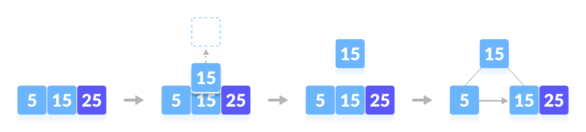

4. Insert 35.
   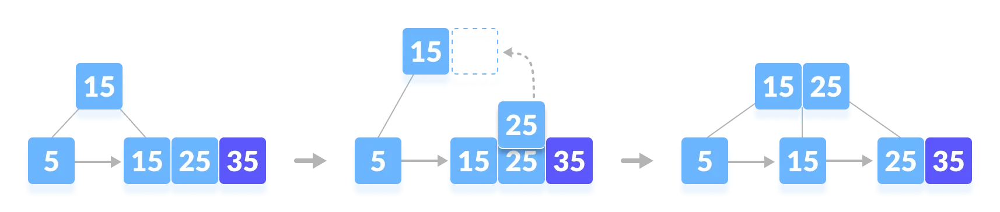

5. Insert 45.
   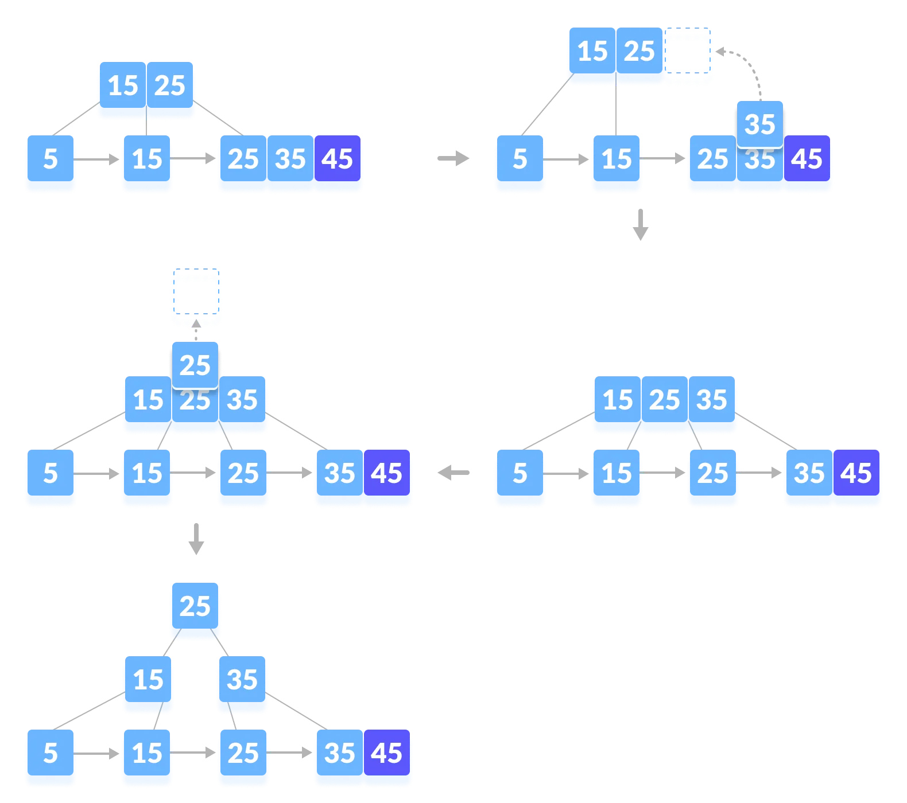

### Python Example

```python
# B+ tee in python


import math

# Node creation
class Node:
    def __init__(self, order):
        self.order = order
        self.values = []
        self.keys = []
        self.nextKey = None
        self.parent = None
        self.check_leaf = False

    # Insert at the leaf
    def insert_at_leaf(self, leaf, value, key):
        if (self.values):
            temp1 = self.values
            for i in range(len(temp1)):
                if (value == temp1[i]):
                    self.keys[i].append(key)
                    break
                elif (value < temp1[i]):
                    self.values = self.values[:i] + [value] + self.values[i:]
                    self.keys = self.keys[:i] + [[key]] + self.keys[i:]
                    break
                elif (i + 1 == len(temp1)):
                    self.values.append(value)
                    self.keys.append([key])
                    break
        else:
            self.values = [value]
            self.keys = [[key]]


# B plus tree
class BplusTree:
    def __init__(self, order):
        self.root = Node(order)
        self.root.check_leaf = True

    # Insert operation
    def insert(self, value, key):
        value = str(value)
        old_node = self.search(value)
        old_node.insert_at_leaf(old_node, value, key)

        if (len(old_node.values) == old_node.order):
            node1 = Node(old_node.order)
            node1.check_leaf = True
            node1.parent = old_node.parent
            mid = int(math.ceil(old_node.order / 2)) - 1
            node1.values = old_node.values[mid + 1:]
            node1.keys = old_node.keys[mid + 1:]
            node1.nextKey = old_node.nextKey
            old_node.values = old_node.values[:mid + 1]
            old_node.keys = old_node.keys[:mid + 1]
            old_node.nextKey = node1
            self.insert_in_parent(old_node, node1.values[0], node1)

    # Search operation for different operations
    def search(self, value):
        current_node = self.root
        while(current_node.check_leaf == False):
            temp2 = current_node.values
            for i in range(len(temp2)):
                if (value == temp2[i]):
                    current_node = current_node.keys[i + 1]
                    break
                elif (value < temp2[i]):
                    current_node = current_node.keys[i]
                    break
                elif (i + 1 == len(current_node.values)):
                    current_node = current_node.keys[i + 1]
                    break
        return current_node

    # Find the node
    def find(self, value, key):
        l = self.search(value)
        for i, item in enumerate(l.values):
            if item == value:
                if key in l.keys[i]:
                    return True
                else:
                    return False
        return False

    # Inserting at the parent
    def insert_in_parent(self, n, value, ndash):
        if (self.root == n):
            rootNode = Node(n.order)
            rootNode.values = [value]
            rootNode.keys = [n, ndash]
            self.root = rootNode
            n.parent = rootNode
            ndash.parent = rootNode
            return

        parentNode = n.parent
        temp3 = parentNode.keys
        for i in range(len(temp3)):
            if (temp3[i] == n):
                parentNode.values = parentNode.values[:i] + \
                    [value] + parentNode.values[i:]
                parentNode.keys = parentNode.keys[:i +
                                                  1] + [ndash] + parentNode.keys[i + 1:]
                if (len(parentNode.keys) > parentNode.order):
                    parentdash = Node(parentNode.order)
                    parentdash.parent = parentNode.parent
                    mid = int(math.ceil(parentNode.order / 2)) - 1
                    parentdash.values = parentNode.values[mid + 1:]
                    parentdash.keys = parentNode.keys[mid + 1:]
                    value_ = parentNode.values[mid]
                    if (mid == 0):
                        parentNode.values = parentNode.values[:mid + 1]
                    else:
                        parentNode.values = parentNode.values[:mid]
                    parentNode.keys = parentNode.keys[:mid + 1]
                    for j in parentNode.keys:
                        j.parent = parentNode
                    for j in parentdash.keys:
                        j.parent = parentdash
                    self.insert_in_parent(parentNode, value_, parentdash)

# Print the tree
def printTree(tree):
    lst = [tree.root]
    level = [0]
    leaf = None
    flag = 0
    lev_leaf = 0

    node1 = Node(str(level[0]) + str(tree.root.values))

    while (len(lst) != 0):
        x = lst.pop(0)
        lev = level.pop(0)
        if (x.check_leaf == False):
            for i, item in enumerate(x.keys):
                print(item.values)
        else:
            for i, item in enumerate(x.keys):
                print(item.values)
            if (flag == 0):
                lev_leaf = lev
                leaf = x
                flag = 1


record_len = 3
bplustree = BplusTree(record_len)
bplustree.insert('5', '33')
bplustree.insert('15', '21')
bplustree.insert('25', '31')
bplustree.insert('35', '41')
bplustree.insert('45', '10')

printTree(bplustree)

if(bplustree.find('5', '34')):
    print("Found")
else:
    print("Not found")
```

### Insertion Complexity

Time Complexity: `O(t.logt(n))`
The complexity is dominated by: `O(logt(n))`

## Deletion from a B+ Tree

Deleting an element on a B+ tree consists of three main events: **searching** the node where the key to be deleted exists, deleting the key and balancing the tree if required. **Underflow** is a situation when there is less number of keys in a node than the minimum number of keys it should hold.

### Deletion Operation

Before going through the steps below, one must know these facts about a B+ tree of degree **m**.

1. A node can have a maximum of m children. (i.e. 3)

2. A node can contain a maximum of `m - 1` keys. (i.e. 2)

3. A node should have a minimum of `[m/2]` children. (i.e. 2)

4. A node (except root node) should contain a minimum of `[m/2] - 1` keys. (i.e. 1)

While deleting a key, we have to take care of the keys present in the internal nodes (i.e. indexes) as well because the values are redundant in a B+ tree. Search the key to be deleted then follow the following steps.

#### Case I

The key to be deleted is present only at the leaf node not in the indexes (or internal nodes).
There are two cases for it:

1. There is more than the minimum number of keys in the node. Simply delete the key.
   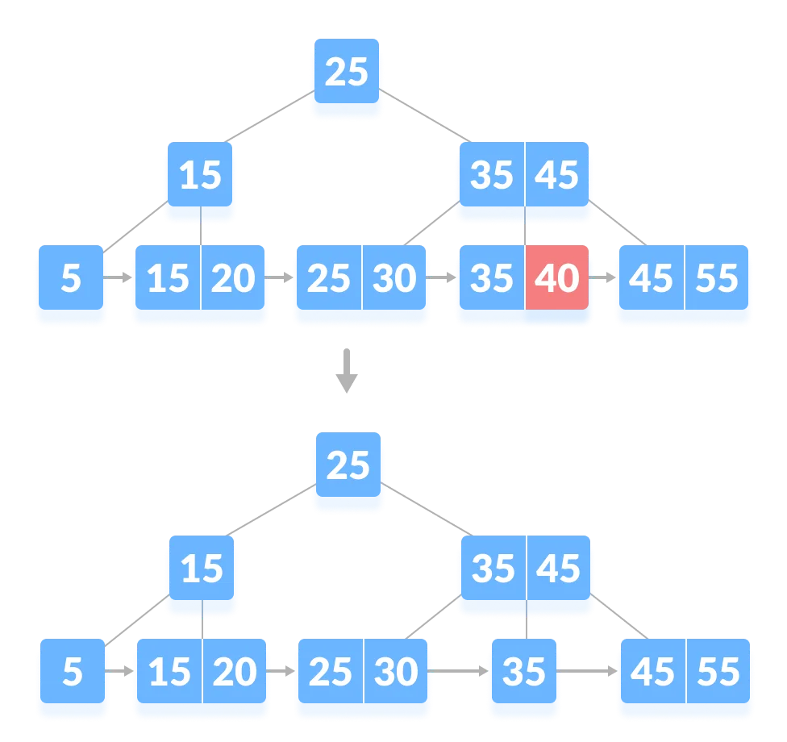

2. There is an exact minimum number of keys in the node. Delete the key and borrow a key from the immediate sibling. Add the median key of the sibling node to the parent.
   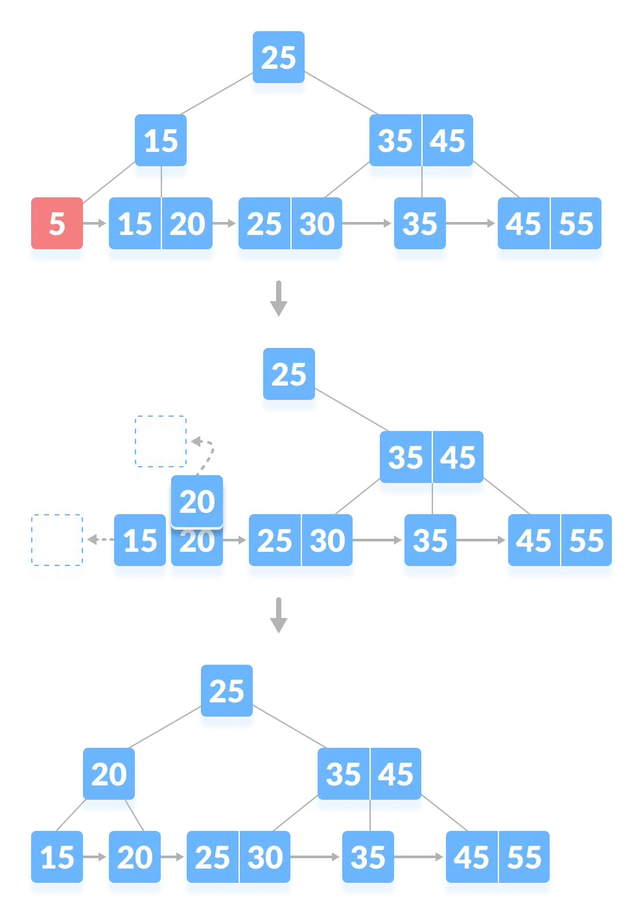

#### Case II

The key to be deleted is present in the internal nodes as well. Then we have to remove them from the internal nodes as well. There are the following cases for this situation.

1. If there is more than the minimum number of keys in the node, simply delete the key from the leaf node and delete the key from the internal node as well.
   Fill the empty space in the internal node with the inorder successor.
   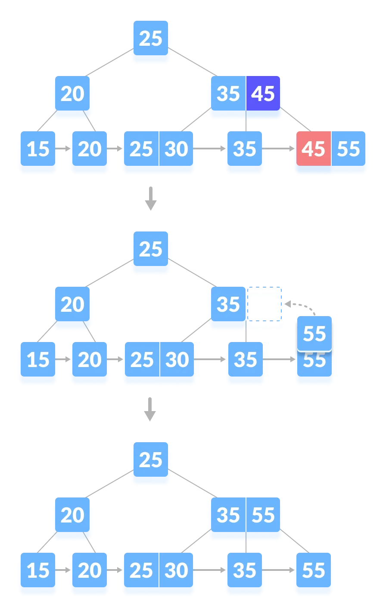

2. If there is an exact minimum number of keys in the node, then delete the key and borrow a key from its immediate sibling (through the parent).
   Fill the empty space created in the index (internal node) with the borrowed key.
   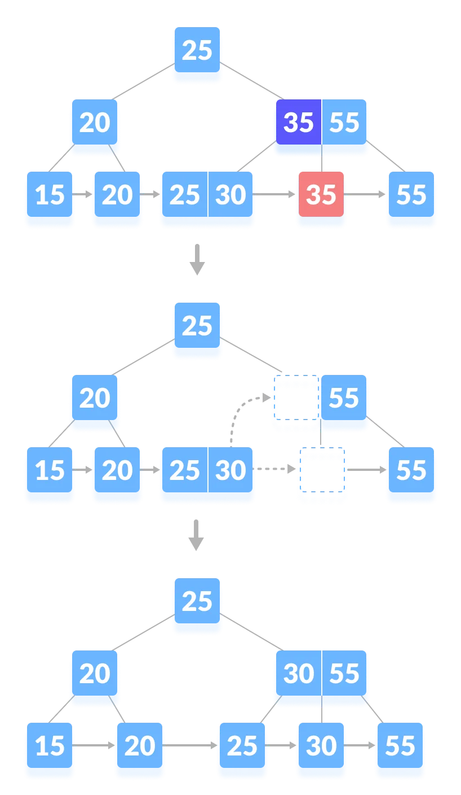

3. This case is similar to Case II(1) but here, empty space is generated above the immediate parent node.
   After deleting the key, merge the empty space with its sibling.
   Fill the empty space in the grandparent node with the inorder successor.
   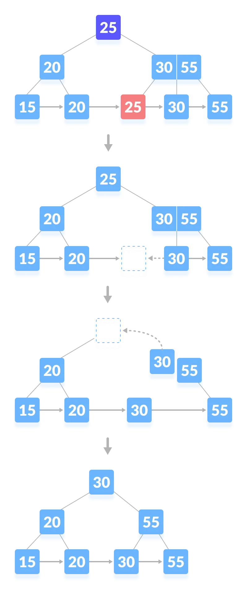

#### Case III

In this case, the height of the tree gets shrinked. It is a little complicated. Deleting 55 from the tree below leads to this condition. It can be understood in the illustrations below.
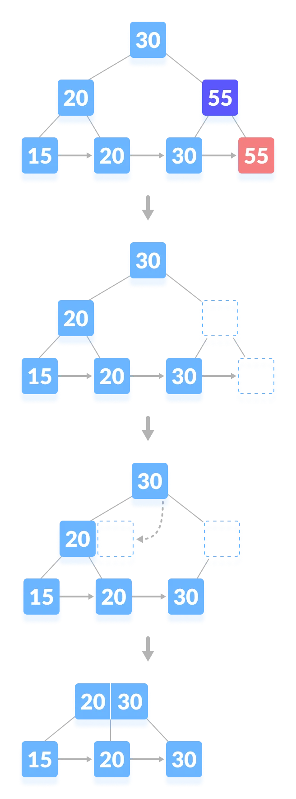

### Python Example

```python
# B+ tee in python


import math

# Node creation
class Node:
    def __init__(self, order):
        self.order = order
        self.values = []
        self.keys = []
        self.nextKey = None
        self.parent = None
        self.check_leaf = False

    # Insert at the leaf
    def insert_at_leaf(self, leaf, value, key):
        if (self.values):
            temp1 = self.values
            for i in range(len(temp1)):
                if (value == temp1[i]):
                    self.keys[i].append(key)
                    break
                elif (value < temp1[i]):
                    self.values = self.values[:i] + [value] + self.values[i:]
                    self.keys = self.keys[:i] + [[key]] + self.keys[i:]
                    break
                elif (i + 1 == len(temp1)):
                    self.values.append(value)
                    self.keys.append([key])
                    break
        else:
            self.values = [value]
            self.keys = [[key]]


# B plus tree
class BplusTree:
    def __init__(self, order):
        self.root = Node(order)
        self.root.check_leaf = True

    # Insert operation
    def insert(self, value, key):
        value = str(value)
        old_node = self.search(value)
        old_node.insert_at_leaf(old_node, value, key)

        if (len(old_node.values) == old_node.order):
            node1 = Node(old_node.order)
            node1.check_leaf = True
            node1.parent = old_node.parent
            mid = int(math.ceil(old_node.order / 2)) - 1
            node1.values = old_node.values[mid + 1:]
            node1.keys = old_node.keys[mid + 1:]
            node1.nextKey = old_node.nextKey
            old_node.values = old_node.values[:mid + 1]
            old_node.keys = old_node.keys[:mid + 1]
            old_node.nextKey = node1
            self.insert_in_parent(old_node, node1.values[0], node1)

    # Search operation for different operations
    def search(self, value):
        current_node = self.root
        while(current_node.check_leaf == False):
            temp2 = current_node.values
            for i in range(len(temp2)):
                if (value == temp2[i]):
                    current_node = current_node.keys[i + 1]
                    break
                elif (value < temp2[i]):
                    current_node = current_node.keys[i]
                    break
                elif (i + 1 == len(current_node.values)):
                    current_node = current_node.keys[i + 1]
                    break
        return current_node

    # Find the node
    def find(self, value, key):
        l = self.search(value)
        for i, item in enumerate(l.values):
            if item == value:
                if key in l.keys[i]:
                    return True
                else:
                    return False
        return False

    # Inserting at the parent
    def insert_in_parent(self, n, value, ndash):
        if (self.root == n):
            rootNode = Node(n.order)
            rootNode.values = [value]
            rootNode.keys = [n, ndash]
            self.root = rootNode
            n.parent = rootNode
            ndash.parent = rootNode
            return

        parentNode = n.parent
        temp3 = parentNode.keys
        for i in range(len(temp3)):
            if (temp3[i] == n):
                parentNode.values = parentNode.values[:i] + \
                    [value] + parentNode.values[i:]
                parentNode.keys = parentNode.keys[:i +
                                                  1] + [ndash] + parentNode.keys[i + 1:]
                if (len(parentNode.keys) > parentNode.order):
                    parentdash = Node(parentNode.order)
                    parentdash.parent = parentNode.parent
                    mid = int(math.ceil(parentNode.order / 2)) - 1
                    parentdash.values = parentNode.values[mid + 1:]
                    parentdash.keys = parentNode.keys[mid + 1:]
                    value_ = parentNode.values[mid]
                    if (mid == 0):
                        parentNode.values = parentNode.values[:mid + 1]
                    else:
                        parentNode.values = parentNode.values[:mid]
                    parentNode.keys = parentNode.keys[:mid + 1]
                    for j in parentNode.keys:
                        j.parent = parentNode
                    for j in parentdash.keys:
                        j.parent = parentdash
                    self.insert_in_parent(parentNode, value_, parentdash)

    # Delete a node
    def delete(self, value, key):
        node_ = self.search(value)

        temp = 0
        for i, item in enumerate(node_.values):
            if item == value:
                temp = 1

                if key in node_.keys[i]:
                    if len(node_.keys[i]) > 1:
                        node_.keys[i].pop(node_.keys[i].index(key))
                    elif node_ == self.root:
                        node_.values.pop(i)
                        node_.keys.pop(i)
                    else:
                        node_.keys[i].pop(node_.keys[i].index(key))
                        del node_.keys[i]
                        node_.values.pop(node_.values.index(value))
                        self.deleteEntry(node_, value, key)
                else:
                    print("Value not in Key")
                    return
        if temp == 0:
            print("Value not in Tree")
            return

    # Delete an entry
    def deleteEntry(self, node_, value, key):

        if not node_.check_leaf:
            for i, item in enumerate(node_.keys):
                if item == key:
                    node_.keys.pop(i)
                    break
            for i, item in enumerate(node_.values):
                if item == value:
                    node_.values.pop(i)
                    break

        if self.root == node_ and len(node_.keys) == 1:
            self.root = node_.keys[0]
            node_.keys[0].parent = None
            del node_
            return
        elif (len(node_.keys) < int(math.ceil(node_.order / 2)) and node_.check_leaf == False) or (len(node_.values) < int(math.ceil((node_.order - 1) / 2)) and node_.check_leaf == True):

            is_predecessor = 0
            parentNode = node_.parent
            PrevNode = -1
            NextNode = -1
            PrevK = -1
            PostK = -1
            for i, item in enumerate(parentNode.keys):

                if item == node_:
                    if i > 0:
                        PrevNode = parentNode.keys[i - 1]
                        PrevK = parentNode.values[i - 1]

                    if i < len(parentNode.keys) - 1:
                        NextNode = parentNode.keys[i + 1]
                        PostK = parentNode.values[i]

            if PrevNode == -1:
                ndash = NextNode
                value_ = PostK
            elif NextNode == -1:
                is_predecessor = 1
                ndash = PrevNode
                value_ = PrevK
            else:
                if len(node_.values) + len(NextNode.values) < node_.order:
                    ndash = NextNode
                    value_ = PostK
                else:
                    is_predecessor = 1
                    ndash = PrevNode
                    value_ = PrevK

            if len(node_.values) + len(ndash.values) < node_.order:
                if is_predecessor == 0:
                    node_, ndash = ndash, node_
                ndash.keys += node_.keys
                if not node_.check_leaf:
                    ndash.values.append(value_)
                else:
                    ndash.nextKey = node_.nextKey
                ndash.values += node_.values

                if not ndash.check_leaf:
                    for j in ndash.keys:
                        j.parent = ndash

                self.deleteEntry(node_.parent, value_, node_)
                del node_
            else:
                if is_predecessor == 1:
                    if not node_.check_leaf:
                        ndashpm = ndash.keys.pop(-1)
                        ndashkm_1 = ndash.values.pop(-1)
                        node_.keys = [ndashpm] + node_.keys
                        node_.values = [value_] + node_.values
                        parentNode = node_.parent
                        for i, item in enumerate(parentNode.values):
                            if item == value_:
                                p.values[i] = ndashkm_1
                                break
                    else:
                        ndashpm = ndash.keys.pop(-1)
                        ndashkm = ndash.values.pop(-1)
                        node_.keys = [ndashpm] + node_.keys
                        node_.values = [ndashkm] + node_.values
                        parentNode = node_.parent
                        for i, item in enumerate(p.values):
                            if item == value_:
                                parentNode.values[i] = ndashkm
                                break
                else:
                    if not node_.check_leaf:
                        ndashp0 = ndash.keys.pop(0)
                        ndashk0 = ndash.values.pop(0)
                        node_.keys = node_.keys + [ndashp0]
                        node_.values = node_.values + [value_]
                        parentNode = node_.parent
                        for i, item in enumerate(parentNode.values):
                            if item == value_:
                                parentNode.values[i] = ndashk0
                                break
                    else:
                        ndashp0 = ndash.keys.pop(0)
                        ndashk0 = ndash.values.pop(0)
                        node_.keys = node_.keys + [ndashp0]
                        node_.values = node_.values + [ndashk0]
                        parentNode = node_.parent
                        for i, item in enumerate(parentNode.values):
                            if item == value_:
                                parentNode.values[i] = ndash.values[0]
                                break

                if not ndash.check_leaf:
                    for j in ndash.keys:
                        j.parent = ndash
                if not node_.check_leaf:
                    for j in node_.keys:
                        j.parent = node_
                if not parentNode.check_leaf:
                    for j in parentNode.keys:
                        j.parent = parentNode


# Print the tree
def printTree(tree):
    lst = [tree.root]
    level = [0]
    leaf = None
    flag = 0
    lev_leaf = 0

    node1 = Node(str(level[0]) + str(tree.root.values))

    while (len(lst) != 0):
        x = lst.pop(0)
        lev = level.pop(0)
        if (x.check_leaf == False):
            for i, item in enumerate(x.keys):
                print(item.values)
        else:
            for i, item in enumerate(x.keys):
                print(item.values)
            if (flag == 0):
                lev_leaf = lev
                leaf = x
                flag = 1


record_len = 3
bplustree = BplusTree(record_len)
bplustree.insert('5', '33')
bplustree.insert('15', '21')
bplustree.insert('25', '31')
bplustree.insert('35', '41')
bplustree.insert('45', '10')

printTree(bplustree)

if(bplustree.find('5', '34')):
    print("Found")
else:
    print("Not found")
```
