# Day 16 (09 August 2023)

## [Datastructures and Algorithms](https://www.programiz.com/dsa)

## Red Black Tree

Red-Black tree is a self-balancing binary search tree in which each node contains an extra bit for denoting the color of the node, either red or black.

A red-black tree satisfies the following properties:

1. **Red/Black Property:** Every node is colored, either red or black.

2. **Root Property:** The root is black.

3. **Leaf Property:** Every leaf(NIL) is black.

4. **Red Property:** If a red node has children then, the children are always black.

5. **Depth Property:** For each node, any simple path from this node to any of its descendant leaf has the same black-depth (the number of black nodes).

An example of a red-black tree is:
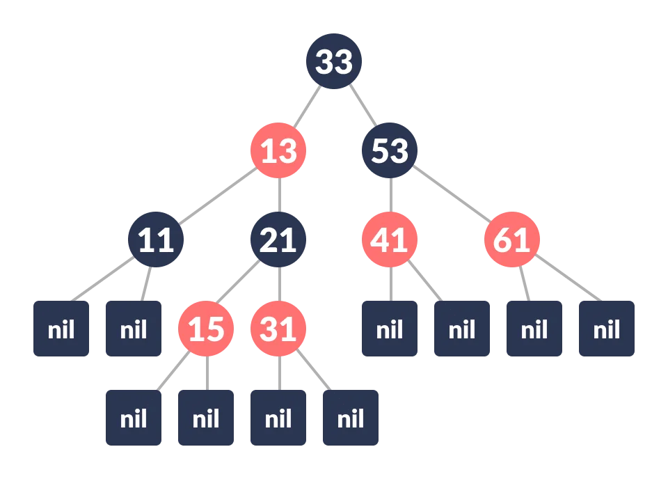

Each node has the following attributes:

- color
- key
- leftChild
- rightChild
- parent (except root node)

**How the red-black tree maintains the property of self-balancing?**

The red-black color is meant for balancing the tree.

The limitations put on the node colors ensure that any simple path from the root to a leaf is not more than twice as long as any other such path. It helps in maintaining the self-balacing property of the red-black tree.

### Operations on a Red-Black Tree

Various operations that can be performed on a red-black tree are:

#### Rotating the subtrees in a Red-Black Tree

In rotation operation, the positions of the nodes of a subtree are interchanged.

Rotation operation is used for maintaining the properties of a red-black tree when they are violated by the other operations such as insertion and deletion.

There are two types of roations:

#### Left Rotate

In left-rotation, the arrangement of the nodes on the right is transformed into the arrangements on the left node.

**Algorithm**

1. Let the initial tree be:
<div align="center" >
    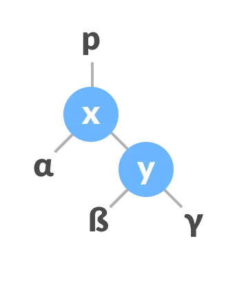
</div>

2. If `y` has a left subtree, assign `x` as the parent of the left subtree of `y`.
<div align="center" >
    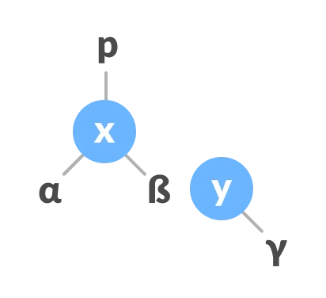
</div>

3. If the parent of `x` is `NULL`, make `y` as the root of the tree.

4. Else if `x` is the left child of `p`, make `y` as the left child of `p`.

5. Else assign `y` as the right child of `p`.
<div align="center" >
    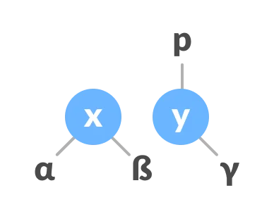
</div>

6. Make `y` as the parent of `x`.
<div align="center" >
    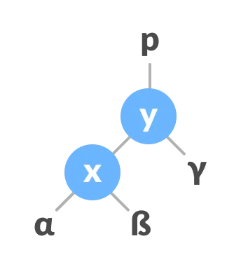
</div>

#### Right Rotate

In right-rotation, the arrangement of the nodes on the left is transformed into the arrangements on the right node.

1. Let the initial tree be:
<div align="center" >
    
</div>

2. If `x` has a right subtree, assign `y` as the parent of the right subtree of `x`.
<div align="center" >
    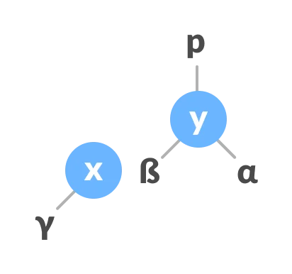
</div>

3. If the parent of `y` is `NILL`, make `x` as the root of the tree.

4. Else if `y` is the right child of its parent `p`, make `x` as the right child of `p`.

5. Else assign `x` as the left child of `p`.
<div align="center" >
    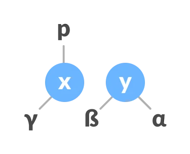
</div>

6. Make `x` as the parent of `y`.
<div align="center" >
    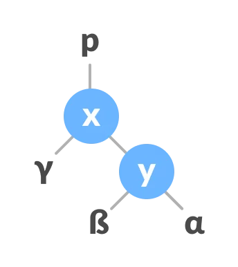
</div>

#### Left-Right and Right-Left Rotate

In left-right rotation, the arrangements are first shifted to the left ans then to the right.

1. Do left rotation on x-y.
   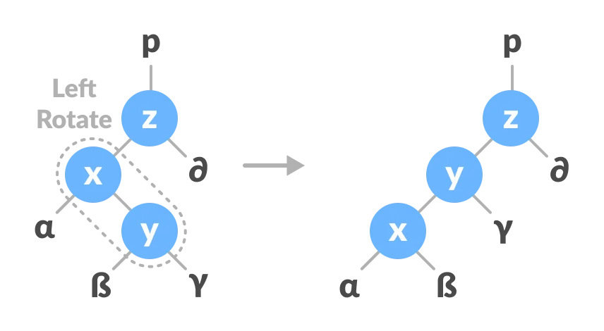

2. Do right rotation on z-y.
   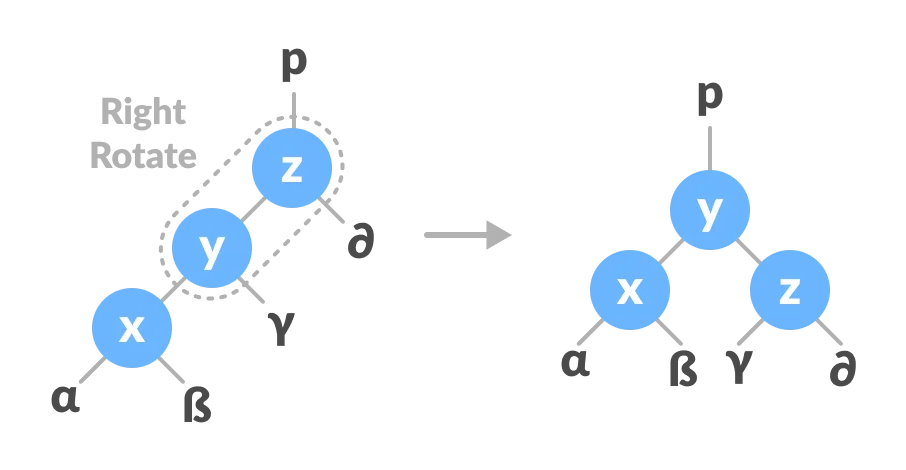

In right-left rotation, the arrangements are first shifted to the right and then to the left.

1. Do right rotation on x-y.
   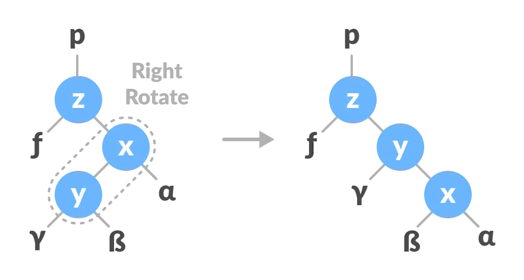

2. Do left rotation on z-y.
   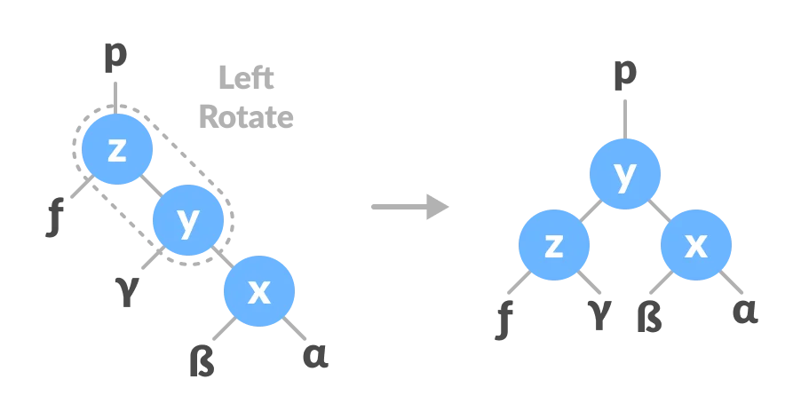

#### Inserting an element into a Red-Black Tree

While inserting a new node, the new node is always inserted as a RED node. After insertion of a new node, if the tree is violating the properties of the red-black tree then, we do the following operations.

1. Recolor
2. Rotation

#### Algorithm to insert a node

Following steps are followed for inserting a new element into a red-black tree:

1. Let y be the leaf (ie. `NIL`) and x be the root of the tree.

2. Check if the tree is empty (ie. whether `x` is `NIL`). If yes, insert `newNode` as a root node and color it black.

3. Else, repeat following steps until leaf(`NIL`) is reached.
   a. Compare `newKey` with `rootKey`.
   b. If `newKey` is greater than rootKey, traverse through the right subtree.
   c. Else traverse through the left subtree.

4. Assign the parent of the leaf as a parent of `newNode`.

5. If `leafKey` is greater than `newKey`, make `newNode` as `rightChild`.

6. Else, make `newNode` as `leftChild`.

7. Assign `NULL` to the left and `rightChild` of `newNode`.

8. Assign RED color to `newNode`.

9. Call InsertFix-algorithm to maintain the property of red-black tree if violated.

**Why newely inserted nodes are always red in a red-black tree?**

This is because inserting a red node does not violate the depth property of a red-black tree.

If you attach a red node to a red node, then the rule is violated but it is easier to fix this problem than the problem introduced by violating the depth property.

#### Algorithm to maintain red-black property after insertion

This algorithm is used for maintaining the property of a red-black tree if the insertion of a newNode violates this property.

1. Do the following while the parent of `newNode` `p` is RED.

2. If `p` is the left child of `grandParent` `gP` of `z`, do the following.
   **Case-I:**
   a. If the color of the right child of `gP` of `z` is RED, set the color of both the children of `gP` as BLACK and the color of `gP` as RED.
   b. Assign `gP` to `newNode`.

   **Case-II:**
   c. Else if `newNode` is the right child of `p` then, assign `p` to `newNode`.
   d. Left-Rotate `newNode`.

   **Case-III:**
   e. Set color of `p` as BLACK and color of `gP` as RED.
   f. Right-Rotate `gP`.

3. Else, do the following.
   a. If the color of the left child of `gP` of `z` is RED, set the color of both the children of `gP` as BLACK and the color of `gP` as RED.
   b. Assign `gP` to `newNode`.
   c. Else if newNode is the left child of `p` then, assign `p` to `newNode` and Right-Rotate `newNode`.
   d. Set color of `p` as BLACK and color of `gP` as RED.
   e. Left-Rotate `gP`

4. Set the root of the tree as BLACK.

#### Deleting an element from a Red-Black Tree

This operation removes a node from the tree. After deleting a node, the red-black property is maintained again.

#### Algorithm to delete a node

1. Save the color of `nodeToBeDeleted` in `originalColor`.

2. If the left child of `nodeToBeDeleted` is `NULL`
   a. Assign the right child of `nodeToBeDeleted` to x.
   b. Transplant `nodeToBeDeleted` with `x`.

3. Else if the right child of `nodeToBeDeleted` is `NULL`
   a. Assign the left child of `nodeToBeDeleted` into `x`.
   b. Transplant `nodeToBeDeleted` with `x`.

4. Else
   a. Assign the minimum of right subtree of `noteToBeDeleted` into `y`.
   b. Save the color of `y` in `originalColor`.
   c. Assign the `rightChild` of `y` into `x`.
   d. If `y` is a child of `nodeToBeDeleted`, then set the parent of `x` as `y`.
   e. Else, transplant `y` with `rightChild` of `y`.
   f. Transplant `nodeToBeDeleted` with `y`.
   g. Set the color of y with originalColor.

5. If the originalColor is BLACK, call DeleteFix(x).

#### Algorithm to maintain Red-Black property after deletion

This algorithm is implemented when a black node is deleted because it violates the black depth property of the red-black tree.

This violation is corrected by assuming that node `x` (which is occupying `y`'s original position) has an extra black. This makes node `x` neither red nor black. It is either doubly black or black-and-red. This violates the red-black properties.

However, the color attribute of `x` is not changed rather the extra black is represented in `x`'s pointing to the node.

The extra black can be removed if

1. It reaches the root node.
2. If x points to a red-black node. In this case, x is colored black.
3. Suitable rotations and recoloring are performed.

The following algorithm retains the properties of a red-black tree.

1. Do the following until the `x` is not the root of the tree and the color of `x` is BLACK

2. If `x` is the left child of its parent then,
   a. Assign w to the sibling of `x`.
   b.If the right child of parent of `x` is RED,
   **Case-I:**
   a. Set the color of the right child of the parent of `x` as BLACK.
   b. Set the color of the parent of `x` as RED.
   c. Left-Rotate the parent of `x`.
   d. Assign the `rightChild` of the parent of `x` to `w`.
   c. If the color of both the right and the `leftChild` of `w` is BLACK,
   **Case-II:**
   a. Set the color of `w` as RED
   b. Assign the parent of `x` to `x`.
   d. Else if the color of the `rightChild` of `w` is BLACK
   **Case-III:**
   a. Set the color of the `leftChild` of `w` as BLACK
   b. Set the color of `w` as RED
   c. Right-Rotate `w`.
   d. Assign the `rightChild` of the parent of `x` to `w`.
   e. If any of the above cases do not occur, then do the following.
   **Case-IV:**
   a. Set the color of `w` as the color of the parent of `x`.
   b. Set the color of the parent of `x` as BLACK.
   c. Set the color of the right child of `w` as BLACK.
   d. Left-Rotate the parent of `x`.
   e. Set `x` as the root of the tree.

3. Else the same as above with right changed to left and vice versa.

4. Set the color of `x` as BLACK.

### Python Example

```python
# Implementing Red-Black Tree in Python


import sys


# Node creation
class Node():
    def __init__(self, item):
        self.item = item
        self.parent = None
        self.left = None
        self.right = None
        self.color = 1


class RedBlackTree():
    def __init__(self):
        self.TNULL = Node(0)
        self.TNULL.color = 0
        self.TNULL.left = None
        self.TNULL.right = None
        self.root = self.TNULL

    # Preorder
    def pre_order_helper(self, node):
        if node != TNULL:
            sys.stdout.write(node.item + " ")
            self.pre_order_helper(node.left)
            self.pre_order_helper(node.right)

    # Inorder
    def in_order_helper(self, node):
        if node != TNULL:
            self.in_order_helper(node.left)
            sys.stdout.write(node.item + " ")
            self.in_order_helper(node.right)

    # Postorder
    def post_order_helper(self, node):
        if node != TNULL:
            self.post_order_helper(node.left)
            self.post_order_helper(node.right)
            sys.stdout.write(node.item + " ")

    # Search the tree
    def search_tree_helper(self, node, key):
        if node == TNULL or key == node.item:
            return node

        if key < node.item:
            return self.search_tree_helper(node.left, key)
        return self.search_tree_helper(node.right, key)

    # Balancing the tree after deletion
    def delete_fix(self, x):
        while x != self.root and x.color == 0:
            if x == x.parent.left:
                s = x.parent.right
                if s.color == 1:
                    s.color = 0
                    x.parent.color = 1
                    self.left_rotate(x.parent)
                    s = x.parent.right

                if s.left.color == 0 and s.right.color == 0:
                    s.color = 1
                    x = x.parent
                else:
                    if s.right.color == 0:
                        s.left.color = 0
                        s.color = 1
                        self.right_rotate(s)
                        s = x.parent.right

                    s.color = x.parent.color
                    x.parent.color = 0
                    s.right.color = 0
                    self.left_rotate(x.parent)
                    x = self.root
            else:
                s = x.parent.left
                if s.color == 1:
                    s.color = 0
                    x.parent.color = 1
                    self.right_rotate(x.parent)
                    s = x.parent.left

                if s.right.color == 0 and s.right.color == 0:
                    s.color = 1
                    x = x.parent
                else:
                    if s.left.color == 0:
                        s.right.color = 0
                        s.color = 1
                        self.left_rotate(s)
                        s = x.parent.left

                    s.color = x.parent.color
                    x.parent.color = 0
                    s.left.color = 0
                    self.right_rotate(x.parent)
                    x = self.root
        x.color = 0

    def __rb_transplant(self, u, v):
        if u.parent == None:
            self.root = v
        elif u == u.parent.left:
            u.parent.left = v
        else:
            u.parent.right = v
        v.parent = u.parent

    # Node deletion
    def delete_node_helper(self, node, key):
        z = self.TNULL
        while node != self.TNULL:
            if node.item == key:
                z = node

            if node.item <= key:
                node = node.right
            else:
                node = node.left

        if z == self.TNULL:
            print("Cannot find key in the tree")
            return

        y = z
        y_original_color = y.color
        if z.left == self.TNULL:
            x = z.right
            self.__rb_transplant(z, z.right)
        elif (z.right == self.TNULL):
            x = z.left
            self.__rb_transplant(z, z.left)
        else:
            y = self.minimum(z.right)
            y_original_color = y.color
            x = y.right
            if y.parent == z:
                x.parent = y
            else:
                self.__rb_transplant(y, y.right)
                y.right = z.right
                y.right.parent = y

            self.__rb_transplant(z, y)
            y.left = z.left
            y.left.parent = y
            y.color = z.color
        if y_original_color == 0:
            self.delete_fix(x)

    # Balance the tree after insertion
    def fix_insert(self, k):
        while k.parent.color == 1:
            if k.parent == k.parent.parent.right:
                u = k.parent.parent.left
                if u.color == 1:
                    u.color = 0
                    k.parent.color = 0
                    k.parent.parent.color = 1
                    k = k.parent.parent
                else:
                    if k == k.parent.left:
                        k = k.parent
                        self.right_rotate(k)
                    k.parent.color = 0
                    k.parent.parent.color = 1
                    self.left_rotate(k.parent.parent)
            else:
                u = k.parent.parent.right

                if u.color == 1:
                    u.color = 0
                    k.parent.color = 0
                    k.parent.parent.color = 1
                    k = k.parent.parent
                else:
                    if k == k.parent.right:
                        k = k.parent
                        self.left_rotate(k)
                    k.parent.color = 0
                    k.parent.parent.color = 1
                    self.right_rotate(k.parent.parent)
            if k == self.root:
                break
        self.root.color = 0

    # Printing the tree
    def __print_helper(self, node, indent, last):
        if node != self.TNULL:
            sys.stdout.write(indent)
            if last:
                sys.stdout.write("R----")
                indent += "     "
            else:
                sys.stdout.write("L----")
                indent += "|    "

            s_color = "RED" if node.color == 1 else "BLACK"
            print(str(node.item) + "(" + s_color + ")")
            self.__print_helper(node.left, indent, False)
            self.__print_helper(node.right, indent, True)

    def preorder(self):
        self.pre_order_helper(self.root)

    def inorder(self):
        self.in_order_helper(self.root)

    def postorder(self):
        self.post_order_helper(self.root)

    def searchTree(self, k):
        return self.search_tree_helper(self.root, k)

    def minimum(self, node):
        while node.left != self.TNULL:
            node = node.left
        return node

    def maximum(self, node):
        while node.right != self.TNULL:
            node = node.right
        return node

    def successor(self, x):
        if x.right != self.TNULL:
            return self.minimum(x.right)

        y = x.parent
        while y != self.TNULL and x == y.right:
            x = y
            y = y.parent
        return y

    def predecessor(self,  x):
        if (x.left != self.TNULL):
            return self.maximum(x.left)

        y = x.parent
        while y != self.TNULL and x == y.left:
            x = y
            y = y.parent

        return y

    def left_rotate(self, x):
        y = x.right
        x.right = y.left
        if y.left != self.TNULL:
            y.left.parent = x

        y.parent = x.parent
        if x.parent == None:
            self.root = y
        elif x == x.parent.left:
            x.parent.left = y
        else:
            x.parent.right = y
        y.left = x
        x.parent = y

    def right_rotate(self, x):
        y = x.left
        x.left = y.right
        if y.right != self.TNULL:
            y.right.parent = x

        y.parent = x.parent
        if x.parent == None:
            self.root = y
        elif x == x.parent.right:
            x.parent.right = y
        else:
            x.parent.left = y
        y.right = x
        x.parent = y

    def insert(self, key):
        node = Node(key)
        node.parent = None
        node.item = key
        node.left = self.TNULL
        node.right = self.TNULL
        node.color = 1

        y = None
        x = self.root

        while x != self.TNULL:
            y = x
            if node.item < x.item:
                x = x.left
            else:
                x = x.right

        node.parent = y
        if y == None:
            self.root = node
        elif node.item < y.item:
            y.left = node
        else:
            y.right = node

        if node.parent == None:
            node.color = 0
            return

        if node.parent.parent == None:
            return

        self.fix_insert(node)

    def get_root(self):
        return self.root

    def delete_node(self, item):
        self.delete_node_helper(self.root, item)

    def print_tree(self):
        self.__print_helper(self.root, "", True)


if __name__ == "__main__":
    bst = RedBlackTree()

    bst.insert(55)
    bst.insert(40)
    bst.insert(65)
    bst.insert(60)
    bst.insert(75)
    bst.insert(57)

    bst.print_tree()

    print("\nAfter deleting an element")
    bst.delete_node(40)
    bst.print_tree()
```

### Red-Black Tree Applications

1. To implement finite maps

2. To implement Java packages: `java.util.TreeMap` and `java.util.TreeSet`

3. To implement Standard Template Libraries (STL) in C++: multiset, map, multimap

4. In Linux Kernal
