# Day 17 (11 August 2023)

## [Datastructures and Algorithms](https://www.programiz.com/dsa)

## Insertion in a Red-Black Tree

Red-Black tree is a self-balancing binary search tree in which each node, either red or black.

While inserting a new node, the new node is always inserted as a RED node. After insertion of a new node, if the tree is violating the properties of the red-black tree then, we do the following operations.

1. Recolor
2. Rotation

### Algorithm to Insert a New Node

Following steps are followed for inserting a new element into a red-black tree:

1. The `newNode` be:
<div align="center" >
    
</div>

2. Let y be the leaf (ie. `NIL`) and `x` be the root of the tree. The new node is inserted in the following tree.
   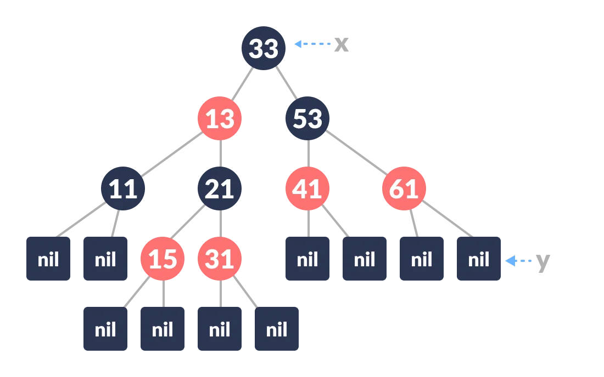

3. Check if the tree is empty (ie. whether `x` is `NIL`). If yes, insert `newNode` as a root node and color it black.

4. Else, repeat steps following steps until leaf(`NIL`) is reached.
   a. Compare `newKey` with `rootKey`.
   b. If `newKey` is greater than `rootKey`, traverse through the right subtree.
   c. Else traverse through the left subtree.
   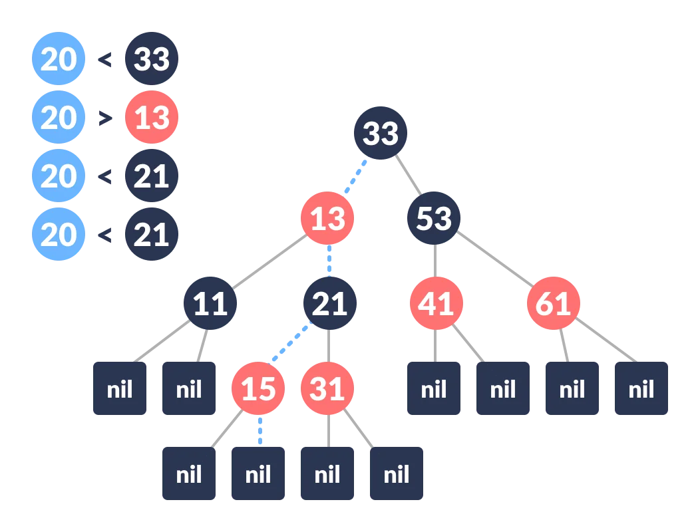

5. Assign the parent of the leaf as parent of `newNode`.

6. If `leafKey` is greater than `newKey`, make `newNode` as `rightChild`.

7. Else, make `newNode` as `leftChild`.
<div align="center" >
    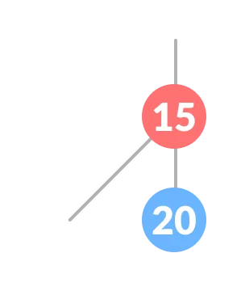
</div>

8. Assign `NULL` to the left and `rightChild` of `newNode`.

9. Assign RED color to `newNode`.
   <div align="center" >
    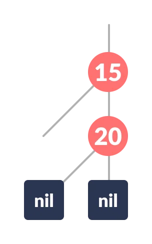
   </div>

10. Call insertFix-algorithm to maintain the property of red-black tree if violated.

**Why newly inserted nodes are always red in a red-black tree?**
This is beacuse inserting a red node does not violate the depth property of a red-black tree.

If you attach a red node to a red node, then the rule is violated but it is easier to fix this problem than the problem introduced by violating the depth property.

### Algorithm to Maintain Red-BLack Property After Insertion

This algorithm is used for maintaining the property of a red-black tree if insertion of a newNode violates this property.

1. Do the following until the parent of `newNode` `p` is RED.

2. If `p` is the left child of `grandParent` `gP` of `newNode`, do the following.
   **Case-I:**
   a. If the color of the right child of `gP` of `newNode` is RED, set the color of both the children of `gP` as BLACK and the color of `gP` as RED.
   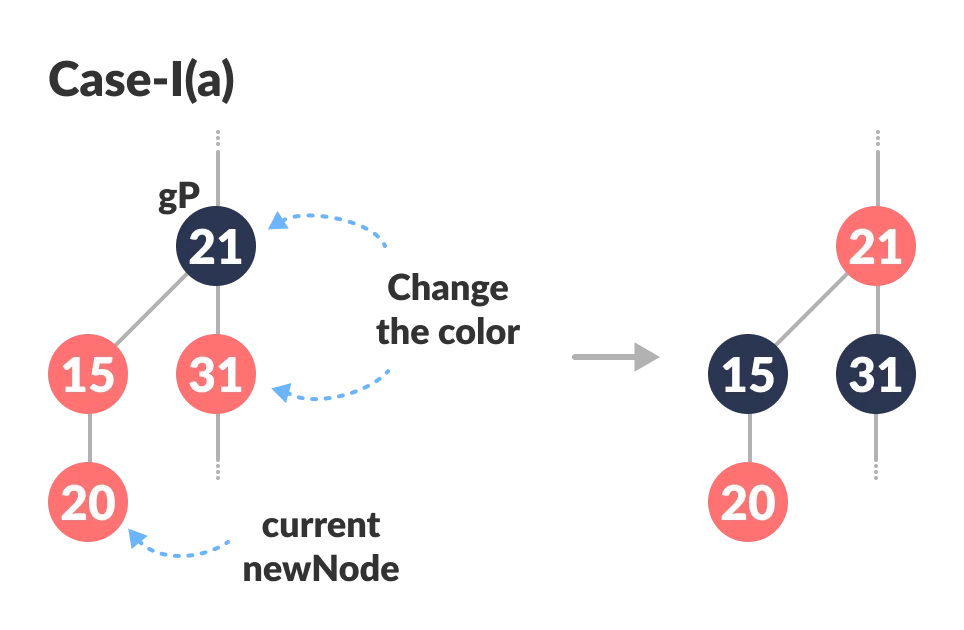

   b. Assign `gP` to `newNode`.
   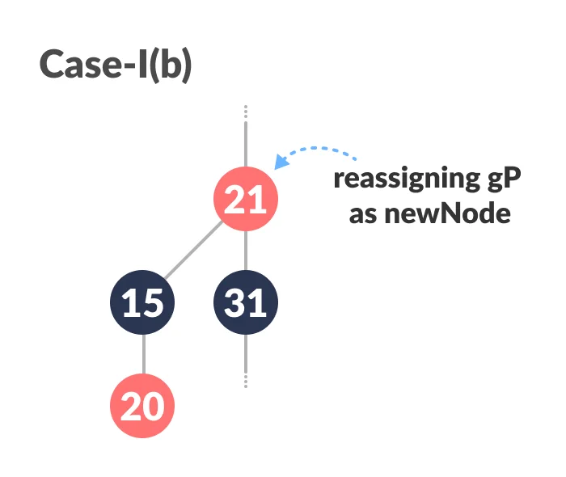

   **Case-II:**
   c. (Before moving on to this step, while loop is checked. If conditions are not satisfied, it the loop is broken.)
   Else if `newNode` is the right child of `p` then, assign `p` to `newNode`.
   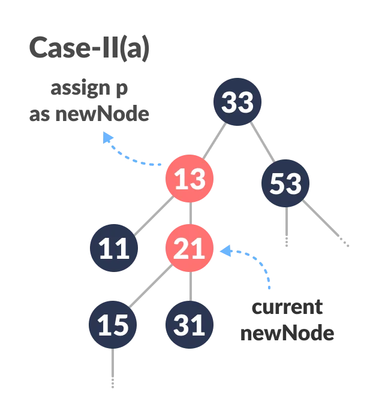

   d.Left-Rotate `newNode`.
   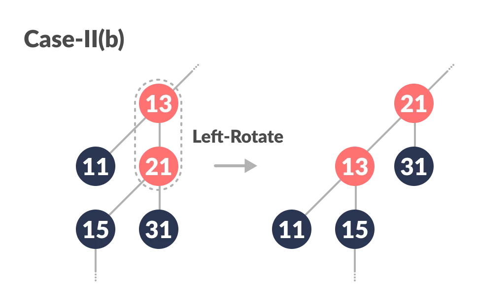

   **Case-III:**
   e. (Before moving on to this step, while loop is checked. If conditions are not satisfied, it the loop is broken.)
   Set color of `p` as BLACK and color of `gP` as RED.
   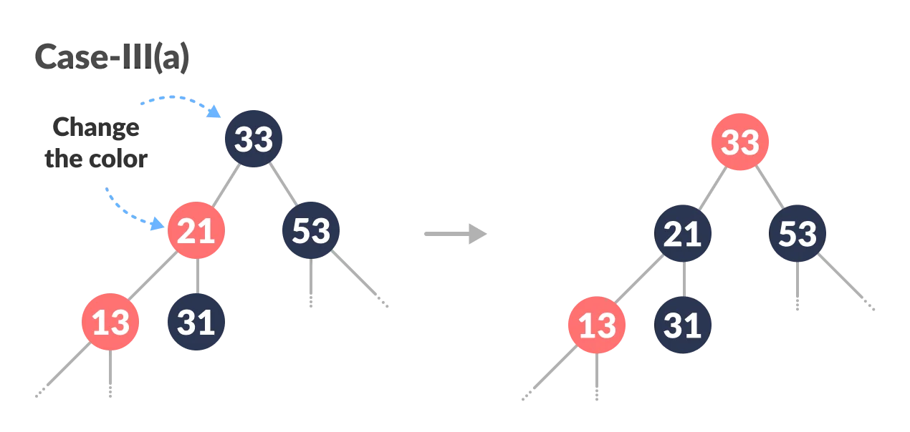

   f. Right-Rotate `gP`.
   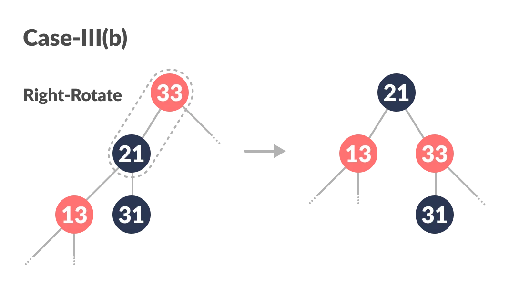

3. Else, do the following.
   a. If the color of the left child of `gP` of `z` is RED, set the color of both the children of `gP` as BLACK and the color of `gP` as RED.

   b. Assign `gP` to `newNode`.

   c. Else if `newNode` is the left child of `p` then, assign `p` to `newNode` and Right-Rotate `newNode`.

   d. Set color of `p` as BLACK and color of `gP` as RED.

   e. Left-Rotate

4. (This step is performed after coming out of the while loop.)
   Set the root of the tree as BLACK.
   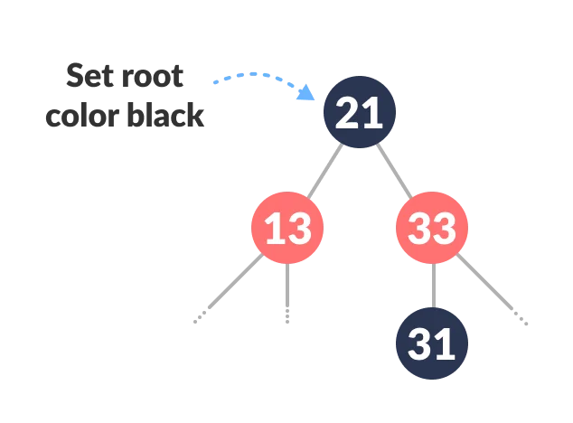

The final tree look like this:
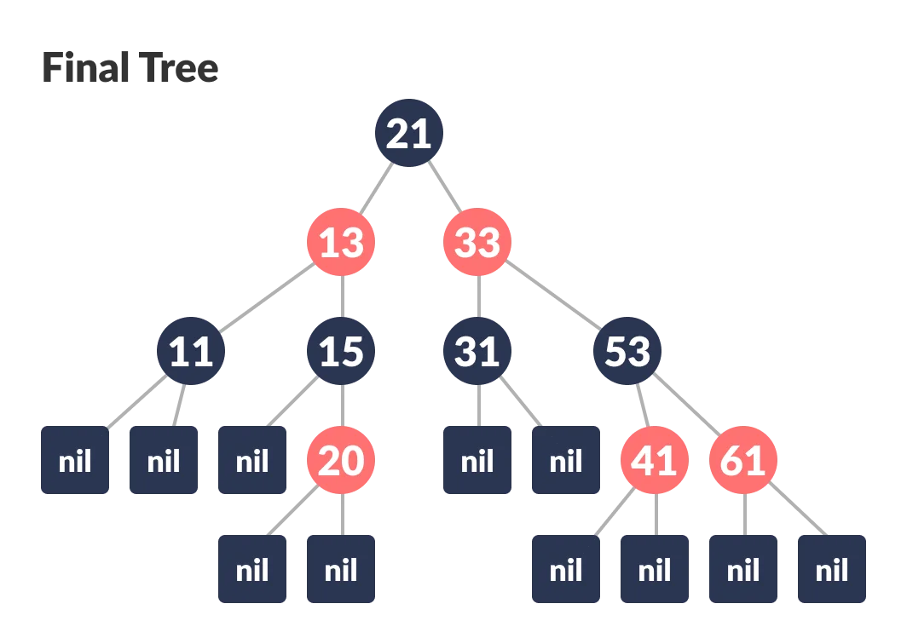

### Python Example

```python
# Implementing Red-Black Tree in Python


import sys

# Node creation
class Node():
    def __init__(self, item):
        self.item = item
        self.parent = None
        self.left = None
        self.right = None
        self.color = 1


class RedBlackTree():
    def __init__(self):
        self.TNULL = Node(0)
        self.TNULL.color = 0
        self.TNULL.left = None
        self.TNULL.right = None
        self.root = self.TNULL

    # Preorder
    def pre_order_helper(self, node):
        if node != TNULL:
            sys.stdout.write(node.item + " ")
            self.pre_order_helper(node.left)
            self.pre_order_helper(node.right)

    # Inorder
    def in_order_helper(self, node):
        if node != TNULL:
            self.in_order_helper(node.left)
            sys.stdout.write(node.item + " ")
            self.in_order_helper(node.right)

    # Postorder
    def post_order_helper(self, node):
        if node != TNULL:
            self.post_order_helper(node.left)
            self.post_order_helper(node.right)
            sys.stdout.write(node.item + " ")

    # Search the tree
    def search_tree_helper(self, node, key):
        if node == TNULL or key == node.item:
            return node

        if key < node.item:
            return self.search_tree_helper(node.left, key)
        return self.search_tree_helper(node.right, key)

    # Balance the tree after insertion
    def fix_insert(self, k):
        while k.parent.color == 1:
            if k.parent == k.parent.parent.right:
                u = k.parent.parent.left
                if u.color == 1:
                    u.color = 0
                    k.parent.color = 0
                    k.parent.parent.color = 1
                    k = k.parent.parent
                else:
                    if k == k.parent.left:
                        k = k.parent
                        self.right_rotate(k)
                    k.parent.color = 0
                    k.parent.parent.color = 1
                    self.left_rotate(k.parent.parent)
            else:
                u = k.parent.parent.right

                if u.color == 1:
                    u.color = 0
                    k.parent.color = 0
                    k.parent.parent.color = 1
                    k = k.parent.parent
                else:
                    if k == k.parent.right:
                        k = k.parent
                        self.left_rotate(k)
                    k.parent.color = 0
                    k.parent.parent.color = 1
                    self.right_rotate(k.parent.parent)
            if k == self.root:
                break
        self.root.color = 0

    # Printing the tree
    def __print_helper(self, node, indent, last):
        if node != self.TNULL:
            sys.stdout.write(indent)
            if last:
                sys.stdout.write("R----")
                indent += "     "
            else:
                sys.stdout.write("L----")
                indent += "|    "

            s_color = "RED" if node.color == 1 else "BLACK"
            print(str(node.item) + "(" + s_color + ")")
            self.__print_helper(node.left, indent, False)
            self.__print_helper(node.right, indent, True)

    def preorder(self):
        self.pre_order_helper(self.root)

    def inorder(self):
        self.in_order_helper(self.root)

    def postorder(self):
        self.post_order_helper(self.root)

    def searchTree(self, k):
        return self.search_tree_helper(self.root, k)

    def minimum(self, node):
        while node.left != self.TNULL:
            node = node.left
        return node

    def maximum(self, node):
        while node.right != self.TNULL:
            node = node.right
        return node

    def successor(self, x):
        if x.right != self.TNULL:
            return self.minimum(x.right)

        y = x.parent
        while y != self.TNULL and x == y.right:
            x = y
            y = y.parent
        return y

    def predecessor(self,  x):
        if (x.left != self.TNULL):
            return self.maximum(x.left)

        y = x.parent
        while y != self.TNULL and x == y.left:
            x = y
            y = y.parent

        return y

    def left_rotate(self, x):
        y = x.right
        x.right = y.left
        if y.left != self.TNULL:
            y.left.parent = x

        y.parent = x.parent
        if x.parent == None:
            self.root = y
        elif x == x.parent.left:
            x.parent.left = y
        else:
            x.parent.right = y
        y.left = x
        x.parent = y

    def right_rotate(self, x):
        y = x.left
        x.left = y.right
        if y.right != self.TNULL:
            y.right.parent = x

        y.parent = x.parent
        if x.parent == None:
            self.root = y
        elif x == x.parent.right:
            x.parent.right = y
        else:
            x.parent.left = y
        y.right = x
        x.parent = y

    def insert(self, key):
        node = Node(key)
        node.parent = None
        node.item = key
        node.left = self.TNULL
        node.right = self.TNULL
        node.color = 1

        y = None
        x = self.root

        while x != self.TNULL:
            y = x
            if node.item < x.item:
                x = x.left
            else:
                x = x.right

        node.parent = y
        if y == None:
            self.root = node
        elif node.item < y.item:
            y.left = node
        else:
            y.right = node

        if node.parent == None:
            node.color = 0
            return

        if node.parent.parent == None:
            return

        self.fix_insert(node)

    def get_root(self):
        return self.root

    def print_tree(self):
        self.__print_helper(self.root, "", True)


if __name__ == "__main__":
    bst = RedBlackTree()

    bst.insert(55)
    bst.insert(40)
    bst.insert(65)
    bst.insert(60)
    bst.insert(75)
    bst.insert(57)

    bst.print_tree()
```
