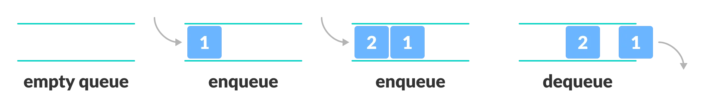
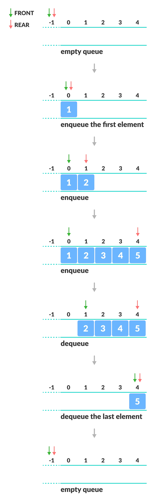
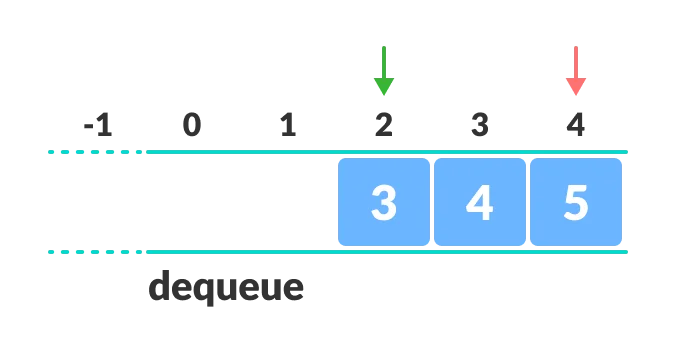
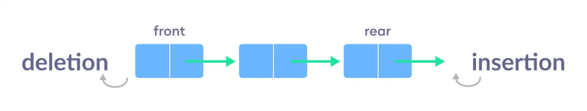
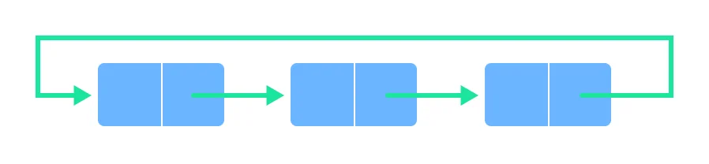
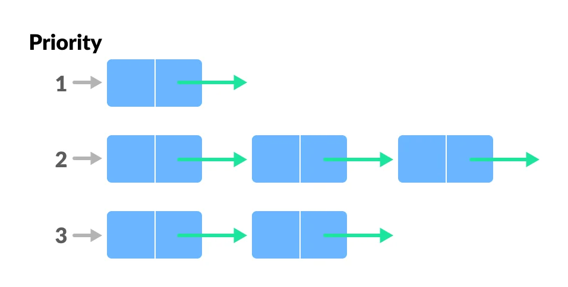
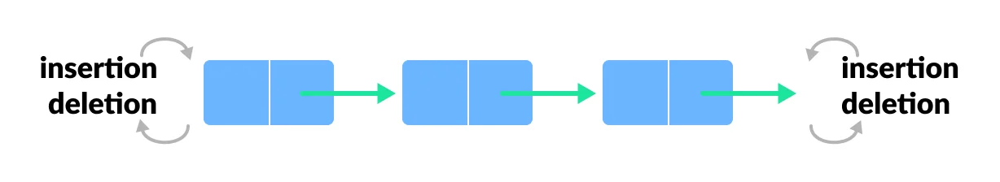
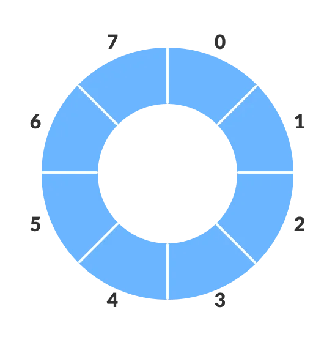
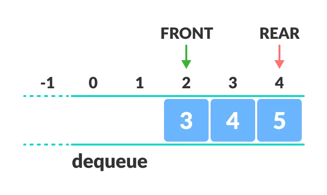
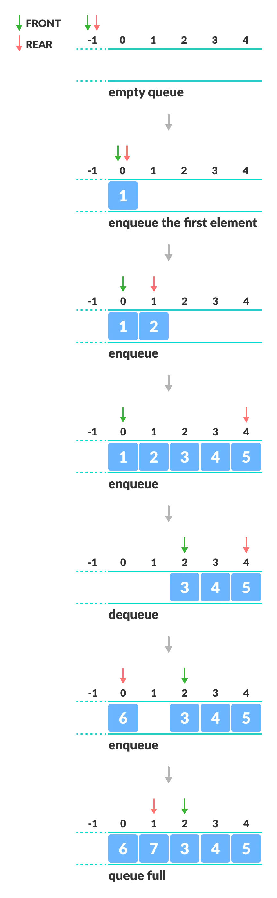

# Day 5 (01 July 2023)

## [Datastructures and Algorithms](https://www.programiz.com/dsa)

## Queue Data Structure

A queue is a useful data structure in programming. It is similar to the ticket queue outside a cinema hall, where the first person entering the queue is the first person who gets the ticket.

Queue follows the **First In First Out (FIFO)** rule - the item that goes in first is the item that comes out first.



In the above image, since 1 was kept in the queue before 2, it is the first to be removed from the queue as well. It follows the **FIFO** rule.

In programming terms, putting items in the queue is called **enqueue**, and removing items from the queue is called **dequeue**.

We can implement the queue in any programming language like C, C++, Java, Python or C#, but the specification is pretty much the same.

### Basic Operation of Queue

A queue is an object (an abstract data structure - ADT) that follows the followinf operations:

- **Enqueue:** Add an element to the end of the queue
- **Dqueue:** Remove an element from the front of the queue
- **IsEmpty:** Check if the queue is empty
- **IsFull:** Check if the queue is full
- **Peek:** Get the value of the front of the queue without removing it

### Working of Queue

Queue operations work as follows:

- two pointers `FRONT` and `REAR`
- `FRONT` track the first element of the queue
- `REAR` track the last element of the queue
- initially, set value of `FRONT` and `REAR` to -1

### Enqueue Operation

- check if the queue is full
- for the first element, set value of `FRONT` to 0
- increase the `REAR` index by 1
- add the new element in the position pointed to by `REAR`

### Dequeue Operation

- check if the queue is empty
- return the value pointed by `FRONT`
- increase the `FRONT` index by 1
- for the last element, reset the value of `FRONT` and `REAR` to -1



### Queue Implementation in Python

We usually use arrays to implement queues in Java and C++, In the case of Python, we use lists.

```python
# Queue implementation in python

class Queue:

    def __init__(self):
        self.queue = []

    # Add an element
    def enqueue(self, item):
        self.queue.append(item)

    # Remove an element
    def dequeue(self):
        if len(self.queue) < 1:
            return None
        return self.queue.pop(0)

    # Display the queue
    def display(self):
        print(self.queue)

    def size(self):
        return len(self.queue)

q = Queue()
q.enqueue(1)
q.enqueue(2)
q.enqueue(3)
q.enqueue(4)
q.enqueue(5)

q.display()

q.dequeue()

print("After removing an element")

q.display()

```

### Limitations of Queue

As you can see the image below, after a bit of enqeuing and dequeuing, the size of the queue has been reduced.

<div align="center" >
    
</div>

And we can only add indexes 0 and 1 only when the queue is reset(when all the elements have been dequeued).

After `REAR` reaches the last index, if we can store extra elements in the empty spaces(0 and 1), we can make use of the empty spaces. This is implemented by a modified queue called the circular queue.

### Complexity Analysis

The complexity of enqueue and dequeue operations in a queue using an array is `O(1)`. If you use `pop(N)` in python code, then the complexity might be `O(n)` depending on the position of the item to be popped.

### Applications of Queue

- CPU scheduling, Disk Scheduling
- When data is transferred asynchronously between two processes. The queue synchronization. For example: IO Bufferes, pipes, file IO, etc
- Handling of iterrupts in real-time systems.
- Call Center phone systems use Queues to hold people calling them in order.

## Types of Queues

A queue is a useful data structure in programminng. It is similar to the ticket queue outside a cinema hall, where the first person entering the queue is the first person who gets the ticket.

There are four different types of queues:

- Simple Queue
- Circular Queue
- Priority Queue
- Double Ended Queue

### Simple Queue

In a simple queue, insertion takes place at the rear and removal occurs at the front. It strictly follows the FIFO (First In First Out) rule.



### Circular Queue

In a circular queue, the last element points to the first element making a circular link.



The main advanntage of a circular queue over a simple queue is better memory utilization. If the last position is full annd the first position is empty, we can insert an element in the first position. This action is not possible in a simple queue.

### Priority Queue

A priority queue is a special type of queue in which each element is associated with a priority and is served according to its priority. If elements with the same priority occur, they are served according to their order in the queue.



Insertion occurs based on the arrival of the values and removal occurs based on priority.

### Deque (Double Ended Queue)

In a double ended queue, insertion and removal of elements can be performed from either from the front or rear. Thus, it does not follow the FIFO (First In First Out) rule.



## Circular Queue Data Structure

A circular queue is the extended version of a regular queue where the last element is connected to the first element. Thus forming a circle-like structure.

<div align="center" >

</div>

The circular queue solves the major limitation of the normal queue. In a normal queue, after a bit of insertion and deletion, there will be non-usable empty space.

<div align="center" >

</div>

Here, indexes **0** and **1** can only be used after resetting the queue (deletion of all elements). This reduces the actual size of queue.

### How Circular Queue Works

Circular Queue works by the process of circular increment i.e. when we try to increment the pointer annd we reach the end of the queue, we start from the beginning of the queue.

Here, the circular increment is performed by modulo division with the queue size. That is,

```python
if REAR + 1 == 5 (overflow!), REAR = (REAR + 1) % 5 = 0 (start of queue)
```

### Circular Queue Operations

The circular queue work as follows:

- two pointers `FRONT` and `REAR`
- `FRONT` track the first element of the queue
- `REAR` track the last elements of the queue
- initially, set value of `FRONT` and `REAR` to -1

#### 1. Enqueue Operation

- check if the queue is full
- for the first element, set value of `FRONT` to 0
- circularly increase the `REAR` index by 1 (i.e. if the rear reaches the ened, next it would be at the start of the queue)
- add the new element in the position pointed to by `REAR`

#### 2. Dequeue Operation

- check if the queue is empty
- return the value pointed by `FRONT`
- circularly increase the `FRONT` index by 1
- for the last element, reset the values of `FRONT` and `REAR` to -1

However, the check for full queue has a new additional case:

- Case 1: `FRONT` = 0 && `REAR == SIZE - 1`
- Case 2: `FRONT = REAR - 1`

The second case happens when `REAR` starts from 0 due to circular increment when its value is just 1 less than `FRONT`, the queue is full.



### Circular Queue Implementation in Python

The most common queue implementation is using arrays, but it can also be implemented using lists.

```python
# Circular Queue implementation in Python

class MyCircularQueue():

    def __init__(self, k):
        self.k = k
        self.queue = [None] * k
        self.head = self.tail = -1

    # Insert an element into the circular queue
    def enqueue(self, data):

        if ((self.tail + 1) % self.k == self.head ):
            print("The circular queue is full\n")

        elif (self.head == -1):
            self.head = 0
            self.tail = 0
            self.queue[self.tail] = data

        else:
            self.tail = (self.tail + 1) % self.k
            self.queue[self.tail] = data

    # Delete an element from the circular queue
    def dequeue(self):

        if (self.head == -1):
            print("The circular queue is empty\n")

        elif (self.head == self.tail):
            temp = self.queue[self.head]
            self.head = -1
            self.tail = -1
            return temp

        else:
            temp = self.queue[self.head]
            self.head = (self.head + 1) % self.k
            return temp

    # Printing the Circular Queue
    def printCQueue(self):

        if (self.head == -1):
            print("No element in the circular queue")

        elif (self.tail >= self.head):
            for i in range(self.head, self.tail + 1):
                print(self.queue[i], end=" ")
            print()

        else:
            for i in range(self.head, self.k):
                print(self.queue[i], end=" ")
            for i in range(0, self.tail + 1):
                print(self.queue[i], end=" ")
            print()

# Your MyCircularQueue object will be instantiated and called as such:
obj = MyCircularQueue(5)
obj.enqueue(1)
obj.enqueue(2)
obj.enqueue(3)
obj.enqueue(4)
obj.enqueue(5)

print("Initial queue")

obj.printCQueue()

obj.dequeue()

print("After removing an element from the queue")

obj.printCQueue()

```

### Circular Queue Complexity Analysis

The complexity of the enqueue and dequeue operations of a circular queue is `O(1)` for (array implementations).

### Applications of Circular Queue

- CPU scheduling
- Memory management
- Traffic Management
