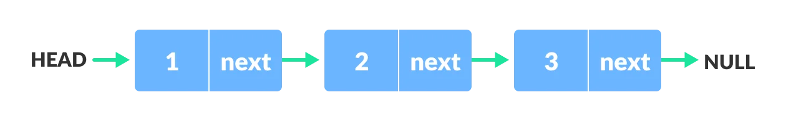
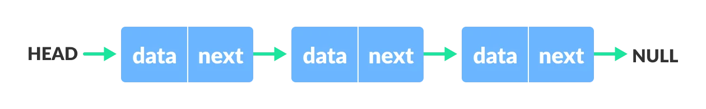
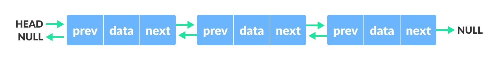
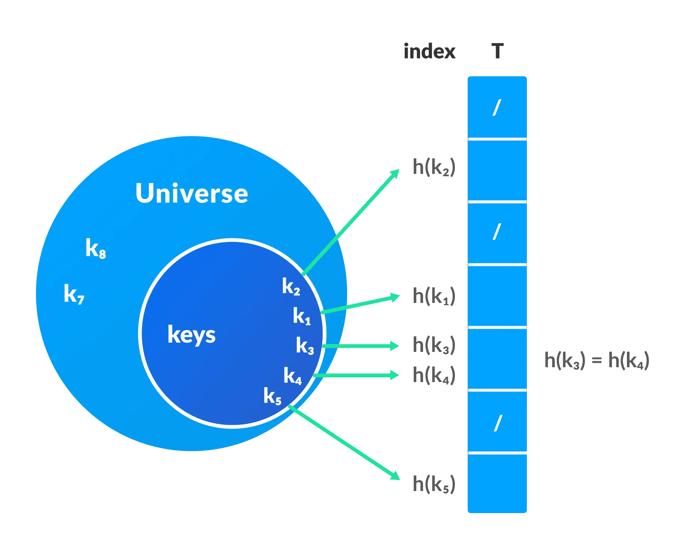
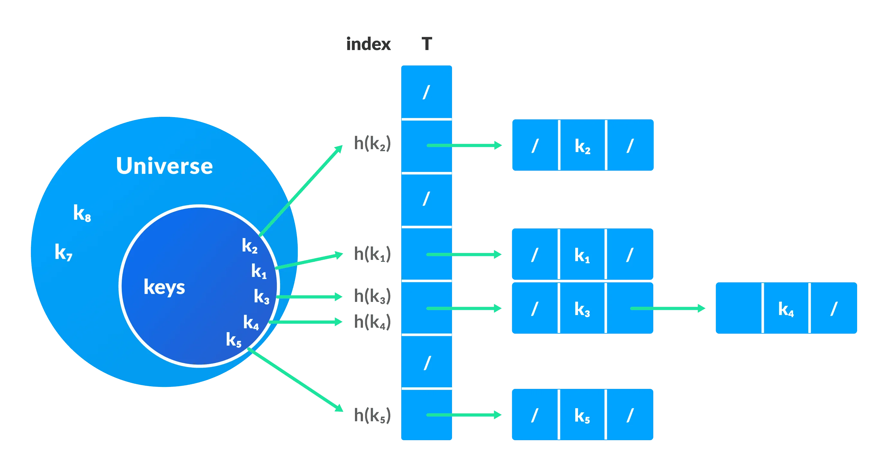

# Day 7 (12 July 2023)

## [Datastructures and Algorithms](https://www.programiz.com/dsa)

## Linked List Data Structure

A linked list is a linear data structure that includes a series of connected nodes. Here, each node stores the **data** and the **address** of the next node. For example,


You have to start somewhere, so we give the address of the first node a special name called `HEAD`. Also, the last node in the linked list can be identified because its next portion points to `NULL`.

Linked lists can be of multiple types: **singly**, **doubly**, and **circular linked list**. We will first focus onn the **singly linked list**.

> **Note:** You might have played the game Treasure Hunt, where each clue includes the information about the next clue. That is how the linked list operates.

### Representation of Linked List

Let's see how each node of the linked list is represented. Each node consists:

- A data item
- An address of another node

We wrap both the data item and the next node reference in a struct as:

```python
class Node:
    def __init__(self, data):
        self.data = data
        self.next = None

```

Understanding the structure of a linked list node is the key to having a grasp on it.

Each struct node has a data item and a pointer to another struct node. Let us create a simple Linked List with three items to understand how this works.

```python
# Define Node class
class Node:
    def __init__(self, data):
        self.data = data
        self.next = None

# Initialize nodes
head = None
one = None
two = None
three = None

# Allocate memory
one = Node(None)
two = Node(None)
three = Node(None)

# Assign data values
one.data = 1
two.data = 2
three.data = 3

# Connect nodes
one.next = two
two.next = three
three.next = None

# Save address of first node in head
head = one
```

In just a few steps, we have created a simple linked list with three nodes.


The power of a linked list comes from the ability to break the chain and rejoin it. E.g. if you wanted to put an element 4 between 1 and 2, the steps would be:

- Create a new struct node and allocate memory to it.
- Add its data value as 4
- Point its next pointer to the struct node containing 2 as the data value
- Change the next pointer of "1" to the node we just created.

Doing something similar in an array would have required shifting the positions of all the subsequent elements.

In Python, the linked list can be implemented using classes as shown in the code below.

### Linked List Utility

Lists are one of the most popular and efficient data structures, with implementation in every programming language like C, C++, Python, Java, and C#.

Apart from that, linked lists are a great way to learn how pointers work. By practicing how to manipulate linked lists, you can prepare yourself to learn more advanced data structures like graphs and trees.

### Linked List Implementation in Python

```python

# Linked list implementation in python

class Node:
    # Creating a node
    def __init__(self, item):
        self.item = item
        self.next = None

class LinkedList:

    def __init__(self):
        self.head = None

if __name__ == "__main__":

    linked_list = LinkedList()

    # Assign item values
    linked_list.head = Node(1)
    second = Node(2)
    third = Node(3)

    # Connect nodes
    linked_list.head.next = second
    second.next = third

    # Print the linked list item
    while linked_list.head != None:
        print(linked_list.head.item, end=" ")
        linked_list.head = linked_list.head.next
```

### Linked List Complexity

Time Complexity

|              | Worst case | Average case |
| ------------ | ---------- | ------------ |
| **Search**   | O(n)       | O(n)         |
| **Insert**   | O(1)       | O(1)         |
| **Deletion** | O(1)       | O(1)         |

Space Complexity: `O(n)`

### Linked List Applications

- Dynamic memory allocation
- Implemented in stack and queue
- In **undo** functionality of softwares
- Hash tables, Graphs

## Linked List Operations: Traverse, Insert and Delete

There are various linked list operations that allow us to perform different actions on linked lists. For example, the insertion operation adds a new element to the linked list.

Here's a list of basic linked list operations that we will cover.

- **Traversal** - access each element to the linked list
- **Insertion** - adds a new element to the linked list
- **Deletion** - removes the existing elements
- **Search** - find a node in the linked list
- **Sort** - sort the nodes of the linked list

### Things to Remember about Linked List

- `head` points to the first node of the linked list
- `next` pointer of the last node is `NULL`, so if the next current node is `NULL`, we have reached the end of the linked list.

In all of the examples, we will assume that the linked list has three odes `1--->2--->3` with node structure as below:

```python
class Node:
    def __init__(self, data):
        self.data = data
        self.next = None
```

### Traverse a Linked List

Displaying the contents of a linked list is very simple. We keep moving the temp node to the next one and display its contents.

When `temp` is `NULL`, we know that we have reached the ennd of the linked list so we get out of the while loop.

```python
temp = head
print("\n\nList elements are - ")
while temp is not None:
    print(temp.data, "--->", end=" ")
    temp = temp.next

```

The output of this program will be:

```python
List elements are -
1 --->2 --->3 --->
```

### Insert Elements to a Linked List

You can add elements to either the beginning, middle or end of the linked list.

#### 1. Insert at the beginning

- Allocate memory for new node
- Store data
- Change next of new node to point to head
- Change head to point to recently created node

```python
newNode = Node(None)
newNode.data = 4
newNode.next = head
head = newNode
```

#### 2. Insert at the End

- Allocate memory for new node
- Store data
- Traverse to last node
- Change next of last node to recently created node

```python
newNode = Node(None)
newNode.data = 4
newNode.next = None

temp = head
while temp.next is not None:
    temp = temp.next

temp.next = newNode
```

#### 3. Insert at the Middle

- Allocate memory and store data for new node
- Traverse to node just before the required position of new node
- Change next pointers to inclue new node in between

```python
newNode = Node(None)
newNode.data = 4

temp = head

for i in range(2, position):
    if temp.next is not None:
        temp = temp.next

newNode.next = temp.next
temp.next = newNode
```

### Deleting from a Linked List

#### 1. Delete from beginning

- Point head to the second node

```python
head = head.next
```

#### 2. Delete from end

- Traverse to second last element
- Change its next pointer to null

```python
temp = head
while temp.next.next is not None:
    temp = temp.next
temp.next = None
```

#### 3. Delete from middle

- Traverse to element before the element to be deleted
- Change next pointers to exclude the node from the chain

```python
for i in range(2, position):
    if temp.next is not None:
        temp = temp.next

temp.next = temp.next.next
```

### Search an Element on a Linked List

You can search an element on a linked list using a loop using the following steps. We are finding `item` on a linked list.

- Make `head` as the `current` node.
- Run a loop until the `current` node is `NULL` because the last element points to `NULL`.
- In each iteration, check if the key of the node is equal to `item`. If it the key matches the item, return `true` otherwise return `false`.

```python
def searchNode(head_ref, key):
    current = head_ref

    while current is not None:
        if current.data == key:
            return True
        current = current.next

    return False
```

### Sort Elements of a Linked List

We will use a simple sortinng algorithm, Bubble Sort, to sort the elements of a linked list i ascennding order below.

1. Make the `head` as the `current` node and create another node `index` for later use.
2. If `head` is null, return.
3. Else, run a loop till the last node (i.e. `NULL`).
4. In each iteration, follow the following step 5-6.
5. Store the next node of `current` in `index`.
6. Check if the data of the current node is greater than the next node. If it is greater, swap `current` and `index`.

```python
def sortLinkedList(head_ref):
    current = head_ref
    index = None

    if head_ref is None:
        return
    else:
        while current is not None:
            index = current.next
            while index is not None:
                if current.data > index.data:
                    temp = current.data
                    current.data = index.data
                    index.data = temp
                index = index.next
            current = current.next
```

### LinkedList Operations in Python

```python
# Linked List operations in Python

# Create a Node
class Node:

    def __init__(self, data):
        self.data = data
        self.next = None

class LinkedList:

    def __init__(self):
        self.head = None

    # Insert at the beginning
    def insertAtBeginning(self, new_data):
        new_node = Node(new_data)

        new_node.next = self.head
        self.head = new_node

    # Insert after a node
    def insertAfter(self, prev_node, new_data):

        if prev_node is None:
            print("The given previous node must in LinkedList.")
            return

        new_node = Node(new_data)
        new_node.next = prev_node.next
        prev_node.next = new_node

    # Inser at the end
    def insertAtEnd(self, new_data):
        new_node = Node(new_data)

        if self.head is None:
            self.head = new_node
            return

        last = self.head
        while (last.next):
            last = last.next

        last.next = new_node

    # Deleting a node
    def deleteNode(self, position):

        if self.head is None:
            return

        temp = self.head

        if position == 0:
            self.head = temp.next
            temp = None
            return

        # Find the key to be deleted
        for i in range(position - 1):
            temp = temp.next
            if temp is None:
                break

        # If the key is not present
        if temp is None:
            return

        if temp.next is None:
            return

        next = temp.next.next

        temp.next = None

        temp.next = next

    # Search an element
    def search(self, key):

        current = self.head

        while current is not None:
            if current.data == key:
                return True

            current = current.next

        return False

    # Sort the linked list
    def sortLinkedList(self, head):
        current = head
        index = Node(None)

        if head is None:
            return
        else:
            while current is not None:
                # index points to the node next to current
                index = current.next

                while index is not None:
                    if current.data > index.data:
                        current.data, index.data = index.data, current.data

                    index = index.next
                current = current.next

    # Print the linked list
    def printList(self):
        temp = self.head
        while(temp):
            print(str(temp.data)+" ", end="")
            temp = temp.next

if __name__ == "__main__":

    llist = LinkedList()
    llist.insertAtEnd(1)
    llist.insertAtBeginning(2)
    llist.insertAtBeginning(3)
    llist.insertAtEnd(4)
    llist.insertAfter(llist.head.next, 5)

    print("Linked List:")
    llist.printList()

    print("\nAfter deleting an element: ")
    llist.deleteNode(3)
    llist.printList()

    print()
    item_to_find = 3
    if llist.search(item_to_find):
        print(str(item_to_find) + "is found")
    else:
        print(str(item_to_find) + "is not found")

    llist.sortLinkedList(llist.head)
    print("Sorted List: ")
    llist.printList()
```

## Types of Linked List - Singly linked, doubly linked and circular

There are three common types of Linked List.

1. Singly Linked List
2. Doubly Linked List
3. Circular Linked List

### Singly Linked List

It is the most common. Each node has data and a pointer to the next node.


Node is represented as:

```python
class Node:
    def __init__(self, data):
        self.data = data
        self.next = None
```

A three-member singly linked list can be created as:

```python
class Node:
    def __init__(self, data):
        self.data = data
        self.next = None

# Initialize nodes
head = None
one = None
two = None
three = None

# Allocate memory
one = Node(None)
two = Node(None)
three = Node(None)

# Assign data values
one.data = 1
two.data = 2
three.data = 3

# Connect nodes
one.next = two
two.next = three
three.next = None

# Save address of first node in head
head = one
```

### Doubly Liked List

We add a pointer to the previous node in a doubly-linked list. Thus, we can go in either direction: forward or backward.


A node is represented as

```python
class Node:
    def __init__(self, data):
        self.data = data
        self.next = None
        self.prev = None
```

A three-member doubly linked list can be created as

```python
class Node:
    def __init__(self, data):
        self.data = data
        self.next = None
        self.prev = None

# Initialize nodes
head = None
one = None
two = None
three = None

# Allocate memory
one = Node(None)
two = Node(None)
three = Node(None)

# Assign data values
one.data = 1
two.data = 2
three.data = 3

# Connect nodes
one.next = two
one.prev = None

two.next = three
two.prev = one

three.next = None
three.prev = two

# Save address of first node in head
head = one
```

### Circular Linked List

A circular linked list is a variation of a linked list in which the last element is linked to the first element. This forms a circular loop.


A circular linked list can be either singly linked or doubly linked.

- for singly linked list, next pointer of last item points to the first item
- In the doubly linked list, `prev` pointer of the first item points to the last item as well.

A three-member circular singly linked list can be created as:

```python
class Node:
    def __init__(self, data):
        self.data = data
        self.next = None

# Initialize nodes
head = None
one = None
two = None
three = None

# Allocate memory
one = Node(None)
two = Node(None)
three = Node(None)

# Assign data values
one.data = 1
two.data = 2
three.data = 3

# Connect nodes
one.next = two
two.next = three
three.next = one

# Save address of first node in head
head = one
```

## Hash Table

The Hash table data structure stores elements in key-value pairs where

- **key-** unique integer that is used for inndexing the values
- **values-** data that are associated with keys.

<div align="center" >

</div>

### Hashing (Hash Function)

In a hash table, a new index is processed using the keys. And, the element correspoding to that key is stored in the index. This process is called **hashing.**

Let `k` be a key and `h(x)` be a hash function.

Here, `h(k)` will give us a new index to store the element linked with `k`.


### Hash Collision

When the hash function generates the same index for multiple keys, there will be conflict (what value to be stored in that index). This is called a **hash collision.**

We can resolve the hash collision using one of the following techniques.

- Collision resolution by chaining
- Open Addressing: Linear/Quadratic Probing and Double Hashing

#### 1. Collision resolution by chaining

In chaining, if a hash function produces the same index for multiple elements, these elements are stored in the same index by using a doubly-linked list.

If `j` is the slot for multiple elements, it contains a pointer to the head of the list of elements. If no element is present, `j` contains `NIL`.


**Pseudocode for operations:**

```
chainedHashSearch(T, k)
  return T[h(k)]
chainedHashInsert(T, x)
  T[h(x.key)] = x //insert at the head
chainedHashDelete(T, x)
  T[h(x.key)] = NIL
```

#### 2. Open Addressing

Unlike chaining, open addressinng doesn't store multiple elements into the same slot. Here, each slot is either filled with a sinngle key or left `NIL`.

Different techniques used in open addressing are:

##### i. Linear Probing

In linear probing, collision is resolved by checking the next slot.

`h(k, i) = (h'(k) + i) mod m`

where

- `i = {0, 1, ....}`
- `h'(k)` is a new hash function

If a collision occurs at `h(k, 0)`, then `h(k, 1)` is checked. In this way, the value of `i` is incremented linearly.

The problem with linear probing is that a cluster of adjacent slots is filled. When inserting a new element, the entire cluster must be traversed. This adds to the time required to perform operations on the hash table.

##### ii. Quadratic Probing

It works similar to linear probing but the spacing between the slots is increased (greater than one) by using the following relation.

`h(k, i) = (h'(k) + c1*i + c2*i^2) mod m`

where,

- `c1` and `c2` are positive auxiliary constants,
- `i = {0, 1, ....}`

###### iii. Double hashing

If a collision occurs after applying a hash function `h(k)`, then another hash function is calculated for finding the next slot.

`h(k, i) = (h1(k) + i*h2(k)) mod m`

### Good Hash Functions

A good hash function may not prevent the collisions completely however it can reduce the number of collisions.

Here, we will look into different methods to find a good hash function

#### 1. Division Method

If `k` is a key and `m` is the size of the hash table, the hash function `h()` is calculated as:

`h(k) = k mod m`

For example, If the size of a hash table is `10` and `k = 112` then `h(k) = 112` mod `10 = 2`. The value of `m` must not be the powers of `2`. This is because the powers of `2` in binary format are `10, 100, 1000, ...`. When we find `k mod m`, we will always get the lower order p-bits.

```
if m = 22, k = 17, then h(k) = 17 mod 22 = 10001 mod 100 = 01
if m = 23, k = 17, then h(k) = 17 mod 22 = 10001 mod 100 = 001
if m = 24, k = 17, then h(k) = 17 mod 22 = 10001 mod 100 = 0001
if m = 2p, then h(k) = p lower bits of m
```

#### 2. Multiplication Method

`h(k) = [m(kA mod 1)]`

where,

- `kA mod 1` gives the fractional part `kA`,
- `[ ]` gives the floor value
- `A` is any constant. The value of `A` lies between 0 and 1. But, an optimal choice will be `≈ (√5-1)/2` suggested by Knuth.

#### 3. Universal Hashing

In Universal hashing, the hash function is chosen at random indepedet of keys.

### Python Example

```python
# Python program to demonstrate working of HashTable

hashTable = [[],] * 10

def checkPrime(n):
    if n == 1 or n == 0:
        return 0

    for i in range(2, n//2):
        if n % i == 0:
            return 0

    return 1

def getPrime(n):
    if n % 2 == 0:
        n = n + 1

    while not checkPrime(n):
        n += 2

    return n

def hashFunction(key):
    capacity = getPrime(10)
    return key % capacity

def insertData(key, data):
    index = hashFunction(key)
    hashTable[index] = [key, data]

def removeData(key, data):
    index = hashFunction(key)
    hashTable[index] = 0

insertData(123, "apple")
insertData(432, "mango")
insertData(213, "banana")
insertData(654, "guava")

print(hashTable)

removeData(123)

print(hashTable)
```

### Applications of Hash Table

Hash tables are implemented where

- constant time lookup and insertion is required
- cryptographic applications
- indexing data is required
