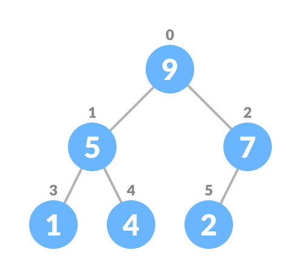

# Day 8 (23 July 2023)

## [Datastructures and Algorithms](https://www.programiz.com/dsa)

## Heap Data Structure

Heap data structure is a complete binary tree that satisfies **the heap property**, where any given node is

- always greater than its child node/s and the key of the root node is the largest among all other nodes. This property is also called **max heap property.**

- always smaller than the child node/s and the key of the root node is the smallest among all other nodes. This property is also called **min heap property.**

<div align="center" >
    
    <h4>Max-Heap</h4>
</div>

<div align="center" >
    <br>
    
    <h4>Min-Heap</h4>
</div>

This type of data structure is also called a **binary heap.**

### Heap Operations

Some of the importat operationns performed on a heap are described below along with their algorithms.

#### Heapify

Heapify is the process of creating a heap data structure from a binary tree. It is used to create a Min-Heap or a Max-Heap.

1. Let the input array be
   

2. Create a complete binary tree from the array
   <div align="center" >
    
   </div>

3. Start from the first index of non-leaf node whose index is given by `n/2 - 1`.
<div align="center" >

</div>

4. Set current element `i` as `largest`.

5. The index of left child is given by `2i + 1` and the right child is given by `2i + 2`.

   - If `leftChild` is greater than `currentElement` (i.e. element at `ith` index), set `leftChildIndex` as largest.
   - If `rightChild` is greater than element in `largest`, set `rightChildIndex` as `largest`.

6. Swap `largest` with `currentElement`
<div align="center" >

</div>

7. Repeat stpes 3-7 until the subtrees are also heapified.

##### Algorithm

```lua
Heapify(array, size, i)
   set i as largest
   leftChild = 2i + 1
   rightChild = 2i + 2

   if leftChild > array[largest]
      set leftChildInndex as largest
   if rightChild > array[largest]
      set rightChildIndex as largest

   swap array[i] and array[largest]
```

To create a Max-Heap:

```lua
MaxHeap(array, size)
   loop from the first index of non-leaf node down to zero call heapify
```

For Min-Heap, both `leftChild` and `rightChild` must be larger than the parent for all nodes.

#### Insert Element into Heap

Algorithm for insertion in Max Heap

```lua
If there is no node,
   create a newNode.
else (a node is already present)
   insert the newNode at the end (last node from left to right.)

heapify the array
```

1. Insert the new element at the end of the tree.
   <div align="center" >
   
   </div>

2. Heapify the tree.
   <div align="center" >
   
   </div>

For Min Heap, the above algorithm is modified so that `parentNode` is always smaller than `newNode`.

#### Delete Element from Heap

Algorithm for deletion in Max Heap

```lua
if nodeToBeDeleted is the leafNode
   remove the node
else swap nodeToBeDeleted with the leafNode
   remove noteToBeDeleted

heapify the array
```

1. Select the element to be deleted.
   <div align="center" >
   
   </div>

2. Swap it with the last element.
   <div align="center" >
   
   </div>

3. Remove the last element.
   <div align="center" >
   
   </div>

4. Heapify the tree.
   <div align="center" >
   
   </div>

For Min Heap, above algorithm is modified so that both `childNodes` are greater smaller than `currentNode`.

#### Peek (Find max/min)

Peek operation return the maximum element from Max Heap or minimum element from Min Heap without deleting the node.

For both Max heap and Min heap

```lua
return rootNode
```

#### Extract-Max/Min

Extract-Max return the node with maximum value after removing it from a Max Heap whereas Extract-Min returns the node with minimum after removing it from Min Heap.

### Python Example

```python
# Max-Heap data structure in Python

def heapify(arr, n, i):
   largest = i
   l = 2 * i + 1
   r = 2 * i + 2

   if l < n and arr[i] < arr[l]:
      largest = l

   if r < n and arr[largest] < arr[r]:
      largest = r

   if largest != i:
      arr[i], arr[largest] = arr[largest], arr[i]
      heapify(arr, n, largest)

def insert(array, newNum):
   size = len(array)
   if size == 0:
      array.append(newNum)
   else:
      array.append(newNum)
      for i in range((size//2)-1, -1, -1):
         heapify(array, size, i)

def deleteNode(array, num):
   size = len(array)
   i = 0
   for i in range(0, size):
      if num == array[i]:
         break

   array[i], array[size - 1] = array[size - 1], array[i]

   array.remove(num)

   for i in range((len(array)//2) - 1, -1, -1):
      heapify(array, len(array), i)

arr = []

insert(arr, 3)
insert(arr, 4)
insert(arr, 9)
insert(arr, 5)
insert(arr, 2)

print("Max-Heap array: " + str(arr))

deleteNode(arr, 4)
print("After deleting an element: " + str(arr))
```

### Heap Data Structure Applications

- Heap is used while implementing a priority queue.
- Dijkstra's Algorithm
- Heap Sort

## Fibonacci Heap

A fibonacci heap is data structure that consists of a collection of trees which follow min heap or max heap property. These two principles are the characteristics of the trees present on a fibonacci heap.

In a fibonacci heap, a node can have more than two children or no children at all. Also, it has more efficient heap operations than that supported by the binomial and binary heaps.

The fibonacci heap is called a **fibonacci** heap because the trees are constructed in a way such that a tree of order `n` has at least `Fn+2` nodes in it, where `Fn+2` is the `(n + 2)th` Fibonacci number.


### Properties of a Fibonacci Heap

Important properties of a Fibonacci heap are:

1. It is a set of **min heap-ordered** trees. (i.e. The parent is always smaller than the children.)

2. A pointer is maintained at the minimum element node.

3. It consists of a set of marked nodes. (Decrease key operation)

4. The trees within a Fibonacci heap are unordered but **rooted**.

### Memory Representation of the Nodes in a Fibonacci Heap

The roots of all the tree are linked together for faster access. The child nodes of a parent node are connected to each other through a circuar doubly linked list as shown below.

There are two main advantages of using a circular doubly linked list.

1. Deleting a nnode from the tree takes `O(1)` time.

2. The concatenation of two such lists takes `O(1)` time.


### Operations on a Fibonacci Heap

#### Insertion

Algorithm

```lua
insert(H, x)
   degree[x] = 0
   p[x] = NIL
   child[x] = NIL
   left[x] = x
   right[x] = x
   mark[x] = FALSE
   concatenate the root list conntaining x with root list H
   if min[H] == NIL or key[x] < key[min[H]]
      then min[H] = x
   n[H] = n[H] + 1
```

Inserting a node into an already existing heap follows the steps below.

1. Create a new node for the element.

2. Check if the heap is empty.

3. If the heap is empty, set the new node as a root node and mark it `min`.

4. Else, insert the node into the root list and update `min`.


#### Find Min

The minimum element is always given by the `min` pointer.

##### Union

Union of two fibonacci heaps consists of following steps.

1. Concatenate the roots of both the heaps.

2. Update `min` by selecting a minimum key from the new root lists.


#### Extract Min

It is the most important operation on a fibonacii heap. In this operation, the node with minimum value is removed from the heap and the tree is re-adjusted.

The following steps are followed:

1. Delete the min node.

2. Set the min-pointer to the next root in the root list.

3. Create an array of size equal to the maximum degree of the trees in the heap before deletion.

4. Do the following (seteps 5-7) until there are no multiple roots with the same degree.

5. Map the degree of current root (min-pointer) to the degree in the array.

6. Map the degree of next root to the degree in array.

7. If there are more two mappings for the same degree, then apply union operation to those roots such that the min-heap property is maintained (i.e. the minimum is at the root).

An implementation of the above steps can be understood in the example below.

1. We will perform an extract-min operation on the heap below.


2. Delete the min node, add all its child nodes to the root list and set the mi-pointer to the next room in the root list.


3. The maximum degree in the tree is 3. Create an array of size 4 and map degree of the next roots with the array.


4. Here, 23 and 7 have the same degrees, so unite them.


5. Again, 7 and 17 have the same degrees, so unnite them as well.


6. Again 7 and 24 have the same degree, so unite them.


7. Map the next nodes.


8. Again, 52 and 21 have the same degree, so unite them


9. Similarly, unite 21 and 18.


10. Map the remaining root.


11. The final heap is.


#### Decreasing a Key and Deleting a Node

Those are the most important operations which are discussed in Deacrease Key and Delete Node Operations.

### Python Example

```python
# Fibonacci Heap in python

import math

# Creating fibonacci tree
class FibonacciTree:
   def __init__(self, value):
      self.value = value
      self.child = []
      self.order = 0

   # Adding tree at the end of the tree
   def add_at_end(self, t):
      self.child.append(t)
      self.order = self.order + 1

# Creating Fibonacci heap
class FibonacciHeap:
   def __init__(self):
      self.trees = []
      self.least = None
      self.count = 0

   # Insert a node
   def insert_node(self, value):
      new_tree = FibonacciTree(value)
      self.trees.append(new_tree)
      if (self.least is None or value < self.least.value):
         self.least = new_tree
      self.count = self.count + 1

   # Get minimum value
   def get_min(self):
      if self.least is None:
         return None
      return self.least.value

   # Extract the minimum value
   def extract_min(self):
      smallest = self.least
      if smallest is not None:
         for child in smallest.child:
            self.trees.append(child)
         self.trees.remove(smallest)
         if self.trees == []:
            self.least = None
         else:
            self.least = self.trees[0]
            self.consolidate()
         self.count = self.count - 1
         return smallest.value

   # Consolidate the tree
   def consolidate(self):
      aux = (floor_log(self.count) + 1) * [None]

      while self.trees != []:
         x = self.trees[0]
         order = x.order
         self.trees.remove(x)
         while aux[order] is not None:
            y = aux[order]
            if x.value > y.value:
               x, y = y, x
            x.add_at_end(y)
            aux[order] = None
            order = order + 1
         aux[order] = x

      self.least = None
      for k in aux:
         if k is not None:
            self.trees.append(k)
            if (self.least is None or k.value < self.least.value):
               self.least = k

def floor_log(x):
   return math.frexp(x)[1] - 1

fibonacci_heap = FibonacciHeap()

fibonacci_heap.insert_node(7)
fibonacci_heap.insert_node(3)
fibonacci_heap.insert_node(17)
fibonacci_heap.insert_node(24)

print("The minimum value of the fibonacci heap: {}".format(fibonacci_heap.get_min()))

print("The minimum value remove: {}".format(fibonacci_heap.extract_min()))
```

### Complexities

| Function Name | Complexity |
| ------------- | ---------- |
| Insertion     | O(1)       |
| Find Min      | O(1)       |
| Union         | O(1)       |
| Extract Min   | O(log n)   |
| Decrease Key  | O(1)       |
| Delete Node   | O(log n)   |

### Fibonacci Heap Applications

1. To improve the asymptotic running time of Dijkstra's algorithm.
